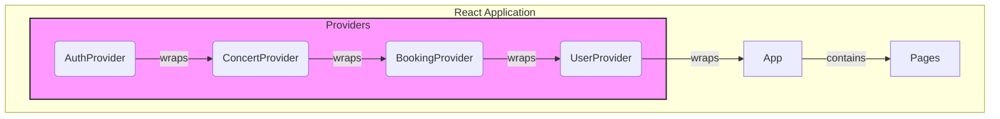

# **1. 아키텍처 개요: 여러 개의 분리된 Context**

애플리케이션의 모든 상태를 하나의 거대한 Context에 넣는 것은 비효율적입니다. 상태의 한 부분이 변경될 때마다 해당 Context를 구독하는 모든 컴포넌트가 불필요하게 리렌더링될 수 있기 때문입니다.

따라서, **관심사가 비슷한 상태끼리 묶어 여러 개의 독립적인 Context를 생성**하는 것이 바람직합니다. 이는 각 상태의 책임과 역할을 명확히 하고, 성능을 최적화하는 최신 업계 표준 방식입니다.



*   **AuthProvider:** 인증(로그인/로그아웃, 회원 정보) 관련 상태를 관리합니다.
*   **ConcertProvider:** 전체 콘서트 목록, 검색, 필터링 등 '공용 데이터'를 관리합니다.
*   **BookingProvider:** 특정 콘서트의 좌석 선택부터 예매 완료까지의 '흐름(flow)'을 관리합니다.
*   **UserProvider:** 로그인한 사용자의 '개인 데이터'(마이페이지, 찜 목록, 알림)를 관리합니다.

---

# **2. 데이터 관리 흐름 시각화**

각 Provider는 내부적으로 `useReducer`를 사용하여 상태 로직을 관리합니다. 데이터 흐름은 다음과 같습니다.

```mermaid
graph TD
    subgraph "React Component (View)"
        A(1. 사용자 이벤트 발생<br>예: 로그인 버튼 클릭) --> B{2. 이벤트 핸들러 호출<br>handleLogin()};
        B --> C(3. dispatch 함수 호출<br>authDispatch({ type: 'LOGIN_START' }));
    end

    subgraph "Context Provider (e.g., AuthProvider)"
        D(4. dispatch가 Action을 Reducer에 전달)
        E[5. AuthReducer<br>switch(action.type){...}]
        F((6. 기존 State와 Action을 조합해<br>새로운 State 생성))
        G[7. Provider의 State가<br>새로운 State로 업데이트됨]
    end

    subgraph "React Rerendering"
      H(8. Provider가 새로운<br>Context 값을 하위로 전파)
      I(9. useContext(AuthContext)를<br>사용하는 컴포넌트들이<br>새로운 State로 리렌더링)
    end
    
    C --> D --> E --> F --> G --> H --> I
```

---

# **3. Context별 상세 설계**

각 Context Provider가 하위 컴포넌트에 노출할 상태(변수)와 함수(Action을 dispatch하는 래퍼 함수)의 인터페이스를 설계합니다.

## **가. AuthContext**

*   **역할:** 전역적인 사용자 인증 상태를 관리합니다. 헤더 UI 변경, 로그인/비로그인 접근 제어 등에 사용됩니다.
*   **State 인터페이스 (`AuthState`)**:
    ```typescript
    type AuthState = {
      isLoading: boolean;       // 로그인 시도 중 로딩 상태
      isLoggedIn: boolean;      // 로그인 여부
      currentUser: { id: string; name: string; } | null; // 현재 유저 정보
      error: string | null;     // 에러 메시지
      showLoginModal: boolean;  // 로그인 모달 표시 여부
    };
    ```
*   **노출 변수 및 함수 (`AuthContextValue`)**:
    *   `state: AuthState`: 위의 상태 객체 전체
    *   `login(email, password)`: 로그인 시도를 위한 함수 (내부적으로 `LOGIN_START`, `LOGIN_SUCCESS`/`FAILURE` 액션 dispatch)
    *   `logout()`: 로그아웃 함수 (내부적으로 `LOGOUT` 액션 dispatch)
    *   `openLoginModal()`: 로그인 모달을 여는 함수
    *   `closeLoginModal()`: 로그인 모달을 닫는 함수

## **나. ConcertContext**

*   **역할:** 메인 페이지와 콘서트 목록에 필요한 데이터를 불러오고, 검색/필터링 결과를 관리합니다.
*   **State 인터페이스 (`ConcertState`)**:
    ```typescript
    type ConcertStatus = 'idle' | 'loading' | 'success' | 'error';

    type ConcertState = {
      status: ConcertStatus;
      allConcerts: Concert[];     // 서버에서 받은 원본 콘서트 목록
      filteredConcerts: Concert[];// 화면에 보여줄 필터링된 목록
      searchTerm: string;         // 현재 검색어
      activeFilters: { genre?: string; date?: string; }; // 적용된 필터
      error: string | null;
    };
    ```
*   **노출 변수 및 함수 (`ConcertContextValue`)**:
    *   `state: ConcertState`: 상태 객체 전체
    *   `fetchConcerts()`: 전체 콘서트 목록을 불러오는 함수
    *   `setSearchTerm(term: string)`: 검색어를 변경하고 목록을 필터링하는 함수
    *   `setFilter(filter: { genre: string })`: 필터를 적용하는 함수
    *   `clearFilters()`: 모든 필터와 검색어를 초기화하는 함수

## **다. BookingContext**

*   **역할:** 사용자가 '예매하기' 버튼을 누른 시점부터 예매 완료/취소까지의 독립적인 흐름을 관리합니다.
*   **State 인터페이스 (`BookingState`)**:
    ```typescript
    type BookingStatus = 'idle' | 'loading' | 'selecting' | 'confirming' | 'success' | 'error';

    type BookingState = {
      status: BookingStatus;
      concertInfo: { id: string; name: string; } | null; // 예매 중인 콘서트 정보
      allSeats: Seat[];           // 해당 콘서트의 전체 좌석 정보
      selectedSeats: Seat[];      // 사용자가 선택한 좌석 정보
      bookingResult: BookingInfo | null; // 예매 완료 후 결과
      error: string | null;
    };
    ```
*   **노출 변수 및 함수 (`BookingContextValue`)**:
    *   `state: BookingState`: 상태 객체 전체
    *   `startBooking(concertId: string)`: 특정 콘서트의 예매를 시작하고 좌석 정보를 불러오는 함수
    *   `selectSeat(seatId: string)`: 좌석을 선택하는 함수
    *   `deselectSeat(seatId: string)`: 선택한 좌석을 해제하는 함수
    *   `confirmBooking(bookingDetails)`: 예매를 확정하고 서버에 전송하는 함수
    *   `resetBooking()`: 예매 흐름을 초기 상태로 되돌리는 함수 (예: 사용자가 예매 중 페이지를 이탈할 때)

## **라. UserContext**

*   **역할:** 로그인한 사용자의 개인화된 데이터(마이페이지, 찜, 알림)를 관리합니다. `AuthProvider`의 `isLoggedIn`이 true일 때만 데이터를 불러옵니다.
*   **State 인터페이스 (`UserState`)**:
    ```typescript
    type UserStatus = 'idle' | 'loading' | 'success' | 'error';

    type UserState = {
      status: UserStatus;
      myBookings: BookingInfo[];   // 내 예매 내역
      wishlist: Concert[];         // 찜한 콘서트 목록
      notifications: Notification[]; // 알림 목록
      hasNewNotification: boolean; // 새 알림 여부
      error: string | null;
    };
    ```*   **노출 변수 및 함수 (`UserContextValue`)**:
    *   `state: UserState`: 상태 객체 전체
    *   `fetchUserData()`: 로그인 시 마이페이지, 찜, 알림 데이터를 모두 불러오는 함수
    *   `toggleWishlist(concertId: string)`: 찜 목록에 콘서트를 추가/삭제하는 함수
    *   `readNotification(notificationId: string)`: 특정 알림을 읽음 처리하는 함수

---

# **4. 요약: 하위 컴포넌트에 노출되는 인터페이스**

| Context Provider | 노출 변수 (상태) | 노출 함수 (상태 변경) |
| :--- | :--- | :--- |
| **AuthProvider** | `isLoading`, `isLoggedIn`, `currentUser`, `error`, `showLoginModal` | `login()`, `logout()`, `openLoginModal()`, `closeLoginModal()` |
| **ConcertProvider** | `status`, `allConcerts`, `filteredConcerts`, `searchTerm`, `activeFilters` | `fetchConcerts()`, `setSearchTerm()`, `setFilter()`, `clearFilters()` |
| **BookingProvider** | `status`, `concertInfo`, `allSeats`, `selectedSeats`, `bookingResult` | `startBooking()`, `selectSeat()`, `deselectSeat()`, `confirmBooking()`, `resetBooking()` |
| **UserProvider** | `status`, `myBookings`, `wishlist`, `notifications`, `hasNewNotification` | `fetchUserData()`, `toggleWishlist()`, `readNotification()` |
