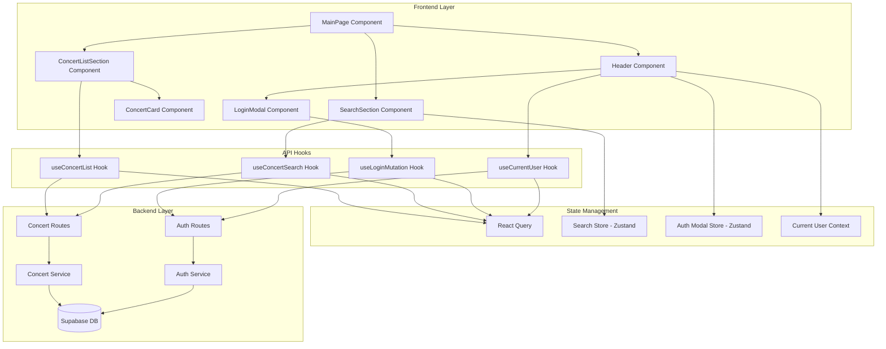

# 메인 페이지 (콘서트 목록) - 상세 설계 문서

## 1. 페이지 개요

메인 페이지는 TicketGem의 랜딩 페이지이자 콘서트 탐색의 시작점입니다. 사용자는 이 페이지에서 모든 콘서트 목록을 확인하고, 키워드 검색을 통해 원하는 콘서트를 빠르게 찾을 수 있습니다.

### 주요 목적
- 전체 콘서트 목록 노출
- 키워드 기반 실시간 검색 기능
- 콘서트 상세 페이지로의 네비게이션
- 로그인/회원가입 접근점 제공

### 라우팅
- **경로**: `/` (root)
- **접근 권한**: Public (비회원/회원 모두 접근 가능)

---

## 2. 페이지 구조 및 레이아웃

```
┌─────────────────────────────────────────────────┐
│ Header                                          │
│  - Logo                                         │
│  - Navigation (Home, My Page)                   │
│  - Login Button / User Profile                  │
│  - Notification Icon (로그인 시)                │
└─────────────────────────────────────────────────┘
┌─────────────────────────────────────────────────┐
│ Search Section                                  │
│  - Search Input (검색창)                         │
│  - Search Button (돋보기 아이콘)                 │
└─────────────────────────────────────────────────┘
┌─────────────────────────────────────────────────┐
│ Concert List Section                            │
│  ┌───────┐ ┌───────┐ ┌───────┐ ┌───────┐      │
│  │Concert│ │Concert│ │Concert│ │Concert│      │
│  │ Card  │ │ Card  │ │ Card  │ │ Card  │      │
│  └───────┘ └───────┘ └───────┘ └───────┘      │
│  ┌───────┐ ┌───────┐ ┌───────┐ ┌───────┐      │
│  │Concert│ │Concert│ │Concert│ │Concert│      │
│  │ Card  │ │ Card  │ │ Card  │ │ Card  │      │
│  └───────┘ └───────┘ └───────┘ └───────┘      │
└─────────────────────────────────────────────────┘
┌─────────────────────────────────────────────────┐
│ Footer (선택적)                                  │
└─────────────────────────────────────────────────┘
```

### 레이아웃 특징
- **헤더**: 고정 위치 (sticky), 모든 페이지에서 공통 사용
- **검색 섹션**: 헤더 하단, 페이지 상단 중앙 배치
- **콘서트 목록**: 반응형 그리드 레이아웃
  - 모바일: 1열
  - 태블릿: 2~3열
  - 데스크톱: 3~4열

---

## 3. 주요 컴포넌트 목록 및 역할

### 3.1 Layout Components (공통)

#### `Header` (src/components/layout/header.tsx)
**역할**: 전역 네비게이션 및 인증 상태 표시

**Props**:
```typescript
interface HeaderProps {
  // Props는 전역 상태에서 가져오므로 불필요
}
```

**내부 구성**:
- Logo (클릭 시 메인 페이지로 이동)
- Navigation Links
  - Home (/)
  - My Page (/my-page) - 로그인 시에만 표시
- Authentication Section
  - 비로그인: "로그인" 버튼 → 로그인 모달 오픈
  - 로그인: 사용자 프로필 아이콘 + 알림 아이콘 + 로그아웃 버튼

**상태 의존성**:
- `useCurrentUser()`: 현재 로그인 사용자 정보
- `useAuthModal()`: 로그인 모달 상태 관리

#### `NotificationBadge` (src/features/notification/components/notification-badge.tsx)
**역할**: 알림 아이콘 및 새 알림 뱃지 표시

**Props**:
```typescript
interface NotificationBadgeProps {
  hasNewNotification: boolean;
  onClick: () => void;
}
```

---

### 3.2 Page-Specific Components

#### `MainPage` (src/app/page.tsx)
**역할**: 메인 페이지 최상위 컴포넌트

**구조**:
```typescript
'use client';

export default async function MainPage() {
  return (
    <main className="min-h-screen bg-background">
      <Header />
      <div className="container mx-auto px-4 py-8">
        <SearchSection />
        <ConcertListSection />
      </div>
    </main>
  );
}
```

#### `SearchSection` (src/features/concert/components/search-section.tsx)
**역할**: 검색 UI 및 검색 로직 처리

**Props**:
```typescript
interface SearchSectionProps {
  // 부모에서 주입받지 않고 내부에서 상태 관리
}
```

**내부 상태**:
- `searchKeyword`: 검색 입력 값
- `debouncedKeyword`: 디바운싱 처리된 검색어

**사용 Hooks**:
- `useConcertSearch(debouncedKeyword)`: 검색 API 호출

**기능**:
- 실시간 검색어 입력
- Enter 키 또는 검색 버튼 클릭으로 검색 실행
- 검색어 유효성 검증 (빈 문자열, 공백 검사)
- 디바운싱 (300ms) 적용으로 API 호출 최적화

#### `ConcertListSection` (src/features/concert/components/concert-list-section.tsx)
**역할**: 콘서트 목록 렌더링 및 상태 처리

**Props**:
```typescript
interface ConcertListSectionProps {
  concerts: Concert[];
  isLoading: boolean;
  isError: boolean;
  errorMessage?: string;
}
```

**렌더링 로직**:
- `isLoading`: 스켈레톤 UI 표시
- `isError`: 에러 메시지 및 재시도 버튼 표시
- `concerts.length === 0`: Empty State UI 표시
- `concerts.length > 0`: 콘서트 카드 그리드 렌더링

#### `ConcertCard` (src/features/concert/components/concert-card.tsx)
**역할**: 개별 콘서트 정보 카드

**Props**:
```typescript
interface ConcertCardProps {
  concert: Concert;
  onClick: (concertId: string) => void;
}

interface Concert {
  id: string;
  title: string;
  posterImageUrl?: string;
  venue?: string;
  startDate?: string;
  endDate?: string;
}
```

**UI 구성**:
- 콘서트 포스터 이미지 (placeholder 지원)
- 콘서트 제목
- 공연 기간 (선택적)
- 공연장 (선택적)
- 찜하기 버튼 (로그인 시, 향후 구현)

**인터랙션**:
- 카드 클릭 시 `/concerts/:id` 페이지로 이동

#### `ConcertCardSkeleton` (src/features/concert/components/concert-card-skeleton.tsx)
**역할**: 로딩 중 스켈레톤 UI

**Props**: 없음

**UI**: shimmer 효과를 가진 카드 스켈레톤

#### `EmptyState` (src/features/concert/components/empty-state.tsx)
**역할**: 검색 결과 없음 또는 콘서트 없음 상태 표시

**Props**:
```typescript
interface EmptyStateProps {
  title: string;
  description: string;
  actionLabel?: string;
  onAction?: () => void;
}
```

**사용 예시**:
- 검색 결과 없음: "검색 결과가 없습니다"
- 전체 콘서트 없음: "등록된 콘서트가 없습니다"

---

### 3.3 Modal Components

#### `LoginModal` (src/features/auth/components/login-modal.tsx)
**역할**: 로그인 모달 UI 및 로직

**Props**:
```typescript
interface LoginModalProps {
  isOpen: boolean;
  onClose: () => void;
  onLoginSuccess?: () => void; // 로그인 성공 후 콜백
}
```

**내부 구성**:
- 이메일 입력 필드 (react-hook-form)
- 비밀번호 입력 필드 (표시/숨김 토글)
- 로그인 버튼
- 회원가입 링크
- 에러 메시지 표시 영역

**사용 Hooks**:
- `useLoginMutation()`: 로그인 API 호출
- `useForm()`: 폼 상태 관리 (react-hook-form)

---

## 4. 상태 관리

### 4.1 React Query (Server State)

#### Concert List Query
```typescript
// src/features/concert/hooks/useConcertList.ts
export const useConcertList = () => {
  return useQuery({
    queryKey: ['concerts', 'list'],
    queryFn: async () => {
      const { data } = await apiClient.get('/api/concerts');
      return ConcertListResponseSchema.parse(data);
    },
    staleTime: 5 * 60 * 1000, // 5분
    gcTime: 10 * 60 * 1000, // 10분 (cacheTime 대체)
  });
};
```

#### Concert Search Query
```typescript
// src/features/concert/hooks/useConcertSearch.ts
export const useConcertSearch = (keyword: string) => {
  return useQuery({
    queryKey: ['concerts', 'search', keyword],
    queryFn: async () => {
      if (!keyword.trim()) {
        return { concerts: [], total: 0 };
      }
      const { data } = await apiClient.get('/api/concerts/search', {
        params: { keyword },
      });
      return ConcertSearchResponseSchema.parse(data);
    },
    enabled: keyword.trim().length > 0,
    staleTime: 5 * 60 * 1000,
  });
};
```

### 4.2 Zustand (Client State)

#### Search Store
```typescript
// src/features/concert/stores/search-store.ts
import { create } from 'zustand';

interface SearchState {
  keyword: string;
  setKeyword: (keyword: string) => void;
  clearKeyword: () => void;
}

export const useSearchStore = create<SearchState>((set) => ({
  keyword: '',
  setKeyword: (keyword) => set({ keyword }),
  clearKeyword: () => set({ keyword: '' }),
}));
```

#### Auth Modal Store
```typescript
// src/features/auth/stores/auth-modal-store.ts
import { create } from 'zustand';

interface AuthModalState {
  isLoginModalOpen: boolean;
  isSignupModalOpen: boolean;
  openLoginModal: () => void;
  closeLoginModal: () => void;
  openSignupModal: () => void;
  closeSignupModal: () => void;
}

export const useAuthModalStore = create<AuthModalState>((set) => ({
  isLoginModalOpen: false,
  isSignupModalOpen: false,
  openLoginModal: () => set({ isLoginModalOpen: true }),
  closeLoginModal: () => set({ isLoginModalOpen: false }),
  openSignupModal: () => set({ isSignupModalOpen: true }),
  closeSignupModal: () => set({ isSignupModalOpen: false }),
}));
```

### 4.3 Current User Context (Auth State)

```typescript
// src/features/auth/context/current-user-context.tsx
'use client';

import { createContext, useContext, ReactNode } from 'react';
import { useCurrentUser } from '@/features/auth/hooks/useCurrentUser';
import type { User } from '@/features/auth/types';

interface CurrentUserContextValue {
  user: User | null;
  isLoading: boolean;
  isAuthenticated: boolean;
}

const CurrentUserContext = createContext<CurrentUserContextValue | undefined>(undefined);

export const CurrentUserProvider = ({ children }: { children: ReactNode }) => {
  const { data: user, isLoading } = useCurrentUser();

  return (
    <CurrentUserContext.Provider
      value={{
        user: user ?? null,
        isLoading,
        isAuthenticated: !!user,
      }}
    >
      {children}
    </CurrentUserContext.Provider>
  );
};

export const useCurrentUserContext = () => {
  const context = useContext(CurrentUserContext);
  if (!context) {
    throw new Error('useCurrentUserContext must be used within CurrentUserProvider');
  }
  return context;
};
```

---

## 5. API 엔드포인트 및 데이터 스키마

### 5.1 GET /api/concerts (콘서트 목록 조회)

#### Backend: Route Handler
```typescript
// src/features/concert/backend/route.ts
import { Hono } from 'hono';
import { respond } from '@/backend/http/response';
import { getSupabase, getLogger } from '@/backend/hono/context';
import { getAllConcerts } from './service';

export const registerConcertRoutes = (app: Hono) => {
  app.get('/api/concerts', async (c) => {
    const supabase = getSupabase(c);
    const logger = getLogger(c);

    const result = await getAllConcerts(supabase);

    if (!result.ok) {
      logger.error('Failed to fetch concerts', result.error);
    }

    return respond(c, result);
  });
};
```

#### Backend: Service
```typescript
// src/features/concert/backend/service.ts
import type { SupabaseClient } from '@supabase/supabase-js';
import { success, failure } from '@/backend/http/response';
import { ConcertListResponseSchema } from './schema';

export const getAllConcerts = async (client: SupabaseClient) => {
  const { data, error } = await client
    .from('concerts')
    .select('id, title, created_at, updated_at')
    .order('created_at', { ascending: false });

  if (error) {
    return failure(500, 'CONCERT_FETCH_ERROR', error.message);
  }

  const concerts = data.map((row) => ({
    id: row.id,
    title: row.title,
    posterImageUrl: `https://picsum.photos/seed/${row.id}/400/600`,
    createdAt: row.created_at,
    updatedAt: row.updated_at,
  }));

  const parsed = ConcertListResponseSchema.safeParse({ concerts, total: concerts.length });

  if (!parsed.success) {
    return failure(500, 'VALIDATION_ERROR', 'Response validation failed', parsed.error);
  }

  return success(parsed.data);
};
```

#### Backend: Schema
```typescript
// src/features/concert/backend/schema.ts
import { z } from 'zod';

export const ConcertSchema = z.object({
  id: z.string().uuid(),
  title: z.string(),
  posterImageUrl: z.string().optional(),
  createdAt: z.string(),
  updatedAt: z.string(),
});

export const ConcertListResponseSchema = z.object({
  concerts: z.array(ConcertSchema),
  total: z.number().int().nonnegative(),
});

export type Concert = z.infer<typeof ConcertSchema>;
export type ConcertListResponse = z.infer<typeof ConcertListResponseSchema>;
```

#### Frontend: DTO Re-export
```typescript
// src/features/concert/lib/dto.ts
export { ConcertSchema, ConcertListResponseSchema, type Concert, type ConcertListResponse } from '../backend/schema';
```

---

### 5.2 GET /api/concerts/search (키워드 검색)

#### Backend: Route Handler
```typescript
// src/features/concert/backend/route.ts (추가)
app.get('/api/concerts/search', async (c) => {
  const keyword = c.req.query('keyword');

  if (!keyword || keyword.trim().length === 0) {
    return respond(c, failure(400, 'INVALID_KEYWORD', '검색어를 입력해주세요'));
  }

  if (keyword.length > 100) {
    return respond(c, failure(400, 'INVALID_KEYWORD', '검색어는 100자 이하여야 합니다'));
  }

  const supabase = getSupabase(c);
  const logger = getLogger(c);

  const result = await searchConcertsByKeyword(supabase, keyword.trim());

  if (!result.ok) {
    logger.error('Concert search failed', result.error);
  }

  return respond(c, result);
});
```

#### Backend: Service
```typescript
// src/features/concert/backend/service.ts (추가)
export const searchConcertsByKeyword = async (
  client: SupabaseClient,
  keyword: string,
) => {
  const { data, error } = await client
    .from('concerts')
    .select('id, title, created_at, updated_at')
    .ilike('title', `%${keyword}%`)
    .order('created_at', { ascending: false });

  if (error) {
    return failure(500, 'SEARCH_ERROR', error.message);
  }

  const concerts = data.map((row) => ({
    id: row.id,
    title: row.title,
    posterImageUrl: `https://picsum.photos/seed/${row.id}/400/600`,
    createdAt: row.created_at,
    updatedAt: row.updated_at,
  }));

  const parsed = ConcertListResponseSchema.safeParse({ concerts, total: concerts.length });

  if (!parsed.success) {
    return failure(500, 'VALIDATION_ERROR', 'Response validation failed', parsed.error);
  }

  return success(parsed.data);
};
```

#### Backend: Schema
```typescript
// src/features/concert/backend/schema.ts (추가)
export const SearchQuerySchema = z.object({
  keyword: z.string().min(1).max(100).trim(),
});

export const ConcertSearchResponseSchema = ConcertListResponseSchema;
export type ConcertSearchResponse = z.infer<typeof ConcertSearchResponseSchema>;
```

---

## 6. 라우팅 및 네비게이션

### 6.1 페이지 간 이동

#### 콘서트 카드 클릭 → 상세 페이지
```typescript
// src/features/concert/components/concert-card.tsx
'use client';

import { useRouter } from 'next/navigation';

export const ConcertCard = ({ concert }: ConcertCardProps) => {
  const router = useRouter();

  const handleClick = () => {
    router.push(`/concerts/${concert.id}`);
  };

  return (
    <div onClick={handleClick} className="cursor-pointer hover:shadow-lg transition">
      {/* Card Content */}
    </div>
  );
};
```

#### 헤더 네비게이션
```typescript
// src/components/layout/header.tsx
'use client';

import Link from 'next/link';

export const Header = () => {
  const { isAuthenticated } = useCurrentUserContext();

  return (
    <header>
      <Link href="/">Logo</Link>
      <nav>
        <Link href="/">Home</Link>
        {isAuthenticated && <Link href="/my-page">My Page</Link>}
      </nav>
      {/* Auth Section */}
    </header>
  );
};
```

### 6.2 모달 네비게이션

#### 로그인 모달 열기
```typescript
// src/components/layout/header.tsx
const { openLoginModal } = useAuthModalStore();

<button onClick={openLoginModal}>로그인</button>
```

---

## 7. UI/UX 요구사항

### 7.1 시각적 디자인

#### 색상 팔레트 (Tailwind CSS)
- Primary: `bg-primary`, `text-primary`
- Secondary: `bg-secondary`, `text-secondary`
- Background: `bg-background`, `text-foreground`
- Muted: `bg-muted`, `text-muted-foreground`
- Accent: `bg-accent`, `text-accent-foreground`

#### 타이포그래피
- 페이지 제목: `text-3xl font-bold`
- 섹션 제목: `text-2xl font-semibold`
- 카드 제목: `text-lg font-medium`
- 본문: `text-base`
- 캡션: `text-sm text-muted-foreground`

### 7.2 인터랙션

#### 로딩 상태
- 스켈레톤 UI 사용 (shimmer 효과)
- 최소 표시 시간: 300ms (너무 빠른 깜빡임 방지)

#### 에러 상태
- Toast 알림으로 일시적 에러 표시
- 페이지 내 에러 메시지 + 재시도 버튼

#### Empty State
- 친근한 일러스트레이션 또는 아이콘
- 명확한 안내 메시지
- 다음 행동 유도 버튼 (CTA)

### 7.3 접근성 (Accessibility)

- **키보드 네비게이션**: Tab, Enter, Escape 키 지원
- **ARIA 속성**: 적절한 role, aria-label 사용
- **Focus Management**: 모달 오픈 시 포커스 트래핑
- **스크린 리더**: 이미지 alt 텍스트, 버튼 레이블 명확화

---

## 8. 반응형 디자인 고려사항

### 8.1 브레이크포인트 (Tailwind CSS 기본)
- **Mobile**: `< 640px`
- **Tablet**: `640px ~ 1024px` (sm, md)
- **Desktop**: `>= 1024px` (lg, xl, 2xl)

### 8.2 레이아웃 변화

#### 헤더
- **Mobile**: 햄버거 메뉴, 아이콘만 표시
- **Desktop**: 전체 네비게이션 바

#### 검색 섹션
- **Mobile**: 전체 너비, 세로 스택
- **Desktop**: 중앙 정렬, 최대 너비 제한

#### 콘서트 그리드
```typescript
<div className="grid grid-cols-1 sm:grid-cols-2 lg:grid-cols-3 xl:grid-cols-4 gap-6">
  {/* Concert Cards */}
</div>
```

---

## 9. 구현 우선순위

### Phase 1: 핵심 기능 (P0)
1. ✅ 기본 페이지 레이아웃 구성
2. ✅ 헤더 컴포넌트 (로고, 네비게이션)
3. ✅ 콘서트 목록 API 구현 (Backend)
4. ✅ 콘서트 목록 조회 (Frontend)
5. ✅ 콘서트 카드 컴포넌트
6. ✅ 로딩 스켈레톤 UI

### Phase 2: 검색 기능 (P0)
1. ✅ 검색 입력 UI
2. ✅ 키워드 검색 API 구현 (Backend)
3. ✅ 검색 결과 렌더링 (Frontend)
4. ✅ 디바운싱 적용
5. ✅ Empty State UI

### Phase 3: 인증 기능 (P1)
1. ✅ 로그인 모달 UI
2. ✅ 로그인 API 구현
3. ✅ 전역 인증 상태 관리
4. ✅ 헤더 UI 동적 변경

### Phase 4: 개선 및 최적화 (P2)
1. 에러 핸들링 개선
2. 이미지 최적화 (Next.js Image)
3. SEO 최적화 (메타 태그)
4. 접근성 개선
5. 성능 모니터링 (Web Vitals)

---

## 10. 모듈 다이어그램



---

## 11. Implementation Plan

### 11.1 Backend Modules

#### Module: Concert Service
**위치**: `src/features/concert/backend/service.ts`

**구현 내역**:
- `getAllConcerts(client: SupabaseClient)`: 전체 콘서트 목록 조회
- `searchConcertsByKeyword(client: SupabaseClient, keyword: string)`: 키워드 검색

**Unit Tests**:
```typescript
describe('Concert Service', () => {
  describe('getAllConcerts', () => {
    it('should return concert list with success', async () => {
      const result = await getAllConcerts(mockSupabaseClient);
      expect(result.ok).toBe(true);
      expect(result.data.concerts).toBeInstanceOf(Array);
    });

    it('should return failure on database error', async () => {
      // Mock database error
      const result = await getAllConcerts(mockErrorClient);
      expect(result.ok).toBe(false);
      expect(result.error.code).toBe('CONCERT_FETCH_ERROR');
    });
  });

  describe('searchConcertsByKeyword', () => {
    it('should return matching concerts', async () => {
      const result = await searchConcertsByKeyword(mockSupabaseClient, '제미니');
      expect(result.ok).toBe(true);
      expect(result.data.concerts.length).toBeGreaterThan(0);
    });

    it('should return empty array when no matches', async () => {
      const result = await searchConcertsByKeyword(mockSupabaseClient, 'nonexistent');
      expect(result.ok).toBe(true);
      expect(result.data.concerts).toHaveLength(0);
    });
  });
});
```

#### Module: Concert Routes
**위치**: `src/features/concert/backend/route.ts`

**구현 내역**:
- `GET /api/concerts`: 콘서트 목록 API
- `GET /api/concerts/search?keyword={keyword}`: 검색 API

**Integration Tests**:
```typescript
describe('Concert Routes', () => {
  describe('GET /api/concerts', () => {
    it('should return 200 with concert list', async () => {
      const res = await app.request('/api/concerts');
      expect(res.status).toBe(200);
      const body = await res.json();
      expect(body.concerts).toBeInstanceOf(Array);
    });
  });

  describe('GET /api/concerts/search', () => {
    it('should return 200 with search results', async () => {
      const res = await app.request('/api/concerts/search?keyword=제미니');
      expect(res.status).toBe(200);
      const body = await res.json();
      expect(body.concerts).toBeInstanceOf(Array);
    });

    it('should return 400 when keyword is empty', async () => {
      const res = await app.request('/api/concerts/search?keyword=');
      expect(res.status).toBe(400);
    });
  });
});
```

---

### 11.2 Frontend Modules

#### Module: ConcertCard Component
**위치**: `src/features/concert/components/concert-card.tsx`

**QA Sheet**:
| Test Case | Expected Behavior | Status |
|-----------|-------------------|--------|
| 콘서트 정보 렌더링 | 제목, 이미지가 올바르게 표시됨 | ⬜ |
| 카드 클릭 | `/concerts/:id` 페이지로 이동 | ⬜ |
| 이미지 로드 실패 | Fallback 이미지 표시 | ⬜ |
| 호버 효과 | 그림자 및 스케일 애니메이션 | ⬜ |

#### Module: SearchSection Component
**위치**: `src/features/concert/components/search-section.tsx`

**QA Sheet**:
| Test Case | Expected Behavior | Status |
|-----------|-------------------|--------|
| 검색어 입력 | 입력 값이 상태에 반영됨 | ⬜ |
| Enter 키 입력 | 검색 실행 | ⬜ |
| 검색 버튼 클릭 | 검색 실행 | ⬜ |
| 빈 검색어 | 에러 메시지 표시, API 호출 안 함 | ⬜ |
| 디바운싱 적용 | 300ms 후 API 호출 | ⬜ |

#### Module: ConcertListSection Component
**위치**: `src/features/concert/components/concert-list-section.tsx`

**QA Sheet**:
| Test Case | Expected Behavior | Status |
|-----------|-------------------|--------|
| 로딩 중 | 스켈레톤 UI 표시 | ⬜ |
| 데이터 로드 성공 | 콘서트 카드 그리드 표시 | ⬜ |
| 데이터 없음 | Empty State UI 표시 | ⬜ |
| 에러 발생 | 에러 메시지 + 재시도 버튼 | ⬜ |
| 반응형 그리드 | 화면 크기별 열 개수 조정 | ⬜ |

#### Module: LoginModal Component
**위치**: `src/features/auth/components/login-modal.tsx`

**QA Sheet**:
| Test Case | Expected Behavior | Status |
|-----------|-------------------|--------|
| 모달 오픈 | 중앙에 모달 표시, 배경 오버레이 | ⬜ |
| ESC 키 입력 | 모달 닫힘 | ⬜ |
| 배경 클릭 | 모달 닫힘 | ⬜ |
| 이메일 유효성 검증 | 잘못된 형식 시 에러 메시지 | ⬜ |
| 로그인 성공 | 모달 닫힘, 헤더 UI 변경 | ⬜ |
| 로그인 실패 | 에러 메시지 표시 | ⬜ |
| 포커스 트래핑 | 모달 내부에서만 Tab 이동 | ⬜ |

---

## 12. 에러 처리 전략

### 12.1 Backend Error Codes
```typescript
// src/features/concert/backend/error.ts
export const concertErrorCodes = {
  fetchError: 'CONCERT_FETCH_ERROR',
  searchError: 'CONCERT_SEARCH_ERROR',
  validationError: 'VALIDATION_ERROR',
  notFound: 'CONCERT_NOT_FOUND',
} as const;

export type ConcertErrorCode = typeof concertErrorCodes[keyof typeof concertErrorCodes];
```

### 12.2 Frontend Error Handling
```typescript
// src/features/concert/hooks/useConcertList.ts
export const useConcertList = () => {
  return useQuery({
    queryKey: ['concerts', 'list'],
    queryFn: fetchConcerts,
    retry: 2,
    retryDelay: (attemptIndex) => Math.min(1000 * 2 ** attemptIndex, 30000),
    onError: (error) => {
      toast.error('콘서트 목록을 불러오는 중 오류가 발생했습니다.');
      console.error('Concert list fetch error:', error);
    },
  });
};
```

---

## 13. 성능 최적화

### 13.1 이미지 최적화
```typescript
// Next.js Image 컴포넌트 사용
import Image from 'next/image';

<Image
  src={concert.posterImageUrl}
  alt={concert.title}
  width={400}
  height={600}
  placeholder="blur"
  blurDataURL="data:image/png;base64,..."
/>
```

### 13.2 React Query 캐싱 전략
- `staleTime`: 5분 (데이터가 신선하다고 간주되는 시간)
- `gcTime`: 10분 (가비지 컬렉션 전 캐시 유지 시간)
- 백그라운드 재검증 활성화

### 13.3 디바운싱
```typescript
import { useDebouncedValue } from '@/hooks/use-debounced-value';

const [keyword, setKeyword] = useState('');
const debouncedKeyword = useDebouncedValue(keyword, 300);
```

---

## 14. 보안 고려사항

### 14.1 XSS 방지
- React의 자동 이스케이핑 활용
- `dangerouslySetInnerHTML` 사용 금지

### 14.2 CSRF 방지
- Supabase Auth 토큰 사용
- SameSite 쿠키 설정

### 14.3 SQL Injection 방지
- Supabase의 파라미터화된 쿼리 사용
- `.ilike()` 메서드는 자동 이스케이핑

---

## 15. 테스트 전략

### 15.1 단위 테스트 (Jest)
- 서비스 함수 로직
- 유틸리티 함수
- 커버리지 목표: 80% 이상

### 15.2 컴포넌트 테스트 (React Testing Library)
- 렌더링 테스트
- 사용자 인터랙션 테스트
- 스냅샷 테스트

### 15.3 E2E 테스트 (Playwright)
- 주요 사용자 시나리오
- 크로스 브라우저 테스트

---

## 16. 참고 자료

- [PRD 문서](../../prd.md)
- [Database 스키마](../../database.md)
- [State Management 설계](../../state-management.md)
- [UC-001: 키워드 검색](../001/spec.md)
- [UC-004: 로그인 모달](../004/spec.md)
- [UC-010: 마이페이지](../010/spec.md)
