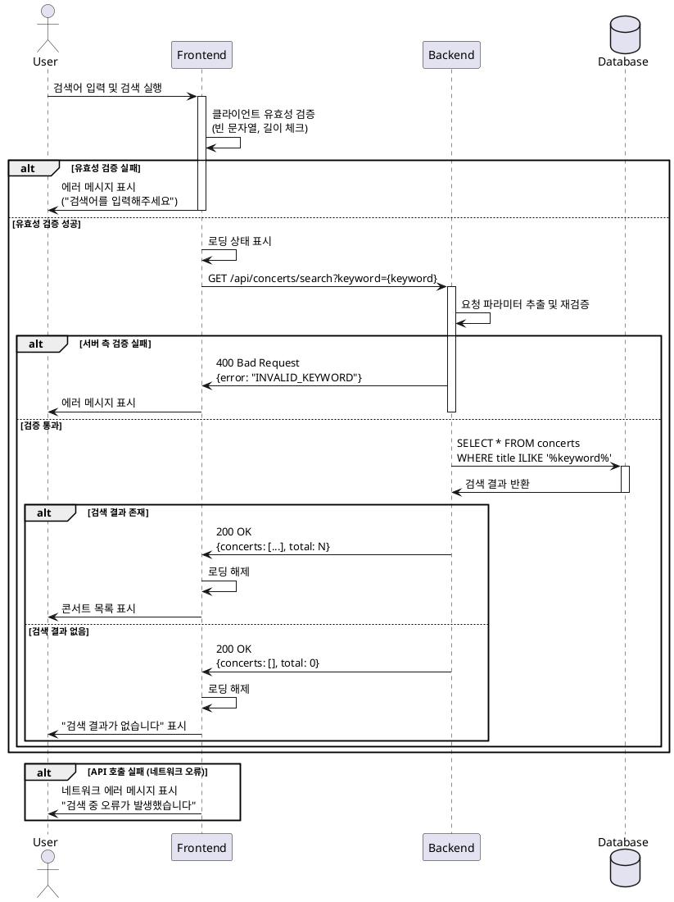

# UC-001: 키워드 검색

## 개요 (Overview)
사용자가 메인 페이지에서 콘서트 이름 키워드를 입력하여 원하는 콘서트를 검색하고, 일치하는 콘서트 목록을 확인하는 기능입니다.

## 목적 (Purpose)
- 사용자가 원하는 콘서트를 빠르게 찾을 수 있도록 지원
- 검색어 기반의 직관적인 탐색 경험 제공
- 비회원/회원 모두 사용 가능한 기본 검색 기능 제공

---

## Primary Actor
- **모든 사용자** (비회원 및 회원)

---

## Precondition (사전 조건)
- 사용자가 메인 페이지(콘서트 목록 페이지)에 접속한 상태
- 검색 UI(검색 입력창, 검색 버튼/아이콘)가 화면에 표시되어 있음

---

## Postcondition (사후 조건)
- **성공 시**: 키워드와 일치하는 콘서트 목록이 화면에 표시됨
- **실패 시**: 적절한 에러 메시지 또는 안내 문구가 표시됨

---

## Trigger (트리거)
- 사용자가 검색 입력창에 키워드를 입력하고 검색 버튼을 클릭하거나 Enter 키를 누름

---

## Main Scenario (주요 시나리오)

### 1. 사용자 입력
1. 사용자가 메인 페이지의 검색 입력창에 검색 키워드를 입력한다. (예: "제미니")
2. 사용자가 검색 실행을 요청한다.
   - 검색 아이콘/버튼 클릭
   - 또는 Enter 키 입력

### 2. 클라이언트 처리
1. 프론트엔드는 입력된 키워드를 가져온다.
2. 키워드의 기본 유효성을 검증한다.
   - 빈 문자열 검사
   - 공백만 포함된 문자열 검사
   - 최소/최대 길이 검증 (예: 1~100자)
3. 검증 통과 시, 로딩 상태를 표시하고 백엔드 API에 검색 요청을 전송한다.

```typescript
// API 요청 예시
GET /api/concerts/search?keyword={keyword}
```

### 3. 백엔드 처리
1. 백엔드는 요청 파라미터에서 키워드를 추출한다.
2. 키워드를 서버 측에서 재검증한다. (보안 및 데이터 무결성)
3. 데이터베이스에서 `concerts.title`을 기준으로 키워드를 포함하는 콘서트를 검색한다.
   - 대소문자 구분 없이 검색 (ILIKE)
   - 부분 일치 검색 지원 (예: "제미" 입력 시 "제미니" 콘서트 검색 가능)
4. 검색 결과를 JSON 형태로 클라이언트에 반환한다.

```sql
-- 예상 쿼리
SELECT id, title, created_at, updated_at
FROM concerts
WHERE title ILIKE '%{keyword}%'
ORDER BY created_at DESC;
```

### 4. 클라이언트 출력
1. 프론트엔드는 백엔드 응답을 받아 로딩 상태를 해제한다.
2. 검색 결과를 콘서트 카드 리스트 형태로 화면에 렌더링한다.
3. 각 콘서트 카드는 다음 정보를 표시한다.
   - 콘서트 이미지 (placeholder 사용 가능)
   - 콘서트 제목
   - 기타 메타 정보 (일시, 장소 등 - 향후 확장)

---

## Edge Cases (예외 상황)

### 1. 빈 검색어 입력
- **상황**: 사용자가 공백만 입력하거나 아무것도 입력하지 않고 검색
- **처리**:
  - 클라이언트 측에서 검증 실패
  - 검색 입력창 하단에 "검색어를 입력해주세요" 안내 메시지 표시
  - API 호출하지 않음

### 2. 검색 결과 없음
- **상황**: 입력한 키워드와 일치하는 콘서트가 없음
- **처리**:
  - 백엔드에서 빈 배열 반환 (HTTP 200 OK)
  - 프론트엔드에서 "검색 결과가 없습니다" 메시지와 함께 안내 UI 표시
  - 추천 검색어 또는 전체 콘서트 목록 표시 (선택적)

```json
// 응답 예시
{
  "success": true,
  "data": {
    "concerts": [],
    "total": 0
  }
}
```

### 3. API 호출 실패 (네트워크 오류, 서버 에러)
- **상황**: 네트워크 연결 끊김, 서버 5xx 에러, 타임아웃 등
- **처리**:
  - 로딩 상태 해제
  - 에러 메시지 표시: "검색 중 오류가 발생했습니다. 잠시 후 다시 시도해주세요."
  - 재시도 버튼 제공 (선택적)

### 4. 과도하게 긴 검색어
- **상황**: 사용자가 100자를 초과하는 검색어를 입력
- **처리**:
  - 클라이언트에서 최대 길이 제한 (예: 100자)
  - 입력 필드에서 자동으로 제한하거나 경고 메시지 표시

### 5. 특수문자 및 SQL Injection 시도
- **상황**: 악의적인 검색어 입력 시도
- **처리**:
  - 백엔드에서 파라미터화된 쿼리 사용 (Prepared Statement)
  - Supabase의 자동 이스케이핑 활용
  - 필요 시 특수문자 필터링 또는 서버 측 검증 강화

---

## API 스키마

### Request

**Endpoint**
```
GET /api/concerts/search
```

**Query Parameters**
```typescript
{
  keyword: string;  // 검색 키워드, required, 1~100자
}
```

**Headers**
```
Content-Type: application/json
```

---

### Response

**성공 응답 (200 OK)**
```typescript
{
  success: true;
  data: {
    concerts: Array<{
      id: string;           // uuid
      title: string;        // 콘서트 제목
      created_at: string;   // ISO 8601
      updated_at: string;   // ISO 8601
    }>;
    total: number;          // 검색 결과 총 개수
  }
}
```

**실패 응답 (400 Bad Request - 유효성 검증 실패)**
```typescript
{
  success: false;
  error: {
    code: "INVALID_KEYWORD";
    message: "검색어는 1자 이상 100자 이하여야 합니다.";
  }
}
```

**실패 응답 (500 Internal Server Error)**
```typescript
{
  success: false;
  error: {
    code: "INTERNAL_ERROR";
    message: "검색 중 오류가 발생했습니다.";
  }
}
```

---

## UI/UX 요구사항

### 검색 입력 UI
- **위치**: 메인 페이지 상단 또는 헤더 영역
- **구성 요소**:
  - 검색 입력창 (placeholder: "콘서트를 검색하세요")
  - 검색 버튼 또는 돋보기 아이콘
  - Enter 키 입력 지원
- **상태 표시**:
  - 입력 중: 기본 상태
  - 검증 실패: 입력창 하단에 빨간색 에러 메시지
  - 검색 중: 로딩 스피너 또는 버튼 비활성화

### 검색 결과 UI
- **성공 시**:
  - 콘서트 카드 그리드 레이아웃 (반응형)
  - 각 카드 클릭 시 콘서트 상세 페이지로 이동
- **결과 없음 시**:
  - 중앙 정렬된 안내 메시지
  - "검색 결과가 없습니다" 텍스트
  - (선택적) 전체 콘서트 목록 링크
- **에러 발생 시**:
  - 에러 메시지 표시
  - 재시도 버튼 제공

### 반응형 디자인
- **모바일**: 세로 1열 카드 배치, 검색창 전체 너비
- **태블릿**: 2~3열 카드 배치
- **데스크톱**: 3~4열 카드 배치

---

## 에러 처리 및 피드백

### 클라이언트 측 에러
1. **입력 유효성 검증 실패**
   - 피드백: 입력창 하단에 빨간색 텍스트로 에러 메시지 표시
   - 예시: "검색어를 입력해주세요", "검색어는 100자 이하여야 합니다"

2. **네트워크 연결 실패**
   - 피드백: Toast 알림 또는 모달로 "인터넷 연결을 확인해주세요" 메시지
   - 재시도 버튼 제공

### 서버 측 에러
1. **유효성 검증 실패 (400)**
   - 피드백: 서버에서 받은 에러 메시지를 그대로 표시
   - 로그: 클라이언트 콘솔에 경고 출력

2. **서버 내부 오류 (500)**
   - 피드백: 사용자 친화적 메시지 표시 ("일시적인 오류가 발생했습니다")
   - 로그: Sentry 등 에러 트래킹 시스템에 전송 (선택적)

### 로딩 상태 관리
- API 호출 중에는 반드시 로딩 상태를 표시하여 사용자가 대기 중임을 인지하도록 함
- 로딩 시간이 2초 이상 걸릴 경우 "잠시만 기다려주세요" 메시지 추가

---

## Business Rules (비즈니스 규칙)

1. **검색 범위**
   - 현재는 `concerts.title` 필드만 검색 대상
   - 향후 확장: 아티스트명, 장르, 장소 등으로 확장 가능

2. **검색어 처리**
   - 대소문자 구분 없음 (Case-insensitive)
   - 앞뒤 공백 자동 제거 (trim)
   - 부분 일치 검색 지원 (Partial match)

3. **성능 최적화**
   - `concerts.title` 컬럼에 인덱스 생성 권장 (GIN 또는 BTREE)
   - 검색 결과는 최대 100개로 제한 (페이지네이션 고려)
   - 디바운싱 적용 가능 (사용자가 입력을 멈춘 후 300ms 후 검색)

4. **보안**
   - 모든 입력값은 서버 측에서 재검증
   - SQL Injection 방지를 위해 파라미터화된 쿼리 사용
   - Rate Limiting 적용 (동일 IP에서 초당 최대 10회 요청)

5. **접근 권한**
   - 비회원/회원 모두 검색 가능
   - 인증 불필요 (Public API)

---

## Sequence Diagram



---

## 구현 참고사항

### Frontend (React + React Query)
```typescript
// hooks/useConcertSearch.ts
import { useQuery } from '@tanstack/react-query';
import { apiClient } from '@/lib/remote/api-client';

export const useConcertSearch = (keyword: string, enabled: boolean) => {
  return useQuery({
    queryKey: ['concerts', 'search', keyword],
    queryFn: async () => {
      const response = await apiClient.get('/api/concerts/search', {
        params: { keyword }
      });
      return response.data;
    },
    enabled: enabled && keyword.trim().length > 0,
    staleTime: 1000 * 60 * 5, // 5분
  });
};
```

### Backend (Hono + Supabase)
```typescript
// features/concert/backend/route.ts
import { Hono } from 'hono';
import { z } from 'zod';
import { searchConcertsByKeyword } from './service';

const searchSchema = z.object({
  keyword: z.string().min(1).max(100).trim(),
});

export const registerConcertSearchRoute = (app: Hono) => {
  app.get('/api/concerts/search', async (c) => {
    const { keyword } = searchSchema.parse(c.req.query());

    const result = await searchConcertsByKeyword(
      c.get('supabase'),
      keyword
    );

    if (!result.success) {
      return c.json(result, 500);
    }

    return c.json(result, 200);
  });
};
```

---

## 테스트 시나리오

### 단위 테스트
1. 입력 유효성 검증 함수 테스트
   - 빈 문자열 입력 시 false 반환
   - 공백만 포함된 문자열 입력 시 false 반환
   - 정상 키워드 입력 시 true 반환

2. API 클라이언트 함수 테스트
   - 올바른 엔드포인트 호출 확인
   - 쿼리 파라미터 인코딩 확인

### 통합 테스트
1. 키워드 검색 API 엔드포인트 테스트
   - 정상 키워드로 검색 시 200 응답 및 데이터 반환 확인
   - 일치하는 결과 없을 때 빈 배열 반환 확인
   - 유효하지 않은 키워드 입력 시 400 응답 확인

### E2E 테스트
1. 사용자가 검색창에 "제미니" 입력 후 검색
2. 로딩 스피너 표시 확인
3. 검색 결과 목록이 화면에 렌더링되는지 확인
4. 결과 없는 키워드 검색 시 "검색 결과가 없습니다" 메시지 표시 확인

---

## 향후 개선 사항
1. **자동완성 기능**: 입력 중 실시간으로 추천 키워드 표시
2. **검색 히스토리**: 최근 검색어 저장 및 재검색 기능
3. **필터 조합**: 키워드 + 날짜/장소/가격 범위 필터 결합
4. **전문 검색**: Postgres Full-Text Search 또는 Elasticsearch 도입
5. **검색 로그 수집**: 인기 검색어 분석 및 추천
