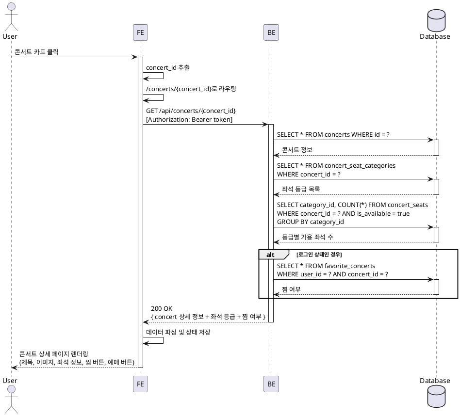

# UC-002: 콘서트 상세 정보 조회

## 개요
사용자가 콘서트 목록에서 특정 콘서트를 선택하여 상세 정보(제목, 설명, 날짜, 장소, 좌석 등급 정보 등)를 조회하고, 로그인 상태에 따라 찜하기 기능을 활용할 수 있는 기능입니다.

## Primary Actor
- 일반 사용자 (회원 / 비회원)

## Precondition
- 사용자가 메인 페이지의 콘서트 목록 화면에 접근한 상태
- 조회하려는 콘서트가 데이터베이스에 존재함

## Trigger
사용자가 메인 페이지의 콘서트 목록에서 특정 콘서트 아이템을 클릭

## Main Scenario

### 1. 콘서트 선택
**User → FE**
- 사용자가 메인 페이지에서 콘서트 카드를 클릭

**FE → FE**
- 선택된 콘서트의 고유 식별자(concert_id)를 추출
- 콘서트 상세 페이지로 라우팅 (`/concerts/{concert_id}`)

### 2. 상세 정보 요청
**FE → BE**
- `GET /api/concerts/{concert_id}` 요청
- 로그인 상태인 경우 인증 토큰을 헤더에 포함

**BE → Database**
- `concerts` 테이블에서 해당 `id`로 콘서트 기본 정보 조회
- `concert_seat_categories` 테이블에서 해당 콘서트의 좌석 등급 정보 조회
- `concert_seats` 테이블에서 등급별 좌석 수 집계
- 로그인된 경우, `favorite_concerts` 테이블에서 `(user_id, concert_id)` 존재 여부 확인

**Database → BE**
- 조회 결과 반환

**BE → FE**
- 상세 정보 및 찜 여부를 포함한 JSON 응답
```typescript
{
  id: string;
  title: string;
  description?: string;
  imageUrl?: string;
  performanceDate?: string;
  venue?: string;
  seatCategories: Array<{
    id: string;
    name: string;
    displayColor: string;
    price: number;
    availableSeats: number;
  }>;
  isFavorited: boolean; // 로그인 상태일 경우에만 유효
}
```

### 3. 화면 렌더링
**FE → User**
- 상세 페이지 UI에 데이터 표시
  - 콘서트 제목, 이미지, 설명
  - 공연 날짜, 장소
  - 좌석 등급별 정보 (등급명, 색상, 가격, 잔여 좌석)
- 로그인 상태에 따른 찜하기 버튼 표시
  - 로그인 O: 활성화 (찜 상태에 따라 아이콘 변경)
  - 로그인 X: 비활성화 또는 클릭 시 로그인 유도
- "예매하기" 버튼 표시

## Edge Cases

### E1. 존재하지 않는 콘서트 ID
**Scenario**: 유효하지 않거나 삭제된 콘서트 ID로 접근
```
User → FE: /concerts/{invalid_id} 접근
FE → BE: GET /api/concerts/{invalid_id}
BE → FE: 404 Not Found
FE → User: "콘서트를 찾을 수 없습니다" 메시지 표시
           또는 404 페이지로 리다이렉트
```

**처리**:
- BE: `{ error: "CONCERT_NOT_FOUND", message: "콘서트를 찾을 수 없습니다" }` 반환
- FE: 에러 페이지 표시 또는 메인 페이지로 리다이렉트 유도

### E2. API 호출 실패 (네트워크 오류, 서버 에러)
**Scenario**: 서버 통신 중 네트워크 오류 또는 5xx 에러 발생
```
User → FE: 콘서트 클릭
FE → BE: GET /api/concerts/{id}
BE → FE: 500 Internal Server Error 또는 타임아웃
FE → User: "일시적인 오류가 발생했습니다. 잠시 후 다시 시도해주세요"
           재시도 버튼 표시
```

**처리**:
- FE: 에러 상태 관리 및 에러 바운더리 표시
- 사용자에게 재시도 옵션 제공

### E3. 로그인 세션 만료
**Scenario**: 로그인 상태로 접근했으나 세션이 만료된 경우
```
User → FE: 콘서트 상세 조회 (로그인 상태)
FE → BE: GET /api/concerts/{id} (expired token)
BE → FE: 401 Unauthorized
FE → User: 찜 상태는 로그인 필요로 표시
           (상세 정보는 정상 표시)
```

**처리**:
- BE: 인증 실패 시에도 공개 정보는 반환하되 `isFavorited`는 `false` 처리
- FE: 찜하기 버튼 클릭 시 로그인 모달 표시

### E4. 데이터 부분 로딩 실패
**Scenario**: 메인 정보는 로드되었으나 좌석 정보 로딩 실패
```
User → FE: 콘서트 클릭
FE → BE: GET /api/concerts/{id}
BE: concerts 조회 성공, concert_seat_categories 조회 실패
BE → FE: 200 OK (seatCategories: [])
FE → User: 콘서트 기본 정보 표시
           좌석 정보 영역에 "좌석 정보를 불러올 수 없습니다" 표시
```

**처리**:
- BE: 부분 실패 시 가능한 데이터만 반환
- FE: 선택적으로 데이터 영역 표시

## Business Rules

### BR-1: 로그인 상태와 찜하기 기능
- 비로그인 사용자는 찜하기 버튼이 비활성화되거나 클릭 시 로그인 모달 표시
- 로그인 사용자만 찜하기 기능 사용 가능

### BR-2: 데이터 일관성
- 콘서트 삭제 시 연관된 좌석 정보도 cascade 삭제 (`concert_seat_categories`, `concert_seats`)
- 찜하기 정보는 `favorite_concerts`에서 (user_id, concert_id) 유니크 제약

### BR-3: 좌석 가용성 표시
- 좌석 등급별 잔여 좌석 수는 실시간 집계
  - 전체 좌석 수 - 활성 예약된 좌석 수
  - `is_active = true`인 `reservation_order_seats` 제외

### BR-4: 예매 가능 상태
- 좌석 정보가 없거나 모든 좌석이 매진된 경우에도 상세 정보는 표시
- "예매하기" 버튼은 비활성화하고 "매진" 상태 표시

## Sequence Diagram



## API Specification

### Request
```http
GET /api/concerts/{concert_id}
Authorization: Bearer {access_token} (optional)
```

### Response (Success)
```json
{
  "success": true,
  "data": {
    "id": "550e8400-e29b-41d4-a716-446655440000",
    "title": "제미니 콘서트 2025",
    "description": "제미니의 특별한 공연",
    "imageUrl": "https://picsum.photos/800/400",
    "performanceDate": "2025-06-15T19:00:00Z",
    "venue": "올림픽공원 체조경기장",
    "seatCategories": [
      {
        "id": "cat-001",
        "name": "VIP",
        "displayColor": "#FFD700",
        "price": 150000,
        "availableSeats": 42
      },
      {
        "id": "cat-002",
        "name": "R석",
        "displayColor": "#FF6B6B",
        "price": 120000,
        "availableSeats": 180
      }
    ],
    "isFavorited": false
  }
}
```

### Response (Error - Not Found)
```json
{
  "success": false,
  "error": {
    "code": "CONCERT_NOT_FOUND",
    "message": "콘서트를 찾을 수 없습니다"
  }
}
```

### Response (Error - Server Error)
```json
{
  "success": false,
  "error": {
    "code": "INTERNAL_SERVER_ERROR",
    "message": "서버 오류가 발생했습니다"
  }
}
```

## UI/UX Requirements

### Layout
```
┌─────────────────────────────────────────┐
│ Header (로고, 검색, 로그인/프로필)      │
├─────────────────────────────────────────┤
│                                         │
│  ┌───────────────────────────────────┐ │
│  │   콘서트 이미지 (16:9)            │ │
│  └───────────────────────────────────┘ │
│                                         │
│  제미니 콘서트 2025          [♡ 찜하기]│
│  ━━━━━━━━━━━━━━━━━━━━━━━━━━━━━━━━━━│
│                                         │
│  📅 2025년 6월 15일 19:00              │
│  📍 올림픽공원 체조경기장               │
│                                         │
│  공연 소개                              │
│  제미니의 특별한 2025년 콘서트입니다... │
│                                         │
│  좌석 등급 정보                         │
│  ┌──────────────────────────────────┐ │
│  │ 🟡 VIP석    150,000원  잔여 42석│ │
│  │ 🔴 R석      120,000원  잔여 180석│ │
│  │ 🔵 S석       90,000원  잔여 256석│ │
│  └──────────────────────────────────┘ │
│                                         │
│          [예매하기] 버튼                │
│                                         │
└─────────────────────────────────────────┘
```

### Interactive Elements

**찜하기 버튼**
- 비로그인: 회색 하트 아이콘, 클릭 시 로그인 모달
- 로그인 (찜 X): 빈 하트 아이콘, 클릭 시 찜 추가
- 로그인 (찜 O): 채워진 하트 아이콘, 클릭 시 찜 제거

**예매하기 버튼**
- 기본: Primary 색상, 크게 표시
- 매진: 비활성화, "매진" 텍스트 표시
- 클릭: 좌석 선택 페이지로 이동

### Loading State
```
┌─────────────────────────────────────────┐
│  ┌───────────────────────────────────┐ │
│  │   [이미지 스켈레톤]               │ │
│  └───────────────────────────────────┘ │
│                                         │
│  [제목 스켈레톤]            [버튼 스켈레톤]│
│  ━━━━━━━━━━━━━━━━━━━━━━━━━━━━━━━━━━│
│  [정보 스켈레톤 라인 1]                │
│  [정보 스켈레톤 라인 2]                │
│  ...                                    │
└─────────────────────────────────────────┘
```

### Error State
```
┌─────────────────────────────────────────┐
│            ⚠️                           │
│                                         │
│      콘서트를 찾을 수 없습니다          │
│                                         │
│   요청하신 콘서트가 존재하지 않거나     │
│   삭제되었습니다.                       │
│                                         │
│        [메인으로 돌아가기]              │
│                                         │
└─────────────────────────────────────────┘
```

## Error Handling & Feedback

### Client-Side Validation
- URL 파라미터 검증: concert_id가 UUID 형식인지 확인
- 형식 오류 시 즉시 404 페이지 표시

### Network Error Handling
```typescript
try {
  const concert = await fetchConcertDetail(concertId);
  // 성공 처리
} catch (error) {
  if (error.code === 'CONCERT_NOT_FOUND') {
    // 404 페이지 표시
    router.push('/404');
  } else if (error.code === 'UNAUTHORIZED') {
    // 인증 만료, 찜 기능만 비활성화
    showLoginPrompt();
  } else {
    // 일반 오류
    showErrorToast('콘서트 정보를 불러올 수 없습니다. 다시 시도해주세요.');
  }
}
```

### User Feedback
- **Loading**: 스켈레톤 UI로 로딩 상태 표시
- **Success**: 자연스러운 페이지 전환 및 데이터 표시
- **Error**:
  - Toast 메시지 (일시적 오류)
  - 전체 페이지 에러 화면 (치명적 오류)
  - 재시도 버튼 제공

### Retry Logic
- 네트워크 오류 시 자동 재시도 (최대 2회)
- 실패 시 수동 재시도 버튼 제공

## Implementation Notes

### Frontend (React Query)
```typescript
// hooks/useConcertDetail.ts
export const useConcertDetail = (concertId: string) => {
  return useQuery({
    queryKey: ['concert', concertId],
    queryFn: () => apiClient.get(`/api/concerts/${concertId}`),
    retry: 2,
    staleTime: 1000 * 60 * 5, // 5분
  });
};
```

### Backend (Hono)
```typescript
// features/concert/backend/route.ts
app.get('/api/concerts/:id', async (c) => {
  const concertId = c.req.param('id');
  const userId = c.get('userId'); // 인증된 경우에만 존재

  const concert = await getConcertDetailService(c.get('supabase'), {
    concertId,
    userId,
  });

  if (!concert) {
    return c.json({ error: 'CONCERT_NOT_FOUND', message: '콘서트를 찾을 수 없습니다' }, 404);
  }

  return c.json({ success: true, data: concert });
});
```

### Database Queries
```sql
-- 콘서트 기본 정보
SELECT * FROM concerts WHERE id = $1;

-- 좌석 등급 정보
SELECT
  csc.id,
  csc.name,
  csc.display_color,
  csc.price,
  COUNT(cs.id) as total_seats,
  COUNT(cs.id) FILTER (
    WHERE NOT EXISTS (
      SELECT 1 FROM reservation_order_seats ros
      WHERE ros.seat_id = cs.id AND ros.is_active = true
    )
  ) as available_seats
FROM concert_seat_categories csc
LEFT JOIN concert_seats cs ON cs.category_id = csc.id
WHERE csc.concert_id = $1
GROUP BY csc.id;

-- 찜 여부 (로그인 시)
SELECT EXISTS(
  SELECT 1 FROM favorite_concerts
  WHERE user_id = $1 AND concert_id = $2
);
```

## Related Use Cases
- **UC-001**: 키워드 검색 (이전 단계)
- **UC-003**: 찜하기 (회원) (연관 기능)
- **UC-005**: 좌석 선택 (다음 단계)

## Acceptance Criteria
- [ ] 콘서트 상세 정보가 정확하게 표시됨
- [ ] 좌석 등급별 잔여 좌석 수가 실시간으로 반영됨
- [ ] 로그인 상태에 따라 찜하기 버튼이 적절히 동작함
- [ ] 존재하지 않는 콘서트 접근 시 404 처리됨
- [ ] 네트워크 오류 시 적절한 에러 메시지가 표시됨
- [ ] 로딩 중 스켈레톤 UI가 표시됨
- [ ] 모바일/데스크탑에서 모두 정상 작동함
- [ ] 매진된 콘서트의 경우 예매 버튼이 비활성화됨
