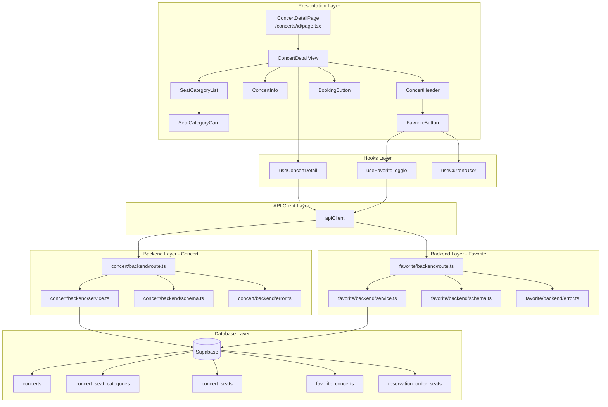

# UC-002: 콘서트 상세 페이지 - 상세 설계

## 1. 개요

### 1.1 목적
사용자가 메인 페이지에서 특정 콘서트를 선택하여 상세 정보(제목, 설명, 날짜, 장소, 좌석 등급 정보 등)를 조회하고, 로그인 상태에 따라 찜하기 기능을 사용하며, 예매를 시작할 수 있는 페이지를 구현합니다.

### 1.2 주요 기능
- 콘서트 상세 정보 조회 및 표시
- 로그인 상태에 따른 찜하기 기능
- 좌석 등급별 가격 및 잔여 좌석 정보 표시
- 예매하기 버튼을 통한 좌석 선택 페이지 진입

### 1.3 라우팅 경로
- **페이지 경로**: `/concerts/[id]`
- **API 엔드포인트**: `GET /api/concerts/:id`, `POST /api/favorites/toggle`

---

## 2. 모듈 구조 설계

### 2.1 모듈 개요

| 모듈명 | 위치 | 설명 |
|--------|------|------|
| **ConcertDetailPage** | `src/app/concerts/[id]/page.tsx` | 콘서트 상세 페이지 컴포넌트 |
| **ConcertDetailView** | `src/features/concert/components/concert-detail-view.tsx` | 상세 정보 표시 메인 컨테이너 |
| **ConcertHeader** | `src/features/concert/components/concert-header.tsx` | 콘서트 이미지, 제목, 찜하기 버튼 |
| **ConcertInfo** | `src/features/concert/components/concert-info.tsx` | 날짜, 장소, 설명 정보 |
| **SeatCategoryList** | `src/features/concert/components/seat-category-list.tsx` | 좌석 등급별 정보 목록 |
| **SeatCategoryCard** | `src/features/concert/components/seat-category-card.tsx` | 개별 좌석 등급 카드 |
| **BookingButton** | `src/features/concert/components/booking-button.tsx` | 예매하기 버튼 |
| **FavoriteButton** | `src/features/favorite/components/favorite-button.tsx` | 찜하기 토글 버튼 (재사용 가능) |
| **useConcertDetail** | `src/features/concert/hooks/useConcertDetail.ts` | 콘서트 상세 조회 React Query 훅 |
| **useFavoriteToggle** | `src/features/favorite/hooks/useFavoriteToggle.ts` | 찜하기 토글 React Query 훅 |
| **concert/backend/route** | `src/features/concert/backend/route.ts` | 콘서트 관련 API 라우트 |
| **concert/backend/service** | `src/features/concert/backend/service.ts` | 콘서트 비즈니스 로직 |
| **concert/backend/schema** | `src/features/concert/backend/schema.ts` | 요청/응답 zod 스키마 |
| **concert/backend/error** | `src/features/concert/backend/error.ts` | 콘서트 에러 코드 정의 |
| **favorite/backend/route** | `src/features/favorite/backend/route.ts` | 찜하기 API 라우트 |
| **favorite/backend/service** | `src/features/favorite/backend/service.ts` | 찜하기 비즈니스 로직 |
| **favorite/backend/schema** | `src/features/favorite/backend/schema.ts` | 찜하기 요청/응답 스키마 |
| **favorite/backend/error** | `src/features/favorite/backend/error.ts` | 찜하기 에러 코드 |

### 2.2 모듈 다이어그램



---

## 3. Implementation Plan

### 3.1 Backend Layer

#### 3.1.1 Concert Feature - Error Codes
**파일**: `src/features/concert/backend/error.ts`

```typescript
export const concertErrorCodes = {
  notFound: 'CONCERT_NOT_FOUND',
  fetchError: 'CONCERT_FETCH_ERROR',
  validationError: 'CONCERT_VALIDATION_ERROR',
  seatInfoError: 'SEAT_INFO_FETCH_ERROR',
} as const;

type ConcertErrorValue = (typeof concertErrorCodes)[keyof typeof concertErrorCodes];

export type ConcertServiceError = ConcertErrorValue;
```

**Unit Test Plan**:
- ✅ `concertErrorCodes` 객체가 정의된 모든 에러 코드를 포함하는지 확인
- ✅ 에러 코드 타입이 문자열 리터럴 타입으로 제대로 추론되는지 확인

---

#### 3.1.2 Concert Feature - Schema
**파일**: `src/features/concert/backend/schema.ts`

```typescript
import { z } from 'zod';

// URL 파라미터 검증
export const ConcertIdParamSchema = z.object({
  id: z.string().uuid({ message: 'Concert id must be a valid UUID.' }),
});

export type ConcertIdParam = z.infer<typeof ConcertIdParamSchema>;

// 좌석 등급 스키마
export const SeatCategorySchema = z.object({
  id: z.string().uuid(),
  name: z.string(),
  displayColor: z.string(),
  price: z.number().nonnegative(),
  availableSeats: z.number().int().nonnegative(),
  totalSeats: z.number().int().nonnegative(),
});

export type SeatCategory = z.infer<typeof SeatCategorySchema>;

// 콘서트 상세 응답 스키마
export const ConcertDetailResponseSchema = z.object({
  id: z.string().uuid(),
  title: z.string(),
  description: z.string().nullable(),
  imageUrl: z.string().nullable(),
  performanceDate: z.string().nullable(),
  venue: z.string().nullable(),
  seatCategories: z.array(SeatCategorySchema),
  isFavorited: z.boolean(),
  totalAvailableSeats: z.number().int().nonnegative(),
});

export type ConcertDetailResponse = z.infer<typeof ConcertDetailResponseSchema>;

// DB Row 스키마
export const ConcertTableRowSchema = z.object({
  id: z.string().uuid(),
  title: z.string(),
  description: z.string().nullable(),
  image_url: z.string().nullable(),
  performance_date: z.string().nullable(),
  venue: z.string().nullable(),
  created_at: z.string(),
  updated_at: z.string(),
});

export type ConcertRow = z.infer<typeof ConcertTableRowSchema>;

export const SeatCategoryRowSchema = z.object({
  id: z.string().uuid(),
  concert_id: z.string().uuid(),
  name: z.string(),
  display_color: z.string(),
  price: z.string(), // numeric from DB
  total_seats: z.number().int().nonnegative(),
  available_seats: z.number().int().nonnegative(),
});

export type SeatCategoryRow = z.infer<typeof SeatCategoryRowSchema>;
```

**Unit Test Plan**:
- ✅ `ConcertIdParamSchema`가 유효한 UUID를 통과시키는지 확인
- ✅ `ConcertIdParamSchema`가 잘못된 UUID를 거부하는지 확인
- ✅ `ConcertDetailResponseSchema`가 모든 필수 필드를 검증하는지 확인
- ✅ `SeatCategorySchema`가 음수 가격/좌석을 거부하는지 확인

---

#### 3.1.3 Concert Feature - Service
**파일**: `src/features/concert/backend/service.ts`

```typescript
import type { SupabaseClient } from '@supabase/supabase-js';
import {
  failure,
  success,
  type HandlerResult,
} from '@/backend/http/response';
import {
  ConcertDetailResponseSchema,
  ConcertTableRowSchema,
  SeatCategoryRowSchema,
  type ConcertDetailResponse,
  type ConcertRow,
  type SeatCategoryRow,
} from './schema';
import {
  concertErrorCodes,
  type ConcertServiceError,
} from './error';

const CONCERTS_TABLE = 'concerts';
const SEAT_CATEGORIES_TABLE = 'concert_seat_categories';
const SEATS_TABLE = 'concert_seats';
const RESERVATION_SEATS_TABLE = 'reservation_order_seats';
const FAVORITES_TABLE = 'favorite_concerts';

const fallbackImage = (id: string) =>
  `https://picsum.photos/seed/${encodeURIComponent(id)}/800/400`;

/**
 * 콘서트 상세 정보를 조회합니다.
 * @param client - Supabase 클라이언트
 * @param concertId - 조회할 콘서트 ID
 * @param userId - 로그인한 사용자 ID (optional)
 */
export const getConcertDetailById = async (
  client: SupabaseClient,
  concertId: string,
  userId?: string,
): Promise<HandlerResult<ConcertDetailResponse, ConcertServiceError, unknown>> => {
  // 1. 콘서트 기본 정보 조회
  const { data: concertData, error: concertError } = await client
    .from(CONCERTS_TABLE)
    .select('id, title, description, image_url, performance_date, venue, created_at, updated_at')
    .eq('id', concertId)
    .maybeSingle<ConcertRow>();

  if (concertError) {
    return failure(500, concertErrorCodes.fetchError, concertError.message);
  }

  if (!concertData) {
    return failure(404, concertErrorCodes.notFound, 'Concert not found');
  }

  const concertRowParse = ConcertTableRowSchema.safeParse(concertData);

  if (!concertRowParse.success) {
    return failure(
      500,
      concertErrorCodes.validationError,
      'Concert row failed validation.',
      concertRowParse.error.format(),
    );
  }

  // 2. 좌석 등급 정보 조회 (가용 좌석 수 포함)
  const { data: categoriesData, error: categoriesError } = await client
    .rpc('get_concert_seat_availability', { p_concert_id: concertId });

  if (categoriesError) {
    // 좌석 정보 조회 실패 시에도 기본 정보는 반환 (빈 배열)
    console.error('Failed to fetch seat categories:', categoriesError);
  }

  const seatCategories: SeatCategoryRow[] = categoriesData || [];

  // 3. 찜 여부 확인 (로그인한 경우에만)
  let isFavorited = false;

  if (userId) {
    const { data: favData, error: favError } = await client
      .from(FAVORITES_TABLE)
      .select('id')
      .eq('user_id', userId)
      .eq('concert_id', concertId)
      .maybeSingle();

    if (!favError && favData) {
      isFavorited = true;
    }
  }

  // 4. 응답 매핑
  const mappedCategories = seatCategories.map((cat) => ({
    id: cat.id,
    name: cat.name,
    displayColor: cat.display_color,
    price: parseFloat(cat.price),
    availableSeats: cat.available_seats,
    totalSeats: cat.total_seats,
  }));

  const totalAvailableSeats = mappedCategories.reduce(
    (sum, cat) => sum + cat.availableSeats,
    0,
  );

  const response: ConcertDetailResponse = {
    id: concertRowParse.data.id,
    title: concertRowParse.data.title,
    description: concertRowParse.data.description,
    imageUrl: concertRowParse.data.image_url ?? fallbackImage(concertRowParse.data.id),
    performanceDate: concertRowParse.data.performance_date,
    venue: concertRowParse.data.venue,
    seatCategories: mappedCategories,
    isFavorited,
    totalAvailableSeats,
  };

  const parsed = ConcertDetailResponseSchema.safeParse(response);

  if (!parsed.success) {
    return failure(
      500,
      concertErrorCodes.validationError,
      'Concert detail response failed validation.',
      parsed.error.format(),
    );
  }

  return success(parsed.data);
};
```

**Unit Test Plan**:
- ✅ 존재하는 콘서트 ID로 조회 시 성공 응답 반환
- ✅ 존재하지 않는 콘서트 ID로 조회 시 404 에러 반환
- ✅ 로그인 사용자의 찜 여부가 정확하게 반영되는지 확인
- ✅ 비로그인 사용자의 경우 `isFavorited`가 `false`로 반환되는지 확인
- ✅ 좌석 정보 조회 실패 시에도 기본 정보는 반환되는지 확인
- ✅ DB 에러 발생 시 500 에러 반환 확인

---

#### 3.1.4 Concert Feature - Route
**파일**: `src/features/concert/backend/route.ts`

```typescript
import type { Hono } from 'hono';
import {
  failure,
  respond,
  type ErrorResult,
} from '@/backend/http/response';
import {
  getLogger,
  getSupabase,
  type AppEnv,
} from '@/backend/hono/context';
import { ConcertIdParamSchema } from './schema';
import { getConcertDetailById } from './service';
import {
  concertErrorCodes,
  type ConcertServiceError,
} from './error';

export const registerConcertRoutes = (app: Hono<AppEnv>) => {
  /**
   * 콘서트 상세 조회
   * GET /api/concerts/:id
   */
  app.get('/api/concerts/:id', async (c) => {
    const parsedParams = ConcertIdParamSchema.safeParse({
      id: c.req.param('id'),
    });

    if (!parsedParams.success) {
      return respond(
        c,
        failure(
          400,
          'INVALID_CONCERT_ID',
          'The provided concert id is invalid.',
          parsedParams.error.format(),
        ),
      );
    }

    const supabase = getSupabase(c);
    const logger = getLogger(c);

    // 인증된 사용자 ID 추출 (optional)
    const userId = c.get('userId') as string | undefined;

    const result = await getConcertDetailById(
      supabase,
      parsedParams.data.id,
      userId,
    );

    if (!result.ok) {
      const errorResult = result as ErrorResult<ConcertServiceError, unknown>;

      if (errorResult.error.code === concertErrorCodes.notFound) {
        logger.info(`Concert not found: ${parsedParams.data.id}`);
      } else if (errorResult.error.code === concertErrorCodes.fetchError) {
        logger.error('Failed to fetch concert', errorResult.error.message);
      }

      return respond(c, result);
    }

    return respond(c, result);
  });
};
```

**Unit Test Plan**:
- ✅ 유효한 UUID로 요청 시 200 응답 반환
- ✅ 잘못된 UUID로 요청 시 400 에러 반환
- ✅ 존재하지 않는 콘서트 ID로 요청 시 404 에러 반환
- ✅ 인증 토큰이 있는 경우 `userId`가 전달되는지 확인
- ✅ 서버 에러 발생 시 500 에러 반환

---

#### 3.1.5 Favorite Feature - Error Codes
**파일**: `src/features/favorite/backend/error.ts`

```typescript
export const favoriteErrorCodes = {
  unauthorized: 'FAVORITE_UNAUTHORIZED',
  concertNotFound: 'FAVORITE_CONCERT_NOT_FOUND',
  toggleError: 'FAVORITE_TOGGLE_ERROR',
  validationError: 'FAVORITE_VALIDATION_ERROR',
} as const;

type FavoriteErrorValue = (typeof favoriteErrorCodes)[keyof typeof favoriteErrorCodes];

export type FavoriteServiceError = FavoriteErrorValue;
```

---

#### 3.1.6 Favorite Feature - Schema
**파일**: `src/features/favorite/backend/schema.ts`

```typescript
import { z } from 'zod';

export const FavoriteToggleRequestSchema = z.object({
  concertId: z.string().uuid({ message: 'Concert id must be a valid UUID.' }),
});

export type FavoriteToggleRequest = z.infer<typeof FavoriteToggleRequestSchema>;

export const FavoriteToggleResponseSchema = z.object({
  isFavorited: z.boolean(),
  message: z.string(),
});

export type FavoriteToggleResponse = z.infer<typeof FavoriteToggleResponseSchema>;
```

---

#### 3.1.7 Favorite Feature - Service
**파일**: `src/features/favorite/backend/service.ts`

```typescript
import type { SupabaseClient } from '@supabase/supabase-js';
import {
  failure,
  success,
  type HandlerResult,
} from '@/backend/http/response';
import {
  FavoriteToggleResponseSchema,
  type FavoriteToggleResponse,
} from './schema';
import {
  favoriteErrorCodes,
  type FavoriteServiceError,
} from './error';

const FAVORITES_TABLE = 'favorite_concerts';
const CONCERTS_TABLE = 'concerts';

/**
 * 찜하기 토글 기능
 * @param client - Supabase 클라이언트
 * @param userId - 로그인한 사용자 ID
 * @param concertId - 콘서트 ID
 */
export const toggleFavorite = async (
  client: SupabaseClient,
  userId: string,
  concertId: string,
): Promise<HandlerResult<FavoriteToggleResponse, FavoriteServiceError, unknown>> => {
  // 1. 콘서트 존재 여부 확인
  const { data: concertExists, error: concertCheckError } = await client
    .from(CONCERTS_TABLE)
    .select('id')
    .eq('id', concertId)
    .maybeSingle();

  if (concertCheckError) {
    return failure(500, favoriteErrorCodes.toggleError, concertCheckError.message);
  }

  if (!concertExists) {
    return failure(404, favoriteErrorCodes.concertNotFound, 'Concert not found');
  }

  // 2. 기존 찜 여부 확인
  const { data: existingFavorite, error: checkError } = await client
    .from(FAVORITES_TABLE)
    .select('id')
    .eq('user_id', userId)
    .eq('concert_id', concertId)
    .maybeSingle();

  if (checkError) {
    return failure(500, favoriteErrorCodes.toggleError, checkError.message);
  }

  let isFavorited: boolean;
  let message: string;

  // 3. 토글 처리
  if (existingFavorite) {
    // 찜 제거
    const { error: deleteError } = await client
      .from(FAVORITES_TABLE)
      .delete()
      .eq('id', existingFavorite.id);

    if (deleteError) {
      return failure(500, favoriteErrorCodes.toggleError, deleteError.message);
    }

    isFavorited = false;
    message = 'Favorite removed';
  } else {
    // 찜 추가
    const { error: insertError } = await client
      .from(FAVORITES_TABLE)
      .insert({
        user_id: userId,
        concert_id: concertId,
      });

    if (insertError) {
      return failure(500, favoriteErrorCodes.toggleError, insertError.message);
    }

    isFavorited = true;
    message = 'Favorite added';
  }

  const response: FavoriteToggleResponse = {
    isFavorited,
    message,
  };

  const parsed = FavoriteToggleResponseSchema.safeParse(response);

  if (!parsed.success) {
    return failure(
      500,
      favoriteErrorCodes.validationError,
      'Favorite toggle response failed validation.',
      parsed.error.format(),
    );
  }

  return success(parsed.data);
};
```

**Unit Test Plan**:
- ✅ 찜하지 않은 콘서트 토글 시 찜 추가 (`isFavorited: true`)
- ✅ 이미 찜한 콘서트 토글 시 찜 제거 (`isFavorited: false`)
- ✅ 존재하지 않는 콘서트 토글 시 404 에러 반환
- ✅ DB 에러 발생 시 500 에러 반환

---

#### 3.1.8 Favorite Feature - Route
**파일**: `src/features/favorite/backend/route.ts`

```typescript
import type { Hono } from 'hono';
import {
  failure,
  respond,
  type ErrorResult,
} from '@/backend/http/response';
import {
  getLogger,
  getSupabase,
  type AppEnv,
} from '@/backend/hono/context';
import { FavoriteToggleRequestSchema } from './schema';
import { toggleFavorite } from './service';
import {
  favoriteErrorCodes,
  type FavoriteServiceError,
} from './error';

export const registerFavoriteRoutes = (app: Hono<AppEnv>) => {
  /**
   * 찜하기 토글
   * POST /api/favorites/toggle
   * 로그인 필수
   */
  app.post('/api/favorites/toggle', async (c) => {
    const userId = c.get('userId') as string | undefined;

    if (!userId) {
      return respond(
        c,
        failure(401, favoriteErrorCodes.unauthorized, 'Login required'),
      );
    }

    const body = await c.req.json();
    const parsedBody = FavoriteToggleRequestSchema.safeParse(body);

    if (!parsedBody.success) {
      return respond(
        c,
        failure(
          400,
          'INVALID_FAVORITE_REQUEST',
          'Invalid request body',
          parsedBody.error.format(),
        ),
      );
    }

    const supabase = getSupabase(c);
    const logger = getLogger(c);

    const result = await toggleFavorite(
      supabase,
      userId,
      parsedBody.data.concertId,
    );

    if (!result.ok) {
      const errorResult = result as ErrorResult<FavoriteServiceError, unknown>;

      if (errorResult.error.code === favoriteErrorCodes.concertNotFound) {
        logger.info(`Concert not found for favorite: ${parsedBody.data.concertId}`);
      } else if (errorResult.error.code === favoriteErrorCodes.toggleError) {
        logger.error('Failed to toggle favorite', errorResult.error.message);
      }

      return respond(c, result);
    }

    return respond(c, result);
  });
};
```

**Unit Test Plan**:
- ✅ 인증된 사용자로 요청 시 정상 처리
- ✅ 비인증 요청 시 401 에러 반환
- ✅ 잘못된 요청 바디로 요청 시 400 에러 반환

---

#### 3.1.9 Database Function for Seat Availability
**파일**: `supabase/migrations/YYYYMMDDHHMMSS_add_seat_availability_function.sql`

```sql
-- 콘서트별 좌석 등급 가용성을 계산하는 함수
CREATE OR REPLACE FUNCTION get_concert_seat_availability(p_concert_id UUID)
RETURNS TABLE (
  id UUID,
  concert_id UUID,
  name TEXT,
  display_color TEXT,
  price NUMERIC(10,2),
  total_seats BIGINT,
  available_seats BIGINT
) AS $$
BEGIN
  RETURN QUERY
  SELECT
    csc.id,
    csc.concert_id,
    csc.name,
    csc.display_color,
    csc.price,
    COUNT(cs.id) AS total_seats,
    COUNT(cs.id) FILTER (
      WHERE NOT EXISTS (
        SELECT 1 FROM reservation_order_seats ros
        WHERE ros.seat_id = cs.id AND ros.is_active = true
      )
    ) AS available_seats
  FROM concert_seat_categories csc
  LEFT JOIN concert_seats cs ON cs.category_id = csc.id
  WHERE csc.concert_id = p_concert_id
  GROUP BY csc.id, csc.concert_id, csc.name, csc.display_color, csc.price
  ORDER BY csc.price DESC;
END;
$$ LANGUAGE plpgsql;

COMMENT ON FUNCTION get_concert_seat_availability IS '콘서트별 좌석 등급 정보와 가용 좌석 수를 반환합니다.';
```

---

### 3.2 Frontend Layer

#### 3.2.1 DTO Export
**파일**: `src/features/concert/lib/dto.ts`

```typescript
export {
  ConcertIdParamSchema,
  ConcertDetailResponseSchema,
  SeatCategorySchema,
  type ConcertIdParam,
  type ConcertDetailResponse,
  type SeatCategory,
} from '@/features/concert/backend/schema';
```

**파일**: `src/features/favorite/lib/dto.ts`

```typescript
export {
  FavoriteToggleRequestSchema,
  FavoriteToggleResponseSchema,
  type FavoriteToggleRequest,
  type FavoriteToggleResponse,
} from '@/features/favorite/backend/schema';
```

---

#### 3.2.2 React Query Hooks

**파일**: `src/features/concert/hooks/useConcertDetail.ts`

```typescript
'use client';

import { useQuery } from '@tanstack/react-query';
import { apiClient, extractApiErrorMessage } from '@/lib/remote/api-client';
import { ConcertDetailResponseSchema } from '@/features/concert/lib/dto';

const fetchConcertDetail = async (concertId: string) => {
  try {
    const { data } = await apiClient.get(`/api/concerts/${concertId}`);
    return ConcertDetailResponseSchema.parse(data);
  } catch (error) {
    const message = extractApiErrorMessage(error, 'Failed to fetch concert detail.');
    throw new Error(message);
  }
};

export const useConcertDetail = (concertId: string) =>
  useQuery({
    queryKey: ['concert', concertId],
    queryFn: () => fetchConcertDetail(concertId),
    enabled: Boolean(concertId),
    staleTime: 5 * 60 * 1000, // 5분
    retry: 2,
  });
```

**QA Sheet**:

| Test Case | Input | Expected Output | Notes |
|-----------|-------|-----------------|-------|
| 정상 조회 | 유효한 concertId | `{ data: ConcertDetailResponse }` | 콘서트 정보 반환 |
| 존재하지 않는 콘서트 | 존재하지 않는 ID | `{ error: Error }` | 404 에러 메시지 |
| 네트워크 오류 | 네트워크 타임아웃 | `{ error: Error }` | 재시도 후 실패 |
| concertId 없음 | 빈 문자열 | `{ status: 'pending', enabled: false }` | 쿼리 비활성화 |

---

**파일**: `src/features/favorite/hooks/useFavoriteToggle.ts`

```typescript
'use client';

import { useMutation, useQueryClient } from '@tanstack/react-query';
import { apiClient, extractApiErrorMessage } from '@/lib/remote/api-client';
import {
  FavoriteToggleRequestSchema,
  FavoriteToggleResponseSchema,
} from '@/features/favorite/lib/dto';

const toggleFavorite = async (concertId: string) => {
  try {
    const payload = FavoriteToggleRequestSchema.parse({ concertId });
    const { data } = await apiClient.post('/api/favorites/toggle', payload);
    return FavoriteToggleResponseSchema.parse(data);
  } catch (error) {
    const message = extractApiErrorMessage(error, 'Failed to toggle favorite.');
    throw new Error(message);
  }
};

export const useFavoriteToggle = () => {
  const queryClient = useQueryClient();

  return useMutation({
    mutationFn: toggleFavorite,
    onSuccess: (data, concertId) => {
      // 콘서트 상세 쿼리 무효화하여 최신 찜 상태 반영
      queryClient.invalidateQueries({ queryKey: ['concert', concertId] });
      // 마이페이지 찜 목록 무효화
      queryClient.invalidateQueries({ queryKey: ['favorites'] });
    },
  });
};
```

**QA Sheet**:

| Test Case | Input | Expected Output | Notes |
|-----------|-------|-----------------|-------|
| 찜하기 추가 | 찜하지 않은 콘서트 ID | `{ isFavorited: true }` | 찜 추가 성공 |
| 찜하기 제거 | 이미 찜한 콘서트 ID | `{ isFavorited: false }` | 찜 제거 성공 |
| 비로그인 상태 | concertId | `{ error: Error }` | 401 에러 메시지 |
| 잘못된 ID | 잘못된 UUID | `{ error: Error }` | 400 에러 메시지 |

---

#### 3.2.3 UI Components

**파일**: `src/features/concert/components/concert-detail-view.tsx`

```typescript
'use client';

import { useConcertDetail } from '@/features/concert/hooks/useConcertDetail';
import { ConcertHeader } from './concert-header';
import { ConcertInfo } from './concert-info';
import { SeatCategoryList } from './seat-category-list';
import { BookingButton } from './booking-button';
import { Skeleton } from '@/components/ui/skeleton';
import { Alert, AlertDescription } from '@/components/ui/alert';
import { Button } from '@/components/ui/button';

interface ConcertDetailViewProps {
  concertId: string;
}

export const ConcertDetailView = ({ concertId }: ConcertDetailViewProps) => {
  const { data, status, error, refetch } = useConcertDetail(concertId);

  if (status === 'pending') {
    return <ConcertDetailSkeleton />;
  }

  if (status === 'error') {
    return (
      <div className="flex min-h-[400px] items-center justify-center">
        <Alert variant="destructive" className="max-w-md">
          <AlertDescription className="space-y-4">
            <p>{error instanceof Error ? error.message : '콘서트 정보를 불러올 수 없습니다.'}</p>
            <Button onClick={() => refetch()} variant="outline" size="sm">
              다시 시도
            </Button>
          </AlertDescription>
        </Alert>
      </div>
    );
  }

  if (!data) {
    return null;
  }

  return (
    <div className="mx-auto max-w-4xl space-y-6 p-4">
      <ConcertHeader concert={data} />
      <ConcertInfo concert={data} />
      <SeatCategoryList categories={data.seatCategories} />
      <BookingButton
        concertId={data.id}
        isAvailable={data.totalAvailableSeats > 0}
      />
    </div>
  );
};

const ConcertDetailSkeleton = () => (
  <div className="mx-auto max-w-4xl space-y-6 p-4">
    <Skeleton className="h-[400px] w-full rounded-xl" />
    <Skeleton className="h-12 w-3/4" />
    <Skeleton className="h-6 w-1/2" />
    <Skeleton className="h-6 w-1/2" />
    <Skeleton className="h-32 w-full" />
    <Skeleton className="h-12 w-full" />
  </div>
);
```

**QA Sheet**:

| Test Case | Expected Behavior |
|-----------|-------------------|
| 로딩 상태 | 스켈레톤 UI 표시 |
| 에러 상태 | 에러 메시지 + 재시도 버튼 표시 |
| 성공 상태 | 콘서트 상세 정보 표시 |
| 재시도 버튼 클릭 | `refetch()` 호출 및 재조회 |

---

**파일**: `src/features/concert/components/concert-header.tsx`

```typescript
'use client';

import Image from 'next/image';
import { FavoriteButton } from '@/features/favorite/components/favorite-button';
import type { ConcertDetailResponse } from '@/features/concert/lib/dto';

interface ConcertHeaderProps {
  concert: ConcertDetailResponse;
}

export const ConcertHeader = ({ concert }: ConcertHeaderProps) => {
  return (
    <div className="space-y-4">
      {concert.imageUrl && (
        <div className="relative aspect-video w-full overflow-hidden rounded-xl">
          <Image
            src={concert.imageUrl}
            alt={concert.title}
            fill
            className="object-cover"
            priority
          />
        </div>
      )}
      <div className="flex items-start justify-between gap-4">
        <h1 className="text-3xl font-bold">{concert.title}</h1>
        <FavoriteButton
          concertId={concert.id}
          initialIsFavorited={concert.isFavorited}
        />
      </div>
    </div>
  );
};
```

**QA Sheet**:

| Test Case | Expected Behavior |
|-----------|-------------------|
| 이미지 있음 | 이미지가 16:9 비율로 표시 |
| 이미지 없음 | 이미지 영역 미표시 |
| 제목 표시 | 콘서트 제목이 크게 표시 |
| 찜하기 버튼 | 우측 상단에 찜하기 버튼 표시 |

---

**파일**: `src/features/favorite/components/favorite-button.tsx`

```typescript
'use client';

import { useState, useEffect } from 'react';
import { Heart } from 'lucide-react';
import { Button } from '@/components/ui/button';
import { useCurrentUser } from '@/features/auth/hooks/useCurrentUser';
import { useFavoriteToggle } from '@/features/favorite/hooks/useFavoriteToggle';
import { useToast } from '@/hooks/use-toast';

interface FavoriteButtonProps {
  concertId: string;
  initialIsFavorited: boolean;
}

export const FavoriteButton = ({
  concertId,
  initialIsFavorited,
}: FavoriteButtonProps) => {
  const { isAuthenticated } = useCurrentUser();
  const { mutate, isPending } = useFavoriteToggle();
  const { toast } = useToast();
  const [isFavorited, setIsFavorited] = useState(initialIsFavorited);

  useEffect(() => {
    setIsFavorited(initialIsFavorited);
  }, [initialIsFavorited]);

  const handleClick = () => {
    if (!isAuthenticated) {
      toast({
        title: '로그인이 필요합니다',
        description: '찜하기 기능은 로그인 후 이용 가능합니다.',
        variant: 'destructive',
      });
      // TODO: 로그인 모달 열기
      return;
    }

    mutate(concertId, {
      onSuccess: (data) => {
        setIsFavorited(data.isFavorited);
        toast({
          title: data.isFavorited ? '찜 목록에 추가했습니다' : '찜 목록에서 제거했습니다',
          variant: 'default',
        });
      },
      onError: (error) => {
        toast({
          title: '요청 실패',
          description: error instanceof Error ? error.message : '다시 시도해주세요.',
          variant: 'destructive',
        });
      },
    });
  };

  return (
    <Button
      variant={isFavorited ? 'default' : 'outline'}
      size="icon"
      onClick={handleClick}
      disabled={isPending}
      aria-label={isFavorited ? '찜하기 취소' : '찜하기'}
    >
      <Heart
        className={`h-5 w-5 ${isFavorited ? 'fill-current' : ''}`}
      />
    </Button>
  );
};
```

**QA Sheet**:

| Test Case | Expected Behavior |
|-----------|-------------------|
| 로그인 상태 + 찜 X | 빈 하트 아이콘 표시 |
| 로그인 상태 + 찜 O | 채워진 하트 아이콘 표시 |
| 비로그인 상태 클릭 | 로그인 필요 토스트 메시지 |
| 찜하기 성공 | 아이콘 상태 토글 + 성공 토스트 |
| 찜하기 실패 | 에러 토스트 메시지 |
| 요청 중 | 버튼 비활성화 |

---

**파일**: `src/features/concert/components/concert-info.tsx`

```typescript
'use client';

import { Calendar, MapPin } from 'lucide-react';
import { format } from 'date-fns';
import { ko } from 'date-fns/locale';
import type { ConcertDetailResponse } from '@/features/concert/lib/dto';

interface ConcertInfoProps {
  concert: ConcertDetailResponse;
}

export const ConcertInfo = ({ concert }: ConcertInfoProps) => {
  const formattedDate = concert.performanceDate
    ? format(new Date(concert.performanceDate), 'PPP HH:mm', { locale: ko })
    : null;

  return (
    <div className="space-y-4 rounded-lg border border-slate-200 bg-slate-50 p-6">
      {formattedDate && (
        <div className="flex items-center gap-3">
          <Calendar className="h-5 w-5 text-slate-600" />
          <span className="text-slate-900">{formattedDate}</span>
        </div>
      )}
      {concert.venue && (
        <div className="flex items-center gap-3">
          <MapPin className="h-5 w-5 text-slate-600" />
          <span className="text-slate-900">{concert.venue}</span>
        </div>
      )}
      {concert.description && (
        <div className="mt-4 border-t border-slate-200 pt-4">
          <h3 className="mb-2 font-semibold text-slate-900">공연 소개</h3>
          <p className="whitespace-pre-wrap text-slate-700">{concert.description}</p>
        </div>
      )}
    </div>
  );
};
```

**QA Sheet**:

| Test Case | Expected Behavior |
|-----------|-------------------|
| 날짜 정보 있음 | Calendar 아이콘 + 포맷된 날짜 표시 |
| 장소 정보 있음 | MapPin 아이콘 + 장소명 표시 |
| 설명 있음 | 공연 소개 섹션 표시 |
| 정보 없음 | 해당 항목 미표시 |

---

**파일**: `src/features/concert/components/seat-category-list.tsx`

```typescript
'use client';

import { SeatCategoryCard } from './seat-category-card';
import type { SeatCategory } from '@/features/concert/lib/dto';

interface SeatCategoryListProps {
  categories: SeatCategory[];
}

export const SeatCategoryList = ({ categories }: SeatCategoryListProps) => {
  if (categories.length === 0) {
    return (
      <div className="rounded-lg border border-slate-200 bg-slate-50 p-6 text-center">
        <p className="text-slate-600">좌석 정보를 불러올 수 없습니다.</p>
      </div>
    );
  }

  return (
    <div className="space-y-3">
      <h2 className="text-xl font-semibold">좌석 등급 정보</h2>
      <div className="space-y-2">
        {categories.map((category) => (
          <SeatCategoryCard key={category.id} category={category} />
        ))}
      </div>
    </div>
  );
};
```

---

**파일**: `src/features/concert/components/seat-category-card.tsx`

```typescript
'use client';

import type { SeatCategory } from '@/features/concert/lib/dto';

interface SeatCategoryCardProps {
  category: SeatCategory;
}

export const SeatCategoryCard = ({ category }: SeatCategoryCardProps) => {
  return (
    <div className="flex items-center justify-between rounded-lg border border-slate-200 bg-white p-4">
      <div className="flex items-center gap-4">
        <div
          className="h-6 w-6 rounded-full"
          style={{ backgroundColor: category.displayColor }}
          aria-label={`${category.name} 색상`}
        />
        <span className="font-semibold text-slate-900">{category.name}</span>
      </div>
      <div className="flex items-center gap-6 text-sm">
        <span className="font-medium text-slate-900">
          {category.price.toLocaleString('ko-KR')}원
        </span>
        <span className="text-slate-600">
          잔여 {category.availableSeats}/{category.totalSeats}석
        </span>
      </div>
    </div>
  );
};
```

**QA Sheet**:

| Test Case | Expected Behavior |
|-----------|-------------------|
| 등급 색상 표시 | 원형 색상 아이콘 표시 |
| 가격 표시 | 천 단위 구분 쉼표 포함 |
| 잔여 좌석 표시 | "잔여 X/Y석" 형식 |
| 매진 상태 | 0/Y석으로 표시 |

---

**파일**: `src/features/concert/components/booking-button.tsx`

```typescript
'use client';

import { useRouter } from 'next/navigation';
import { Button } from '@/components/ui/button';

interface BookingButtonProps {
  concertId: string;
  isAvailable: boolean;
}

export const BookingButton = ({ concertId, isAvailable }: BookingButtonProps) => {
  const router = useRouter();

  const handleClick = () => {
    if (!isAvailable) return;
    router.push(`/concerts/${concertId}/seats`);
  };

  return (
    <Button
      onClick={handleClick}
      disabled={!isAvailable}
      size="lg"
      className="w-full text-lg"
    >
      {isAvailable ? '예매하기' : '매진'}
    </Button>
  );
};
```

**QA Sheet**:

| Test Case | Expected Behavior |
|-----------|-------------------|
| 좌석 있음 | "예매하기" 버튼 활성화 |
| 매진 | "매진" 버튼 비활성화 |
| 클릭 | `/concerts/{id}/seats` 페이지로 이동 |

---

#### 3.2.4 Page Component

**파일**: `src/app/concerts/[id]/page.tsx`

```typescript
import { ConcertDetailView } from '@/features/concert/components/concert-detail-view';

interface ConcertDetailPageProps {
  params: Promise<{ id: string }>;
}

export default async function ConcertDetailPage({ params }: ConcertDetailPageProps) {
  const { id } = await params;

  return (
    <main className="container mx-auto py-8">
      <ConcertDetailView concertId={id} />
    </main>
  );
}
```

---

## 4. Integration Checklist

### 4.1 Backend Integration
- [ ] `registerConcertRoutes`를 `src/backend/hono/app.ts`에 등록
- [ ] `registerFavoriteRoutes`를 `src/backend/hono/app.ts`에 등록
- [ ] Supabase migration 파일 실행하여 `get_concert_seat_availability` 함수 생성
- [ ] 테이블 존재 여부 확인 (`concerts`, `concert_seat_categories`, `concert_seats`, `favorite_concerts`, `reservation_order_seats`)

### 4.2 Frontend Integration
- [ ] `src/app/concerts/[id]/page.tsx` 파일 생성
- [ ] 모든 컴포넌트가 `use client` 지시어 사용하는지 확인
- [ ] API 클라이언트 설정 (`@/lib/remote/api-client`) 확인
- [ ] Toast UI 컴포넌트 설치 및 설정 확인

### 4.3 Testing
- [ ] 백엔드 unit test 실행
- [ ] 프론트엔드 QA sheet 기반 테스트 실행
- [ ] 로그인/비로그인 상태별 동작 확인
- [ ] 에러 케이스 (404, 500) 처리 확인

---

## 5. 구현 우선순위

### Phase 1: Backend Core (필수)
1. Database migration (seat availability function)
2. Concert backend (error, schema, service, route)
3. Favorite backend (error, schema, service, route)
4. Route registration in Hono app

### Phase 2: Frontend Core (필수)
1. DTO exports
2. React Query hooks (useConcertDetail, useFavoriteToggle)
3. Page component (`/concerts/[id]/page.tsx`)
4. Main view component (ConcertDetailView)

### Phase 3: UI Components (필수)
1. ConcertHeader (이미지, 제목)
2. FavoriteButton (찜하기)
3. ConcertInfo (날짜, 장소, 설명)
4. SeatCategoryList & Card
5. BookingButton

### Phase 4: Polish (선택)
1. Loading skeleton 개선
2. Error boundary 추가
3. 접근성 향상 (aria-label 등)
4. 애니메이션 효과

---

## 6. 관련 문서
- **UC-001**: 키워드 검색 (메인 페이지)
- **UC-003**: 찜하기 기능
- **UC-005**: 좌석 선택 페이지
- **Database Schema**: `/docs/database.md`
- **User Flow**: `/docs/userflow.md`

---

## 7. 추가 고려사항

### 7.1 성능 최적화
- React Query `staleTime` 설정으로 불필요한 재조회 방지
- 이미지 최적화 (Next.js Image 컴포넌트 사용)
- 좌석 정보 조회 시 DB function 사용으로 쿼리 최적화

### 7.2 보안
- 찜하기 기능은 인증된 사용자만 사용 가능
- API 호출 시 인증 토큰 자동 포함
- XSS 방지를 위한 입력값 검증

### 7.3 접근성
- 시맨틱 HTML 사용
- ARIA 레이블 적용
- 키보드 네비게이션 지원

### 7.4 반응형 디자인
- 모바일/태블릿/데스크톱 모두 지원
- Tailwind CSS breakpoint 활용
- 터치 친화적인 버튼 크기
