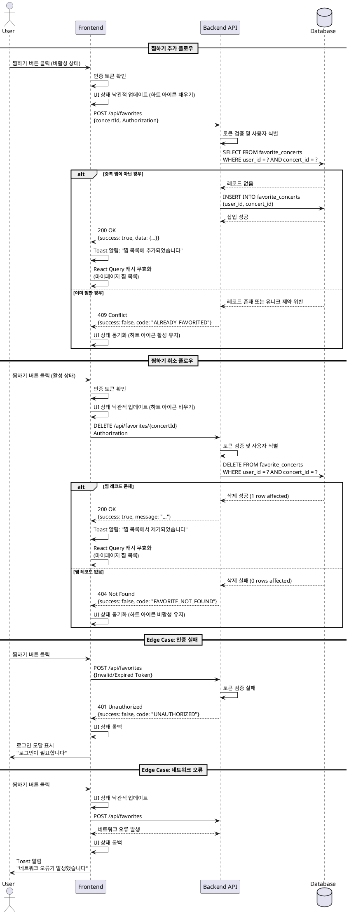

# Use Case: 콘서트 찜하기 (회원)

## 개요

로그인한 회원 사용자가 콘서트 상세 페이지에서 관심있는 콘서트를 찜하거나 취소할 수 있는 기능입니다. 찜한 콘서트는 마이페이지의 '찜한 콘서트' 탭에서 확인할 수 있으며, 티켓 오픈 시 알림을 받을 수 있습니다.

## Primary Actor

- **회원 사용자 (Authenticated User)**: 로그인된 상태로 콘서트를 찜하거나 취소하려는 사용자

## Precondition

- 사용자가 로그인된 상태여야 함
- 유효한 콘서트 상세 페이지에 접근한 상태
- 콘서트 데이터가 데이터베이스에 존재함

## Trigger

- 사용자가 콘서트 상세 페이지에서 '찜하기' 버튼을 클릭

## Main Scenario

### 1. 찜하기 추가 플로우

1. **사용자 액션**: 사용자가 콘서트 상세 페이지에서 비활성 상태(찜하지 않은 상태)의 '찜하기' 버튼을 클릭
2. **인증 확인**: 프론트엔드는 현재 사용자의 로그인 상태 및 인증 토큰을 확인
3. **API 요청**: 프론트엔드는 백엔드 API에 찜 추가 요청 전송
   - Endpoint: `POST /api/favorites`
   - Payload: `{ concertId: string }`
   - Headers: `Authorization: Bearer {token}`
4. **서버 처리**:
   - 토큰 검증 및 사용자 식별
   - 중복 찜 여부 확인 (user_id + concert_id 유니크 제약)
   - `favorite_concerts` 테이블에 새 레코드 생성
5. **성공 응답**: 서버는 성공 응답 반환
   - Status: `200 OK`
   - Body: `{ success: true, data: { id: string, userId: string, concertId: string, createdAt: string } }`
6. **UI 업데이트**: 프론트엔드는 찜하기 버튼을 활성 상태로 변경 (예: 하트 아이콘 채우기)
7. **상태 동기화**: React Query 캐시 무효화를 통해 마이페이지 '찜한 콘서트' 목록 자동 갱신

### 2. 찜하기 취소 플로우

1. **사용자 액션**: 사용자가 활성 상태(이미 찜한 상태)의 '찜하기' 버튼을 클릭
2. **인증 확인**: 프론트엔드는 현재 사용자의 로그인 상태 및 인증 토큰을 확인
3. **API 요청**: 프론트엔드는 백엔드 API에 찜 제거 요청 전송
   - Endpoint: `DELETE /api/favorites/{concertId}`
   - Headers: `Authorization: Bearer {token}`
4. **서버 처리**:
   - 토큰 검증 및 사용자 식별
   - `favorite_concerts` 테이블에서 해당 레코드 삭제 (WHERE user_id = ? AND concert_id = ?)
5. **성공 응답**: 서버는 성공 응답 반환
   - Status: `200 OK`
   - Body: `{ success: true, message: "찜하기가 취소되었습니다" }`
6. **UI 업데이트**: 프론트엔드는 찜하기 버튼을 비활성 상태로 변경 (예: 하트 아이콘 빈 상태)
7. **상태 동기화**: React Query 캐시 무효화를 통해 마이페이지 '찜한 콘서트' 목록 자동 갱신

## Edge Cases

### 1. 인증 실패 (401 Unauthorized)

**시나리오**: 로그인 세션이 만료되었거나 유효하지 않은 토큰으로 요청

**처리**:
- 서버는 `401 Unauthorized` 응답 반환
- 프론트엔드는 사용자에게 "로그인이 필요합니다" 메시지를 표시
- 로그인 모달을 자동으로 열거나 로그인 페이지로 리다이렉트
- 로그인 성공 후 현재 페이지로 복귀

**API 응답**:
```json
{
  "success": false,
  "code": "UNAUTHORIZED",
  "message": "로그인이 필요한 서비스입니다"
}
```

### 2. 중복 찜 시도 (409 Conflict)

**시나리오**: 이미 찜한 콘서트를 다시 찜하려고 시도 (네트워크 지연 등으로 UI와 서버 상태 불일치)

**처리**:
- 서버는 `409 Conflict` 응답 반환
- 프론트엔드는 현재 찜 상태를 서버와 동기화
- 버튼 상태를 활성(찜됨)으로 업데이트
- 별도의 오류 메시지는 표시하지 않음 (이미 원하는 상태이므로)

**API 응답**:
```json
{
  "success": false,
  "code": "ALREADY_FAVORITED",
  "message": "이미 찜한 콘서트입니다"
}
```

### 3. 존재하지 않는 콘서트 (404 Not Found)

**시나리오**: 삭제되었거나 존재하지 않는 콘서트에 대해 찜 시도

**처리**:
- 서버는 `404 Not Found` 응답 반환
- 프론트엔드는 "콘서트를 찾을 수 없습니다" 메시지 표시
- 찜하기 버튼을 비활성화하거나 숨김

**API 응답**:
```json
{
  "success": false,
  "code": "CONCERT_NOT_FOUND",
  "message": "콘서트를 찾을 수 없습니다"
}
```

### 4. 네트워크 오류 또는 서버 오류 (500 Internal Server Error)

**시나리오**: API 호출 중 네트워크 연결 실패 또는 서버 내부 오류 발생

**처리**:
- 프론트엔드는 사용자에게 "일시적인 오류가 발생했습니다. 다시 시도해주세요" 메시지 표시
- 버튼 상태를 이전 상태로 복원 (Optimistic Update 롤백)
- 재시도 버튼 또는 자동 재시도 로직 제공

**API 응답**:
```json
{
  "success": false,
  "code": "INTERNAL_SERVER_ERROR",
  "message": "서버 오류가 발생했습니다"
}
```

### 5. 찜 취소 시 레코드 없음 (404 Not Found)

**시나리오**: 찜하지 않은 콘서트의 찜을 취소하려고 시도 (UI와 서버 상태 불일치)

**처리**:
- 서버는 `404 Not Found` 응답 반환
- 프론트엔드는 현재 찜 상태를 서버와 동기화
- 버튼 상태를 비활성(찜 안됨)으로 업데이트
- 별도의 오류 메시지는 표시하지 않음

**API 응답**:
```json
{
  "success": false,
  "code": "FAVORITE_NOT_FOUND",
  "message": "찜 정보를 찾을 수 없습니다"
}
```

### 6. 빠른 연속 클릭 (Race Condition)

**시나리오**: 사용자가 찜하기 버튼을 빠르게 여러 번 클릭

**처리**:
- 첫 번째 요청 처리 중 버튼을 비활성화 (loading 상태)
- 추가 클릭 이벤트는 무시
- 요청 완료 후 버튼 재활성화
- Debounce 또는 Request Deduplication 적용

## API Specification

### 1. 찜하기 추가

**Endpoint**: `POST /api/favorites`

**Request Headers**:
```
Authorization: Bearer {access_token}
Content-Type: application/json
```

**Request Body**:
```typescript
{
  concertId: string // UUID format
}
```

**Success Response (200 OK)**:
```typescript
{
  success: true,
  data: {
    id: string,
    userId: string,
    concertId: string,
    createdAt: string // ISO 8601
  }
}
```

**Error Responses**:
- `401 Unauthorized`: 인증 실패
- `404 Not Found`: 콘서트를 찾을 수 없음
- `409 Conflict`: 이미 찜한 콘서트
- `500 Internal Server Error`: 서버 오류

### 2. 찜하기 취소

**Endpoint**: `DELETE /api/favorites/{concertId}`

**Request Headers**:
```
Authorization: Bearer {access_token}
```

**Success Response (200 OK)**:
```typescript
{
  success: true,
  message: string
}
```

**Error Responses**:
- `401 Unauthorized`: 인증 실패
- `404 Not Found`: 찜 정보를 찾을 수 없음
- `500 Internal Server Error`: 서버 오류

### 3. 찜 상태 조회 (콘서트 상세 정보에 포함)

**Endpoint**: `GET /api/concerts/{concertId}`

**Request Headers**:
```
Authorization: Bearer {access_token} // Optional
```

**Success Response (200 OK)**:
```typescript
{
  success: true,
  data: {
    id: string,
    title: string,
    // ... other concert fields
    isFavorited: boolean // 로그인 시만 포함, 비로그인 시 false
  }
}
```

## Database Schema

### favorite_concerts 테이블

```sql
CREATE TABLE IF NOT EXISTS public.favorite_concerts (
  id uuid PRIMARY KEY DEFAULT gen_random_uuid(),
  user_id uuid NOT NULL REFERENCES public.profiles(id) ON DELETE CASCADE,
  concert_id uuid NOT NULL REFERENCES public.concerts(id) ON DELETE CASCADE,
  created_at timestamptz NOT NULL DEFAULT now()
);

-- 한 사용자가 같은 콘서트를 중복으로 찜할 수 없도록 유니크 제약
CREATE UNIQUE INDEX IF NOT EXISTS favorite_concerts_user_concert_idx
  ON public.favorite_concerts (user_id, concert_id);
```

**제약 조건**:
- `user_id + concert_id` 조합은 유니크해야 함
- `user_id`는 `profiles` 테이블의 `id`를 참조하며, 사용자 삭제 시 관련 찜 정보도 함께 삭제 (CASCADE)
- `concert_id`는 `concerts` 테이블의 `id`를 참조하며, 콘서트 삭제 시 관련 찜 정보도 함께 삭제 (CASCADE)

## UI/UX 요구사항

### 1. 찜하기 버튼 디자인

**비활성 상태 (찜하지 않음)**:
- 빈 하트 아이콘 (outline)
- 색상: Gray 계열 (#9CA3AF)
- Hover 시: 하트 아이콘 살짝 커지는 애니메이션
- 텍스트: "찜하기" 또는 아이콘만 표시

**활성 상태 (찜함)**:
- 채워진 하트 아이콘 (filled)
- 색상: Primary 컬러 (예: #EF4444, Red)
- Hover 시: 살짝 작아지는 애니메이션
- 텍스트: "찜 취소" 또는 아이콘만 표시

**로딩 상태**:
- 스피너 아이콘 또는 로딩 애니메이션
- 버튼 비활성화 (클릭 불가)
- 색상: Gray 계열

### 2. 애니메이션

- 찜 추가 시: 하트 아이콘이 작아졌다가 커지는 "pop" 애니메이션 (0.3초)
- 찜 취소 시: 하트 아이콘이 살짝 흔들리며 사라지는 애니메이션 (0.2초)
- 상태 전환은 부드럽게 (transition: all 0.2s ease-in-out)

### 3. 피드백 메시지

**성공 시 (Toast 알림)**:
- 찜 추가: "찜 목록에 추가되었습니다"
- 찜 취소: "찜 목록에서 제거되었습니다"
- 위치: 화면 상단 중앙 또는 우측 하단
- 표시 시간: 2-3초 후 자동 사라짐

**실패 시**:
- 인증 실패: 로그인 모달 표시
- 네트워크 오류: "네트워크 오류가 발생했습니다. 다시 시도해주세요" (Toast)
- 서버 오류: "일시적인 오류가 발생했습니다. 잠시 후 다시 시도해주세요" (Toast)

### 4. 접근성 (Accessibility)

- 버튼에 적절한 `aria-label` 속성 추가 (예: "콘서트 찜하기", "콘서트 찜 취소")
- 키보드 접근 가능 (Tab 키로 포커스 이동, Enter 또는 Space 키로 활성화)
- 스크린 리더 사용자를 위한 상태 변경 알림 (`aria-live="polite"`)
- 충분한 색상 대비 (WCAG AA 기준)

### 5. 반응형 디자인

**모바일 (< 768px)**:
- 버튼 크기: 최소 44x44px (터치 타겟 크기)
- 아이콘 크기: 24px
- 하단 고정 버튼 영역에 배치 가능

**태블릿/데스크톱 (>= 768px)**:
- 버튼 크기: 적절한 패딩 (px-4 py-2)
- 아이콘 크기: 20-24px
- 콘서트 제목 옆 또는 이미지 우측 상단에 배치

## Business Rules

### 1. 인증 요구사항

- 찜하기 기능은 **로그인한 회원만** 사용 가능
- 비로그인 사용자가 찜하기 버튼 클릭 시 로그인 모달 표시
- 로그인 후 자동으로 찜하기 동작 실행하거나 사용자가 다시 클릭하도록 유도

### 2. 중복 방지

- 동일한 사용자가 동일한 콘서트를 중복으로 찜할 수 없음
- 데이터베이스 레벨에서 유니크 제약으로 보장
- 클라이언트에서도 버튼 상태로 중복 요청 방지

### 3. 데이터 정합성

- 콘서트가 삭제되면 관련된 모든 찜 정보도 함께 삭제 (CASCADE)
- 사용자가 탈퇴하면 해당 사용자의 모든 찜 정보도 함께 삭제 (CASCADE)

### 4. 성능 최적화

- 찜 상태는 콘서트 상세 정보 조회 시 함께 반환 (JOIN)
- 마이페이지 '찜한 콘서트' 목록은 페이지네이션 적용 (무한 스크롤 또는 페이지 번호)
- React Query를 통한 캐싱 및 자동 재검증

### 5. 사용자 경험

- **Optimistic Update**: 찜하기 버튼 클릭 즉시 UI 업데이트, API 응답 대기 중 로딩 표시 최소화
- 실패 시 이전 상태로 롤백 및 사용자에게 피드백
- 빠른 연속 클릭 방지 (Debounce 또는 요청 중복 제거)

### 6. 알림 연계 (향후 확장)

- 찜한 콘서트의 티켓 오픈 시 알림 발송 (이메일, 푸시, 웹 내 알림)
- 찜한 콘서트의 가격 변동 또는 좌석 추가 시 알림 (선택적)

## Sequence Diagram



## Implementation Notes

### Frontend (React + TypeScript)

**1. React Query Hook 예시**:

```typescript
// src/features/favorite/hooks/useFavoriteMutation.ts
import { useMutation, useQueryClient } from '@tanstack/react-query';
import { apiClient } from '@/lib/remote/api-client';

export const useFavoriteMutation = () => {
  const queryClient = useQueryClient();

  const addFavorite = useMutation({
    mutationFn: (concertId: string) =>
      apiClient.post('/api/favorites', { concertId }),
    onSuccess: () => {
      // 마이페이지 찜 목록 캐시 무효화
      queryClient.invalidateQueries({ queryKey: ['favorites'] });
      // 콘서트 상세 페이지 캐시 무효화 (isFavorited 상태 갱신)
      queryClient.invalidateQueries({ queryKey: ['concert'] });
    },
  });

  const removeFavorite = useMutation({
    mutationFn: (concertId: string) =>
      apiClient.delete(`/api/favorites/${concertId}`),
    onSuccess: () => {
      queryClient.invalidateQueries({ queryKey: ['favorites'] });
      queryClient.invalidateQueries({ queryKey: ['concert'] });
    },
  });

  return { addFavorite, removeFavorite };
};
```

**2. 컴포넌트 예시**:

```typescript
// src/features/favorite/components/FavoriteButton.tsx
'use client';

import { useState } from 'react';
import { Heart } from 'lucide-react';
import { useFavoriteMutation } from '../hooks/useFavoriteMutation';
import { useAuth } from '@/features/auth/hooks/useAuth';
import { toast } from 'sonner';

interface FavoriteButtonProps {
  concertId: string;
  initialIsFavorited: boolean;
}

export const FavoriteButton = ({
  concertId,
  initialIsFavorited,
}: FavoriteButtonProps) => {
  const [isFavorited, setIsFavorited] = useState(initialIsFavorited);
  const { user, openLoginModal } = useAuth();
  const { addFavorite, removeFavorite } = useFavoriteMutation();

  const handleClick = async () => {
    if (!user) {
      openLoginModal();
      return;
    }

    // Optimistic Update
    setIsFavorited(!isFavorited);

    try {
      if (isFavorited) {
        await removeFavorite.mutateAsync(concertId);
        toast.success('찜 목록에서 제거되었습니다');
      } else {
        await addFavorite.mutateAsync(concertId);
        toast.success('찜 목록에 추가되었습니다');
      }
    } catch (error) {
      // 롤백
      setIsFavorited(isFavorited);
      toast.error('오류가 발생했습니다. 다시 시도해주세요');
    }
  };

  const isLoading = addFavorite.isPending || removeFavorite.isPending;

  return (
    <button
      onClick={handleClick}
      disabled={isLoading}
      className="flex items-center gap-2 px-4 py-2 rounded-lg transition-all"
      aria-label={isFavorited ? '콘서트 찜 취소' : '콘서트 찜하기'}
    >
      <Heart
        className={`w-5 h-5 transition-all ${
          isFavorited ? 'fill-red-500 text-red-500' : 'text-gray-400'
        }`}
      />
      <span>{isFavorited ? '찜 취소' : '찜하기'}</span>
    </button>
  );
};
```

### Backend (Hono + Supabase)

**1. Route Handler 예시**:

```typescript
// src/features/favorite/backend/route.ts
import { Hono } from 'hono';
import { zValidator } from '@hono/zod-validator';
import { addFavoriteSchema, deleteFavoriteSchema } from './schema';
import { FavoriteService } from './service';
import { respond } from '@/backend/http/response';

export const registerFavoriteRoutes = (app: Hono) => {
  const service = new FavoriteService();

  // 찜 추가
  app.post(
    '/api/favorites',
    zValidator('json', addFavoriteSchema),
    async (c) => {
      const { concertId } = c.req.valid('json');
      const userId = c.get('userId'); // 인증 미들웨어에서 주입

      const result = await service.addFavorite(userId, concertId);
      return respond(c, result);
    }
  );

  // 찜 제거
  app.delete(
    '/api/favorites/:concertId',
    zValidator('param', deleteFavoriteSchema),
    async (c) => {
      const { concertId } = c.req.valid('param');
      const userId = c.get('userId');

      const result = await service.removeFavorite(userId, concertId);
      return respond(c, result);
    }
  );
};
```

**2. Service 예시**:

```typescript
// src/features/favorite/backend/service.ts
import { SupabaseClient } from '@supabase/supabase-js';
import { success, failure } from '@/backend/http/response';
import { FAVORITE_ERROR_CODES } from './error';

export class FavoriteService {
  async addFavorite(
    supabase: SupabaseClient,
    userId: string,
    concertId: string
  ) {
    // 콘서트 존재 확인
    const { data: concert } = await supabase
      .from('concerts')
      .select('id')
      .eq('id', concertId)
      .single();

    if (!concert) {
      return failure(FAVORITE_ERROR_CODES.CONCERT_NOT_FOUND, 404);
    }

    // 중복 확인
    const { data: existing } = await supabase
      .from('favorite_concerts')
      .select('id')
      .eq('user_id', userId)
      .eq('concert_id', concertId)
      .single();

    if (existing) {
      return failure(FAVORITE_ERROR_CODES.ALREADY_FAVORITED, 409);
    }

    // 찜 추가
    const { data, error } = await supabase
      .from('favorite_concerts')
      .insert({ user_id: userId, concert_id: concertId })
      .select()
      .single();

    if (error) {
      return failure(FAVORITE_ERROR_CODES.DATABASE_ERROR, 500);
    }

    return success(data);
  }

  async removeFavorite(
    supabase: SupabaseClient,
    userId: string,
    concertId: string
  ) {
    const { data, error } = await supabase
      .from('favorite_concerts')
      .delete()
      .eq('user_id', userId)
      .eq('concert_id', concertId)
      .select();

    if (error) {
      return failure(FAVORITE_ERROR_CODES.DATABASE_ERROR, 500);
    }

    if (!data || data.length === 0) {
      return failure(FAVORITE_ERROR_CODES.FAVORITE_NOT_FOUND, 404);
    }

    return success({ message: '찜하기가 취소되었습니다' });
  }
}
```

**3. Schema 예시**:

```typescript
// src/features/favorite/backend/schema.ts
import { z } from 'zod';

export const addFavoriteSchema = z.object({
  concertId: z.string().uuid(),
});

export const deleteFavoriteSchema = z.object({
  concertId: z.string().uuid(),
});
```

**4. Error Codes 예시**:

```typescript
// src/features/favorite/backend/error.ts
export const FAVORITE_ERROR_CODES = {
  CONCERT_NOT_FOUND: {
    code: 'CONCERT_NOT_FOUND',
    message: '콘서트를 찾을 수 없습니다',
  },
  ALREADY_FAVORITED: {
    code: 'ALREADY_FAVORITED',
    message: '이미 찜한 콘서트입니다',
  },
  FAVORITE_NOT_FOUND: {
    code: 'FAVORITE_NOT_FOUND',
    message: '찜 정보를 찾을 수 없습니다',
  },
  DATABASE_ERROR: {
    code: 'DATABASE_ERROR',
    message: '데이터베이스 오류가 발생했습니다',
  },
} as const;
```

## Testing Scenarios

### 1. Unit Tests

- [ ] `FavoriteService.addFavorite()` 정상 동작
- [ ] `FavoriteService.addFavorite()` 중복 찜 시도 시 409 반환
- [ ] `FavoriteService.addFavorite()` 존재하지 않는 콘서트 시도 시 404 반환
- [ ] `FavoriteService.removeFavorite()` 정상 동작
- [ ] `FavoriteService.removeFavorite()` 찜하지 않은 콘서트 취소 시 404 반환

### 2. Integration Tests

- [ ] POST /api/favorites 인증된 사용자로 찜 추가 성공
- [ ] POST /api/favorites 인증되지 않은 사용자로 요청 시 401 반환
- [ ] DELETE /api/favorites/:concertId 찜 제거 성공
- [ ] GET /api/concerts/:id 응답에 isFavorited 필드 포함 확인

### 3. E2E Tests

- [ ] 로그인 상태에서 찜하기 버튼 클릭 → 버튼 상태 변경 및 토스트 알림 표시
- [ ] 비로그인 상태에서 찜하기 버튼 클릭 → 로그인 모달 표시
- [ ] 찜한 후 마이페이지 '찜한 콘서트' 탭에서 확인
- [ ] 찜 취소 후 마이페이지에서 제거 확인
- [ ] 네트워크 오류 시 UI 롤백 및 오류 메시지 표시

### 4. Performance Tests

- [ ] 동시에 100명의 사용자가 같은 콘서트를 찜할 때 중복 방지 확인
- [ ] 찜 추가/제거 API 응답 시간 < 500ms
- [ ] 마이페이지 찜 목록 로딩 시간 (1000개 아이템) < 2초

## Future Enhancements

1. **알림 기능 통합**:
   - 찜한 콘서트의 티켓 오픈 시 이메일/푸시 알림
   - 가격 변동 또는 좌석 추가 시 알림

2. **찜 목록 정렬 및 필터**:
   - 최신 순, 티켓 오픈 임박 순, 가격 순 정렬
   - 장르, 날짜, 지역별 필터

3. **공유 기능**:
   - 찜한 콘서트 목록 공유 링크 생성
   - 소셜 미디어 공유

4. **통계 및 추천**:
   - 사용자 찜 히스토리 기반 콘서트 추천
   - 인기 찜 콘서트 순위 표시

5. **일괄 관리**:
   - 여러 콘서트 한번에 찜 취소
   - 찜 목록 내보내기 (CSV, PDF)

---

**문서 버전**: 1.0
**작성일**: 2025-10-15
**작성자**: Development Team
**최종 검토**: Pending
