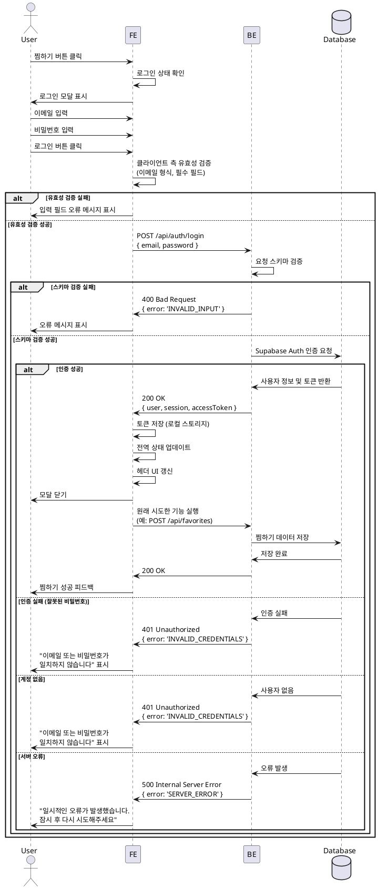

# 유스케이스 004: 로그인 (페이지)

## 개요

TicketGem 서비스에서 회원 전용 기능(찜하기, 마이페이지 등)을 사용하기 위해 사용자가 로그인 페이지를 통해 인증하는 기능입니다. 로그인 페이지(`/login`)는 독립된 페이지로, 사용자의 이메일과 비밀번호를 입력받아 인증을 처리하고, 성공 시 이전 페이지 또는 메인 페이지로 리다이렉트합니다.

## Primary Actor

- 비회원 사용자 (로그인이 필요한 기능을 시도하는 사용자)
- 로그아웃 상태의 회원 사용자

## Precondition

- 사용자가 로그인 필요 기능에 접근을 시도함 (찜하기 버튼 클릭, 마이페이지 접근, 헤더 로그인 버튼 클릭 등)
- 사용자가 유효한 이메일과 비밀번호를 가지고 있음 (회원가입 완료 상태)

## Postcondition

### 성공 시
- 사용자의 인증 토큰이 클라이언트에 저장됨
- 애플리케이션의 전역 로그인 상태가 "로그인됨"으로 업데이트됨
- 헤더 UI가 로그인 상태로 변경됨 (로그인 버튼 → 사용자 프로필/로그아웃 버튼)
- `redirectedFrom` 쿼리 파라미터가 있으면 해당 페이지로, 없으면 메인 페이지(`/`)로 리다이렉트됨

### 실패 시
- 사용자는 로그인되지 않은 상태로 유지됨
- 로그인 페이지에 오류 메시지가 표시됨

## Trigger

사용자가 다음 중 하나의 행동을 수행:
- 비로그인 상태에서 '찜하기' 버튼 클릭
- 헤더의 '로그인' 버튼 클릭
- 마이페이지 등 인증이 필요한 페이지 접근 시도

## Main Scenario

### 1. 페이지 이동
- **User**: 로그인이 필요한 기능을 시도 (예: 찜하기 버튼 클릭)
- **FE**: 사용자의 현재 로그인 상태를 확인
- **FE**: 비로그인 상태일 경우 로그인 페이지(`/login?redirectedFrom=/concerts/123`)로 리다이렉트

### 2. 사용자 입력
- **User**: 로그인 페이지에서 이메일 주소를 입력
- **User**: 비밀번호를 입력
- **User**: '로그인' 버튼 클릭

### 3. 클라이언트 측 유효성 검증
- **FE**: 이메일 형식 검증 (유효한 이메일 주소 형식인지 확인)
- **FE**: 비밀번호 입력 여부 확인 (빈 값이 아닌지 확인)
- **FE**: 검증 실패 시 해당 필드에 인라인 오류 메시지 표시 후 중단

### 4. 로그인 요청
- **FE**: 입력된 이메일과 비밀번호를 포함한 로그인 API 요청 전송
  - `POST /api/auth/login`
  - Request Body: `{ email: string, password: string }`
- **BE**: 요청 데이터의 스키마 검증 (이메일 형식, 비밀번호 존재 여부)
- **BE**: Supabase Auth를 통한 인증 처리
- **Database**: 사용자 인증 정보 확인 및 검증

### 5. 인증 성공 처리
- **BE**: 인증 성공 시 사용자 세션 정보 및 액세스 토큰 생성
- **BE**: 성공 응답 반환
  - Response: `{ success: true, data: { user: {...}, session: {...}, accessToken: string } }`
- **FE**: 액세스 토큰을 로컬 스토리지 또는 쿠키에 저장
- **FE**: 전역 인증 상태 업데이트 (Zustand 등)
- **FE**: 헤더 UI 갱신 (로그인 버튼 → 사용자 프로필 영역)
- **FE**: `redirectedFrom` 또는 메인 페이지로 리다이렉트

### 6. 사용자 피드백
- **User**: 로그인 완료 확인 (이전 페이지 또는 메인 페이지로 이동)

## Edge Cases

### EC-1: 이메일 형식 오류
- **Condition**: 사용자가 유효하지 않은 이메일 형식을 입력
- **Handling**:
  - FE에서 클라이언트 측 검증 실패
  - 이메일 입력 필드 하단에 "유효한 이메일 주소를 입력해주세요" 메시지 표시
  - 로그인 버튼 비활성화 또는 요청 전송 차단

### EC-2: 필수 필드 누락
- **Condition**: 이메일 또는 비밀번호가 입력되지 않음
- **Handling**:
  - FE에서 필드별 검증 실패
  - 해당 필드 하단에 "필수 입력 항목입니다" 메시지 표시
  - 로그인 버튼 비활성화 또는 요청 전송 차단

### EC-3: 인증 실패 (잘못된 비밀번호)
- **Condition**: 이메일은 존재하지만 비밀번호가 일치하지 않음
- **Handling**:
  - BE에서 인증 실패 응답 반환: `{ success: false, error: { code: 'INVALID_CREDENTIALS', message: '이메일 또는 비밀번호가 일치하지 않습니다' } }`
  - FE에서 모달 상단 또는 폼 하단에 오류 메시지 표시
  - 모달은 열린 상태로 유지하여 사용자가 재시도 가능하도록 함
  - 입력 필드 초기화하지 않음 (사용자 편의)

### EC-4: 존재하지 않는 계정
- **Condition**: 입력된 이메일로 가입된 계정이 없음
- **Handling**:
  - BE에서 인증 실패 응답 반환: `{ success: false, error: { code: 'INVALID_CREDENTIALS', message: '이메일 또는 비밀번호가 일치하지 않습니다' } }`
  - FE에서 동일하게 오류 메시지 표시 (보안상 이메일 존재 여부를 명확히 구분하지 않음)
  - "아직 회원이 아니신가요? 회원가입" 링크를 함께 표시하여 회원가입 페이지(`/signup`)로 이동 유도

### EC-5: 서버 통신 오류
- **Condition**: 네트워크 장애, 서버 다운 등으로 API 호출 실패
- **Handling**:
  - FE에서 네트워크 오류 감지
  - 모달 내부에 "일시적인 오류가 발생했습니다. 잠시 후 다시 시도해주세요" 메시지 표시
  - 로그 기록 (디버깅용)
  - 재시도 버튼 제공 또는 자동 재시도 로직 구현 고려

### EC-6: 세션 만료 후 재로그인
- **Condition**: 사용자가 이전에 로그인했으나 세션이 만료됨
- **Handling**:
  - 세션 만료를 감지한 시점에 로그인 페이지로 자동 리다이렉트
  - "세션이 만료되었습니다. 다시 로그인해주세요" 안내 메시지 표시
  - 로그인 성공 후 원래 페이지로 자동 리다이렉트

### EC-7: 이미 로그인된 상태
- **Condition**: 사용자가 이미 로그인되어 있는 상태에서 로그인 페이지 접근
- **Handling**:
  - FE에서 로그인 상태 확인 후 메인 페이지로 리다이렉트
  - 또는 "이미 로그인되어 있습니다" 토스트 메시지 표시

### EC-8: Rate Limiting (과도한 로그인 시도)
- **Condition**: 짧은 시간 내 여러 번 로그인 실패
- **Handling**:
  - BE에서 IP 또는 이메일 기준으로 시도 횟수 제한
  - 제한 초과 시: `{ success: false, error: { code: 'TOO_MANY_ATTEMPTS', message: '로그인 시도 횟수를 초과했습니다. 잠시 후 다시 시도해주세요' } }`
  - FE에서 오류 메시지 표시 및 일정 시간 동안 로그인 버튼 비활성화

## Business Rules

### BR-1: 인증 방식
- Supabase Auth를 기본 인증 수단으로 사용
- 이메일/비밀번호 방식의 기본 인증 지원
- 향후 소셜 로그인(OAuth) 확장 가능하도록 설계

### BR-2: 보안 정책
- 비밀번호는 평문으로 전송하되 HTTPS를 통해 암호화 전송
- 비밀번호는 서버에 평문 저장하지 않음 (Supabase Auth가 해시 처리)
- 인증 실패 시 구체적인 실패 원인(이메일 없음/비밀번호 틀림)을 구분하여 노출하지 않음

### BR-3: 세션 관리
- 로그인 성공 시 액세스 토큰과 리프레시 토큰 발급
- 액세스 토큰은 로컬 스토리지 또는 쿠키에 저장
- 토큰 만료 시 자동 갱신 또는 재로그인 유도

### BR-4: UX 우선순위
- 로그인 페이지에서 브라우저 뒤로가기로 이전 페이지로 돌아갈 수 있음
- 로그인 성공 후 `redirectedFrom` 파라미터가 있으면 해당 페이지로, 없으면 메인 페이지로 리다이렉트

### BR-5: 접근성
- 페이지 로드 시 이메일 필드에 자동 포커스
- 스크린 리더 지원을 위한 ARIA 속성 추가
- 키보드만으로도 로그인 가능 (Tab, Enter)

## API 명세

### Endpoint
```
POST /api/auth/login
```

### Request Schema
```typescript
{
  email: string,      // 유효한 이메일 형식, 필수
  password: string    // 비어있지 않은 문자열, 필수
}
```

### Response Schema (성공)
```typescript
{
  success: true,
  data: {
    user: {
      id: string,           // UUID
      email: string,
      fullName: string | null,
      avatarUrl: string | null,
      createdAt: string     // ISO 8601
    },
    session: {
      accessToken: string,
      refreshToken: string,
      expiresIn: number,    // seconds
      expiresAt: string     // ISO 8601
    }
  }
}
```

### Response Schema (실패)
```typescript
{
  success: false,
  error: {
    code: string,         // 'INVALID_CREDENTIALS' | 'INVALID_INPUT' | 'TOO_MANY_ATTEMPTS' | 'SERVER_ERROR'
    message: string,      // 사용자에게 표시할 오류 메시지
    details?: object      // (선택) 추가 오류 정보 (디버깅용)
  }
}
```

### Error Codes
- `INVALID_CREDENTIALS`: 이메일 또는 비밀번호가 일치하지 않음
- `INVALID_INPUT`: 요청 데이터 형식 오류 (스키마 검증 실패)
- `TOO_MANY_ATTEMPTS`: 로그인 시도 횟수 초과
- `SERVER_ERROR`: 서버 내부 오류

## UI/UX 요구사항

### 페이지 레이아웃
- **위치**: 전체 페이지, 중앙 정렬 카드 형태
- **크기**: 모바일 - 화면 너비의 90%, 최대 400px / 데스크톱 - 고정 너비 480px
- **배경**: 밝은 배경색
- **애니메이션**: 페이지 전환 애니메이션

### 페이지 구성 요소
1. **헤더**
   - 로고/타이틀: "TicketGem"
   - 제목: "로그인"

2. **본문**
   - 이메일 입력 필드
     - Label: "이메일"
     - Placeholder: "example@email.com"
     - Type: email
     - 자동완성 활성화
   - 비밀번호 입력 필드
     - Label: "비밀번호"
     - Placeholder: "비밀번호를 입력하세요"
     - Type: password
     - 표시/숨김 토글 버튼 (눈 아이콘)
   - 오류 메시지 영역
     - 인증 실패 시 표시
     - 빨간색 배경, 흰색 텍스트

3. **푸터**
   - 로그인 버튼
     - Primary 버튼 스타일
     - 전체 너비
     - 로딩 중 스피너 표시
   - 회원가입 링크
     - "아직 회원이 아니신가요? 회원가입"
     - 클릭 시 회원가입 페이지(`/signup`)로 이동

### 상태별 UI
- **입력 중**: 필드 포커스 시 테두리 색상 변경
- **유효성 검증 실패**: 필드 하단에 빨간색 오류 메시지, 필드 테두리 빨간색
- **로딩 중**: 로그인 버튼 비활성화, 스피너 표시, "로그인 중..." 텍스트
- **인증 실패**: 모달 상단에 오류 메시지 배너 표시

### 반응형 디자인
- **모바일**: 세로 스크롤 가능, 키보드 표시 시 모달 위치 조정
- **태블릿/데스크톱**: 고정 크기, 화면 중앙 정렬

## 시퀀스 다이어그램



## 관련 유스케이스

- **UC-003: 찜하기 (회원)** - 로그인 성공 후 이전 페이지로 돌아가 찜하기 기능 실행
- **UC-005: 회원가입 (페이지)** - 로그인 페이지에서 회원가입 페이지로 이동
- **UC-010: 마이페이지 조회** - 로그인 성공 후 마이페이지 접근 가능

## 참고사항

### 기술 스택
- **Frontend**: React, Zustand (전역 상태 관리), React Hook Form (폼 관리), Zod (스키마 검증)
- **Backend**: Next.js, Hono, Supabase Auth
- **UI**: shadcn-ui (Modal, Input, Button), Tailwind CSS

### 구현 우선순위
1. **P0 (필수)**: 기본 이메일/비밀번호 로그인, 모달 UI, 인증 성공/실패 처리
2. **P1 (중요)**: 클라이언트 측 유효성 검증, 오류 메시지 표시, 세션 관리
3. **P2 (선택)**: Rate Limiting, 비밀번호 표시/숨김 토글, 자동 포커스, 접근성

### 향후 확장 가능성
- 소셜 로그인 (구글, 카카오, 네이버 등)
- 2단계 인증 (2FA)
- 비밀번호 찾기 기능
- 자동 로그인 (Remember Me)
