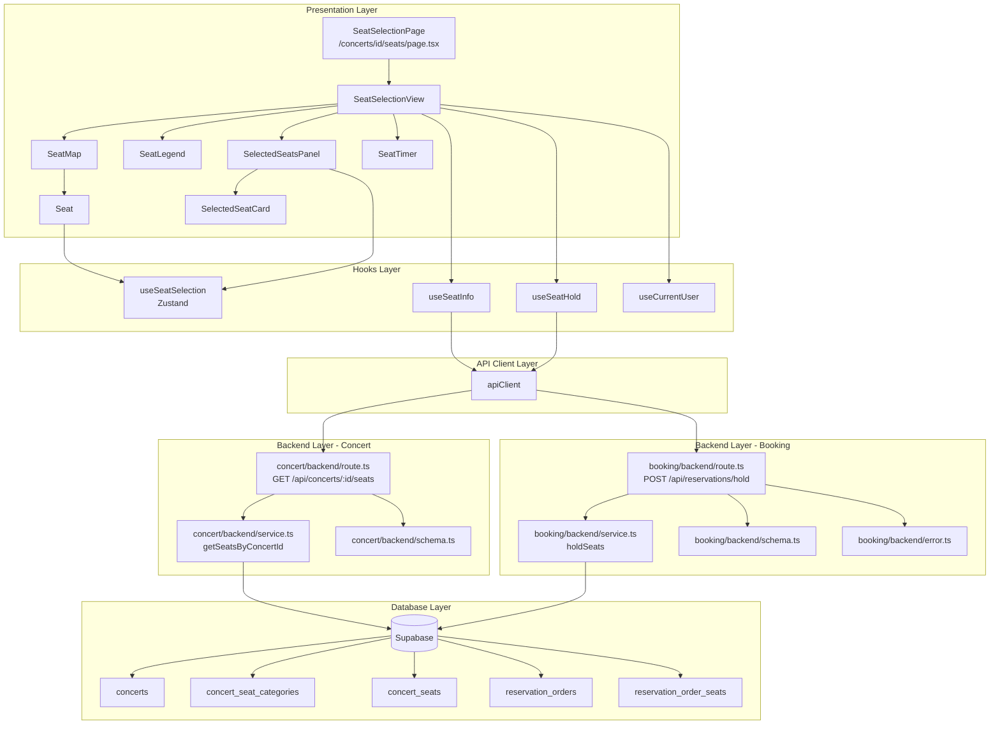

# UC-005: 좌석 선택 페이지 - 상세 설계

## 1. 개요

### 1.1 목적
사용자가 콘서트 예매 시 등급별 좌석을 시각적으로 확인하고, 원하는 좌석을 선택하여 선점할 수 있는 페이지를 구현합니다. 좌석 선점 후에는 5분의 유효 시간이 부여되며, 이 시간 내에 예매를 완료해야 합니다.

### 1.2 주요 기능
- 콘서트 좌석 정보 조회 및 좌석도 렌더링
- 등급별 색상 구분 및 잔여 좌석 표시
- 좌석 선택/해제 기능
- 선택한 좌석 정보 및 총 금액 실시간 표시
- 좌석 선점 API 호출 및 타이머 관리
- 선점 성공 시 다음 단계로 이동

### 1.3 라우팅 경로
- **페이지 경로**: `/concerts/[id]/seats`
- **API 엔드포인트**:
  - `GET /api/concerts/:id/seats` - 좌석 정보 조회
  - `POST /api/reservations/hold` - 좌석 선점

---

## 2. 모듈 구조 설계

### 2.1 모듈 개요

| 모듈명 | 위치 | 설명 |
|--------|------|------|
| **SeatSelectionPage** | `src/app/concerts/[id]/seats/page.tsx` | 좌석 선택 페이지 컴포넌트 |
| **SeatSelectionView** | `src/features/booking/components/seat-selection-view.tsx` | 좌석 선택 메인 컨테이너 |
| **SeatMap** | `src/features/booking/components/seat-map.tsx` | 좌석도 렌더링 컴포넌트 |
| **Seat** | `src/features/booking/components/seat.tsx` | 개별 좌석 버튼 컴포넌트 |
| **SeatLegend** | `src/features/booking/components/seat-legend.tsx` | 좌석 등급별 범례 |
| **SelectedSeatsPanel** | `src/features/booking/components/selected-seats-panel.tsx` | 선택된 좌석 정보 패널 |
| **SelectedSeatCard** | `src/features/booking/components/selected-seat-card.tsx` | 개별 선택 좌석 카드 |
| **SeatTimer** | `src/features/booking/components/seat-timer.tsx` | 선점 타이머 표시 컴포넌트 |
| **useSeatInfo** | `src/features/booking/hooks/useSeatInfo.ts` | 좌석 정보 조회 React Query 훅 |
| **useSeatHold** | `src/features/booking/hooks/useSeatHold.ts` | 좌석 선점 React Query 훅 |
| **useSeatSelection** | `src/features/booking/hooks/useSeatSelection.ts` | 좌석 선택 상태 관리 Zustand 훅 |
| **booking/backend/route** | `src/features/booking/backend/route.ts` | 예약 관련 API 라우트 |
| **booking/backend/service** | `src/features/booking/backend/service.ts` | 예약 비즈니스 로직 |
| **booking/backend/schema** | `src/features/booking/backend/schema.ts` | 요청/응답 zod 스키마 |
| **booking/backend/error** | `src/features/booking/backend/error.ts` | 예약 에러 코드 정의 |
| **concert/backend/route** | `src/features/concert/backend/route.ts` | 좌석 정보 조회 엔드포인트 추가 |
| **concert/backend/service** | `src/features/concert/backend/service.ts` | 좌석 정보 조회 서비스 로직 |

### 2.2 모듈 다이어그램



---

## 3. Implementation Plan

### 3.1 Backend Layer

#### 3.1.1 Booking Feature - Error Codes
**파일**: `src/features/booking/backend/error.ts`

```typescript
export const bookingErrorCodes = {
  // Seat Hold Errors
  seatAlreadyTaken: 'SEAT_ALREADY_TAKEN',
  maxSeatsExceeded: 'MAX_SEATS_EXCEEDED',
  invalidSeats: 'INVALID_SEATS',
  concertNotFound: 'CONCERT_NOT_FOUND',
  holdFailed: 'HOLD_FAILED',

  // Validation Errors
  validationError: 'BOOKING_VALIDATION_ERROR',

  // General Errors
  fetchError: 'BOOKING_FETCH_ERROR',
} as const;

type BookingErrorValue = (typeof bookingErrorCodes)[keyof typeof bookingErrorCodes];

export type BookingServiceError = BookingErrorValue;
```

**Unit Test Plan**:
- ✅ `bookingErrorCodes` 객체가 정의된 모든 에러 코드를 포함하는지 확인
- ✅ 에러 코드 타입이 문자열 리터럴 타입으로 제대로 추론되는지 확인

---

#### 3.1.2 Booking Feature - Schema
**파일**: `src/features/booking/backend/schema.ts`

```typescript
import { z } from 'zod';

// Constants
export const MAX_SEATS_PER_ORDER = 4;
export const HOLD_DURATION_MINUTES = 5;

// 좌석 선점 요청 스키마
export const SeatHoldRequestSchema = z.object({
  concertId: z.string().uuid({ message: 'Concert id must be a valid UUID.' }),
  seatIds: z
    .array(z.string().uuid())
    .min(1, { message: 'At least one seat must be selected.' })
    .max(MAX_SEATS_PER_ORDER, {
      message: `Maximum ${MAX_SEATS_PER_ORDER} seats per order.`
    }),
});

export type SeatHoldRequest = z.infer<typeof SeatHoldRequestSchema>;

// 좌석 선점 응답 스키마
export const HeldSeatSchema = z.object({
  seatId: z.string().uuid(),
  seatLabel: z.string(),
  categoryName: z.string(),
  categoryColor: z.string(),
  price: z.number().nonnegative(),
});

export type HeldSeat = z.infer<typeof HeldSeatSchema>;

export const SeatHoldResponseSchema = z.object({
  orderId: z.string().uuid(),
  reservationNumber: z.string(),
  holdExpiresAt: z.string().datetime(),
  seats: z.array(HeldSeatSchema),
  totalPrice: z.number().nonnegative(),
});

export type SeatHoldResponse = z.infer<typeof SeatHoldResponseSchema>;

// 에러 응답 스키마 (좌석 선점 실패)
export const SeatAlreadyTakenErrorSchema = z.object({
  code: z.literal(bookingErrorCodes.seatAlreadyTaken),
  message: z.string(),
  unavailableSeats: z.array(z.string()),
});

export type SeatAlreadyTakenError = z.infer<typeof SeatAlreadyTakenErrorSchema>;
```

**Unit Test Plan**:
- ✅ `SeatHoldRequestSchema`가 1-4개 좌석만 허용하는지 확인
- ✅ 좌석 ID가 유효한 UUID인지 검증
- ✅ `SeatHoldResponseSchema`가 모든 필수 필드를 검증하는지 확인
- ✅ `HeldSeatSchema`가 음수 가격을 거부하는지 확인

---

#### 3.1.3 Concert Feature - Seat Info Schema (추가)
**파일**: `src/features/concert/backend/schema.ts` (기존 파일에 추가)

```typescript
// 좌석 정보 스키마
export const SeatInfoSchema = z.object({
  id: z.string().uuid(),
  seatLabel: z.string(),
  categoryId: z.string().uuid(),
  isAvailable: z.boolean(),
});

export type SeatInfo = z.infer<typeof SeatInfoSchema>;

// 좌석 등급 정보 스키마
export const SeatCategoryInfoSchema = z.object({
  id: z.string().uuid(),
  name: z.string(),
  displayColor: z.string(),
  price: z.number().nonnegative(),
});

export type SeatCategoryInfo = z.infer<typeof SeatCategoryInfoSchema>;

// 콘서트 좌석 정보 조회 응답 스키마
export const ConcertSeatsResponseSchema = z.object({
  concertId: z.string().uuid(),
  concertTitle: z.string(),
  categories: z.array(SeatCategoryInfoSchema),
  seats: z.array(SeatInfoSchema),
  maxSeatsPerOrder: z.number().int().positive(),
});

export type ConcertSeatsResponse = z.infer<typeof ConcertSeatsResponseSchema>;
```

---

#### 3.1.4 Concert Feature - Service (좌석 정보 조회)
**파일**: `src/features/concert/backend/service.ts` (기존 파일에 추가)

```typescript
import {
  ConcertSeatsResponseSchema,
  type ConcertSeatsResponse,
  type SeatInfo,
  type SeatCategoryInfo,
} from './schema';
import { MAX_SEATS_PER_ORDER } from '@/features/booking/backend/schema';

/**
 * 콘서트의 전체 좌석 정보를 조회합니다.
 * @param client - Supabase 클라이언트
 * @param concertId - 조회할 콘서트 ID
 */
export const getSeatsByConcertId = async (
  client: SupabaseClient,
  concertId: string,
): Promise<HandlerResult<ConcertSeatsResponse, ConcertServiceError, unknown>> => {
  // 1. 콘서트 존재 여부 확인
  const { data: concertData, error: concertError } = await client
    .from(CONCERTS_TABLE)
    .select('id, title')
    .eq('id', concertId)
    .maybeSingle();

  if (concertError) {
    return failure(500, concertErrorCodes.fetchError, concertError.message);
  }

  if (!concertData) {
    return failure(404, concertErrorCodes.notFound, 'Concert not found');
  }

  // 2. 좌석 등급 정보 조회
  const { data: categoriesData, error: categoriesError } = await client
    .from(SEAT_CATEGORIES_TABLE)
    .select('id, name, display_color, price')
    .eq('concert_id', concertId)
    .order('price', { ascending: false });

  if (categoriesError) {
    return failure(500, concertErrorCodes.seatInfoError, categoriesError.message);
  }

  const categories: SeatCategoryInfo[] = (categoriesData || []).map((cat) => ({
    id: cat.id,
    name: cat.name,
    displayColor: cat.display_color,
    price: parseFloat(cat.price),
  }));

  // 3. 전체 좌석 정보 조회
  const { data: seatsData, error: seatsError } = await client
    .from(SEATS_TABLE)
    .select('id, seat_label, category_id')
    .eq('concert_id', concertId)
    .order('seat_label', { ascending: true });

  if (seatsError) {
    return failure(500, concertErrorCodes.seatInfoError, seatsError.message);
  }

  // 4. 이미 선점된 좌석 조회
  const { data: reservedSeatsData, error: reservedError } = await client
    .from(RESERVATION_SEATS_TABLE)
    .select('seat_id')
    .eq('is_active', true);

  if (reservedError) {
    return failure(500, concertErrorCodes.seatInfoError, reservedError.message);
  }

  const reservedSeatIds = new Set(
    (reservedSeatsData || []).map((rs) => rs.seat_id)
  );

  const seats: SeatInfo[] = (seatsData || []).map((seat) => ({
    id: seat.id,
    seatLabel: seat.seat_label,
    categoryId: seat.category_id,
    isAvailable: !reservedSeatIds.has(seat.id),
  }));

  const response: ConcertSeatsResponse = {
    concertId: concertData.id,
    concertTitle: concertData.title,
    categories,
    seats,
    maxSeatsPerOrder: MAX_SEATS_PER_ORDER,
  };

  const parsed = ConcertSeatsResponseSchema.safeParse(response);

  if (!parsed.success) {
    return failure(
      500,
      concertErrorCodes.validationError,
      'Concert seats response failed validation.',
      parsed.error.format(),
    );
  }

  return success(parsed.data);
};
```

**Unit Test Plan**:
- ✅ 존재하는 콘서트 ID로 조회 시 성공 응답 반환
- ✅ 존재하지 않는 콘서트 ID로 조회 시 404 에러 반환
- ✅ 좌석 등급이 가격 내림차순으로 정렬되는지 확인
- ✅ 선점된 좌석의 `isAvailable`이 `false`로 반환되는지 확인
- ✅ DB 에러 발생 시 500 에러 반환 확인

---

#### 3.1.5 Concert Feature - Route (좌석 정보 조회 엔드포인트 추가)
**파일**: `src/features/concert/backend/route.ts` (기존 파일에 추가)

```typescript
/**
 * 콘서트 좌석 정보 조회
 * GET /api/concerts/:id/seats
 */
app.get('/api/concerts/:id/seats', async (c) => {
  const parsedParams = ConcertIdParamSchema.safeParse({
    id: c.req.param('id'),
  });

  if (!parsedParams.success) {
    return respond(
      c,
      failure(
        400,
        'INVALID_CONCERT_ID',
        'The provided concert id is invalid.',
        parsedParams.error.format(),
      ),
    );
  }

  const supabase = getSupabase(c);
  const logger = getLogger(c);

  const result = await getSeatsByConcertId(
    supabase,
    parsedParams.data.id,
  );

  if (!result.ok) {
    const errorResult = result as ErrorResult<ConcertServiceError, unknown>;

    if (errorResult.error.code === concertErrorCodes.notFound) {
      logger.info(`Concert not found for seats: ${parsedParams.data.id}`);
    } else if (errorResult.error.code === concertErrorCodes.seatInfoError) {
      logger.error('Failed to fetch seat info', errorResult.error.message);
    }

    return respond(c, result);
  }

  return respond(c, result);
});
```

**Unit Test Plan**:
- ✅ 유효한 UUID로 요청 시 200 응답 반환
- ✅ 잘못된 UUID로 요청 시 400 에러 반환
- ✅ 존재하지 않는 콘서트 ID로 요청 시 404 에러 반환
- ✅ 서버 에러 발생 시 500 에러 반환

---

#### 3.1.6 Booking Feature - Service (좌석 선점)
**파일**: `src/features/booking/backend/service.ts`

```typescript
import type { SupabaseClient } from '@supabase/supabase-js';
import {
  failure,
  success,
  type HandlerResult,
} from '@/backend/http/response';
import {
  SeatHoldResponseSchema,
  type SeatHoldResponse,
  type HeldSeat,
  HOLD_DURATION_MINUTES,
} from './schema';
import {
  bookingErrorCodes,
  type BookingServiceError,
} from './error';
import { nanoid } from 'nanoid';

const CONCERTS_TABLE = 'concerts';
const SEATS_TABLE = 'concert_seats';
const SEAT_CATEGORIES_TABLE = 'concert_seat_categories';
const RESERVATION_ORDERS_TABLE = 'reservation_orders';
const RESERVATION_SEATS_TABLE = 'reservation_order_seats';

/**
 * 예약 번호 생성
 */
const generateReservationNumber = (): string => {
  const date = new Date();
  const year = date.getFullYear();
  const month = String(date.getMonth() + 1).padStart(2, '0');
  const day = String(date.getDate()).padStart(2, '0');
  const unique = nanoid(6).toUpperCase();
  return `RN${year}${month}${day}${unique}`;
};

/**
 * 좌석 선점
 * @param client - Supabase 클라이언트
 * @param concertId - 콘서트 ID
 * @param seatIds - 선택한 좌석 ID 배열
 * @param userId - 로그인한 사용자 ID (optional)
 */
export const holdSeats = async (
  client: SupabaseClient,
  concertId: string,
  seatIds: string[],
  userId?: string,
): Promise<HandlerResult<SeatHoldResponse, BookingServiceError, unknown>> => {
  // 1. 콘서트 존재 여부 확인
  const { data: concertData, error: concertError } = await client
    .from(CONCERTS_TABLE)
    .select('id, title')
    .eq('id', concertId)
    .maybeSingle();

  if (concertError) {
    return failure(500, bookingErrorCodes.fetchError, concertError.message);
  }

  if (!concertData) {
    return failure(404, bookingErrorCodes.concertNotFound, 'Concert not found');
  }

  // 2. 좌석 정보 조회 (FOR UPDATE로 row lock)
  const { data: seatsData, error: seatsError } = await client
    .from(SEATS_TABLE)
    .select(`
      id,
      seat_label,
      category_id,
      concert_seat_categories (
        name,
        display_color,
        price
      )
    `)
    .in('id', seatIds)
    .eq('concert_id', concertId);

  if (seatsError) {
    return failure(500, bookingErrorCodes.fetchError, seatsError.message);
  }

  if (!seatsData || seatsData.length !== seatIds.length) {
    return failure(400, bookingErrorCodes.invalidSeats, 'Some seats do not exist');
  }

  // 3. 이미 선점된 좌석 확인
  const { data: reservedSeatsData, error: reservedError } = await client
    .from(RESERVATION_SEATS_TABLE)
    .select('seat_id, concert_seats!inner(seat_label)')
    .in('seat_id', seatIds)
    .eq('is_active', true);

  if (reservedError) {
    return failure(500, bookingErrorCodes.fetchError, reservedError.message);
  }

  if (reservedSeatsData && reservedSeatsData.length > 0) {
    const unavailableSeats = reservedSeatsData.map(
      (rs: any) => rs.concert_seats.seat_label
    );

    return failure(
      409,
      bookingErrorCodes.seatAlreadyTaken,
      'Some seats are already taken',
      { unavailableSeats }
    );
  }

  // 4. 예약 주문 생성
  const reservationNumber = generateReservationNumber();
  const holdExpiresAt = new Date();
  holdExpiresAt.setMinutes(holdExpiresAt.getMinutes() + HOLD_DURATION_MINUTES);

  const totalPrice = seatsData.reduce((sum, seat: any) => {
    return sum + parseFloat(seat.concert_seat_categories.price);
  }, 0);

  const { data: orderData, error: orderError } = await client
    .from(RESERVATION_ORDERS_TABLE)
    .insert({
      reservation_number: reservationNumber,
      concert_id: concertId,
      user_id: userId || null,
      status: 'pending',
      hold_expires_at: holdExpiresAt.toISOString(),
      total_price: totalPrice,
    })
    .select('id')
    .single();

  if (orderError) {
    return failure(500, bookingErrorCodes.holdFailed, orderError.message);
  }

  // 5. 좌석 선점 기록
  const reservationSeats = seatsData.map((seat: any) => ({
    order_id: orderData.id,
    seat_id: seat.id,
    price: parseFloat(seat.concert_seat_categories.price),
    is_active: true,
  }));

  const { error: seatsInsertError } = await client
    .from(RESERVATION_SEATS_TABLE)
    .insert(reservationSeats);

  if (seatsInsertError) {
    // Rollback: order 삭제
    await client
      .from(RESERVATION_ORDERS_TABLE)
      .delete()
      .eq('id', orderData.id);

    // Unique constraint violation인 경우
    if (seatsInsertError.code === '23505') {
      const conflictingSeats = seatsData.map((s: any) => s.seat_label);
      return failure(
        409,
        bookingErrorCodes.seatAlreadyTaken,
        'Seats were taken by another user',
        { unavailableSeats: conflictingSeats }
      );
    }

    return failure(500, bookingErrorCodes.holdFailed, seatsInsertError.message);
  }

  // 6. 응답 구성
  const heldSeats: HeldSeat[] = seatsData.map((seat: any) => ({
    seatId: seat.id,
    seatLabel: seat.seat_label,
    categoryName: seat.concert_seat_categories.name,
    categoryColor: seat.concert_seat_categories.display_color,
    price: parseFloat(seat.concert_seat_categories.price),
  }));

  const response: SeatHoldResponse = {
    orderId: orderData.id,
    reservationNumber,
    holdExpiresAt: holdExpiresAt.toISOString(),
    seats: heldSeats,
    totalPrice,
  };

  const parsed = SeatHoldResponseSchema.safeParse(response);

  if (!parsed.success) {
    return failure(
      500,
      bookingErrorCodes.validationError,
      'Seat hold response failed validation.',
      parsed.error.format(),
    );
  }

  return success(parsed.data);
};
```

**Unit Test Plan**:
- ✅ 선점 가능한 좌석으로 요청 시 성공 응답 반환
- ✅ 이미 선점된 좌석 포함 시 409 에러 및 `unavailableSeats` 반환
- ✅ 존재하지 않는 콘서트로 요청 시 404 에러 반환
- ✅ 존재하지 않는 좌석 ID 포함 시 400 에러 반환
- ✅ 예약 번호가 올바른 형식으로 생성되는지 확인
- ✅ `hold_expires_at`이 현재 시각 + 5분으로 설정되는지 확인
- ✅ 총 금액이 정확하게 계산되는지 확인
- ✅ 회원/비회원 모두 처리 가능한지 확인

---

#### 3.1.7 Booking Feature - Route
**파일**: `src/features/booking/backend/route.ts`

```typescript
import type { Hono } from 'hono';
import {
  failure,
  respond,
  type ErrorResult,
} from '@/backend/http/response';
import {
  getLogger,
  getSupabase,
  type AppEnv,
} from '@/backend/hono/context';
import { SeatHoldRequestSchema } from './schema';
import { holdSeats } from './service';
import {
  bookingErrorCodes,
  type BookingServiceError,
} from './error';

export const registerBookingRoutes = (app: Hono<AppEnv>) => {
  /**
   * 좌석 선점
   * POST /api/reservations/hold
   */
  app.post('/api/reservations/hold', async (c) => {
    const body = await c.req.json();
    const parsedBody = SeatHoldRequestSchema.safeParse(body);

    if (!parsedBody.success) {
      return respond(
        c,
        failure(
          400,
          'INVALID_HOLD_REQUEST',
          'Invalid request body',
          parsedBody.error.format(),
        ),
      );
    }

    const supabase = getSupabase(c);
    const logger = getLogger(c);

    // 인증된 사용자 ID 추출 (optional)
    const userId = c.get('userId') as string | undefined;

    const result = await holdSeats(
      supabase,
      parsedBody.data.concertId,
      parsedBody.data.seatIds,
      userId,
    );

    if (!result.ok) {
      const errorResult = result as ErrorResult<BookingServiceError, unknown>;

      if (errorResult.error.code === bookingErrorCodes.seatAlreadyTaken) {
        logger.info('Seat hold failed: seats already taken', errorResult.error.details);
      } else if (errorResult.error.code === bookingErrorCodes.concertNotFound) {
        logger.info(`Concert not found: ${parsedBody.data.concertId}`);
      } else if (errorResult.error.code === bookingErrorCodes.holdFailed) {
        logger.error('Seat hold failed', errorResult.error.message);
      }

      return respond(c, result);
    }

    logger.info(`Seats held successfully: ${result.data.reservationNumber}`);
    return respond(c, result);
  });
};
```

**Unit Test Plan**:
- ✅ 유효한 요청으로 호출 시 200 응답 반환
- ✅ 잘못된 요청 바디로 호출 시 400 에러 반환
- ✅ 좌석 선점 실패 시 409 에러 반환
- ✅ 인증 토큰이 있는 경우 `userId`가 전달되는지 확인
- ✅ 서버 에러 발생 시 500 에러 반환

---

### 3.2 Frontend Layer

#### 3.2.1 DTO Export
**파일**: `src/features/concert/lib/dto.ts` (기존 파일에 추가)

```typescript
export {
  ConcertSeatsResponseSchema,
  SeatInfoSchema,
  SeatCategoryInfoSchema,
  type ConcertSeatsResponse,
  type SeatInfo,
  type SeatCategoryInfo,
} from '@/features/concert/backend/schema';
```

**파일**: `src/features/booking/lib/dto.ts`

```typescript
export {
  SeatHoldRequestSchema,
  SeatHoldResponseSchema,
  HeldSeatSchema,
  type SeatHoldRequest,
  type SeatHoldResponse,
  type HeldSeat,
  MAX_SEATS_PER_ORDER,
  HOLD_DURATION_MINUTES,
} from '@/features/booking/backend/schema';
```

---

#### 3.2.2 Zustand Store (좌석 선택 상태 관리)
**파일**: `src/features/booking/hooks/useSeatSelection.ts`

```typescript
'use client';

import { create } from 'zustand';
import type { SeatInfo } from '@/features/concert/lib/dto';
import { MAX_SEATS_PER_ORDER } from '@/features/booking/lib/dto';

interface SeatSelectionState {
  selectedSeats: SeatInfo[];
  selectSeat: (seat: SeatInfo) => void;
  deselectSeat: (seatId: string) => void;
  clearSelection: () => void;
  canSelectMore: () => boolean;
  isSelected: (seatId: string) => boolean;
  getTotalPrice: (categories: Map<string, number>) => number;
}

export const useSeatSelection = create<SeatSelectionState>((set, get) => ({
  selectedSeats: [],

  selectSeat: (seat: SeatInfo) => {
    const { selectedSeats, canSelectMore } = get();

    if (!canSelectMore()) {
      return;
    }

    // 이미 선택된 좌석인지 확인
    if (selectedSeats.some((s) => s.id === seat.id)) {
      return;
    }

    set({ selectedSeats: [...selectedSeats, seat] });
  },

  deselectSeat: (seatId: string) => {
    set((state) => ({
      selectedSeats: state.selectedSeats.filter((s) => s.id !== seatId),
    }));
  },

  clearSelection: () => {
    set({ selectedSeats: [] });
  },

  canSelectMore: () => {
    return get().selectedSeats.length < MAX_SEATS_PER_ORDER;
  },

  isSelected: (seatId: string) => {
    return get().selectedSeats.some((s) => s.id === seatId);
  },

  getTotalPrice: (categories: Map<string, number>) => {
    const { selectedSeats } = get();
    return selectedSeats.reduce((sum, seat) => {
      const price = categories.get(seat.categoryId) || 0;
      return sum + price;
    }, 0);
  },
}));
```

**QA Sheet**:

| Test Case | Expected Behavior |
|-----------|-------------------|
| 좌석 선택 | `selectedSeats`에 추가됨 |
| 중복 선택 시도 | 무시됨 |
| 최대 수량 초과 시도 | 선택 거부됨 |
| 좌석 선택 해제 | `selectedSeats`에서 제거됨 |
| 전체 선택 해제 | `selectedSeats` 빈 배열 |
| 총 금액 계산 | 선택된 좌석 가격 합산 |

---

#### 3.2.3 React Query Hooks

**파일**: `src/features/booking/hooks/useSeatInfo.ts`

```typescript
'use client';

import { useQuery } from '@tanstack/react-query';
import { apiClient, extractApiErrorMessage } from '@/lib/remote/api-client';
import { ConcertSeatsResponseSchema } from '@/features/concert/lib/dto';

const fetchSeatInfo = async (concertId: string) => {
  try {
    const { data } = await apiClient.get(`/api/concerts/${concertId}/seats`);
    return ConcertSeatsResponseSchema.parse(data);
  } catch (error) {
    const message = extractApiErrorMessage(error, 'Failed to fetch seat information.');
    throw new Error(message);
  }
};

export const useSeatInfo = (concertId: string) =>
  useQuery({
    queryKey: ['concert', concertId, 'seats'],
    queryFn: () => fetchSeatInfo(concertId),
    enabled: Boolean(concertId),
    staleTime: 10 * 1000, // 10초 (좌석 상태는 자주 변경될 수 있음)
    retry: 1,
  });
```

**QA Sheet**:

| Test Case | Input | Expected Output | Notes |
|-----------|-------|-----------------|-------|
| 정상 조회 | 유효한 concertId | `{ data: ConcertSeatsResponse }` | 좌석 정보 반환 |
| 존재하지 않는 콘서트 | 존재하지 않는 ID | `{ error: Error }` | 404 에러 메시지 |
| 네트워크 오류 | 네트워크 타임아웃 | `{ error: Error }` | 재시도 후 실패 |
| concertId 없음 | 빈 문자열 | `{ status: 'pending', enabled: false }` | 쿼리 비활성화 |

---

**파일**: `src/features/booking/hooks/useSeatHold.ts`

```typescript
'use client';

import { useMutation } from '@tanstack/react-query';
import { apiClient, extractApiErrorMessage } from '@/lib/remote/api-client';
import {
  SeatHoldRequestSchema,
  SeatHoldResponseSchema,
} from '@/features/booking/lib/dto';

const holdSeats = async (concertId: string, seatIds: string[]) => {
  try {
    const payload = SeatHoldRequestSchema.parse({ concertId, seatIds });
    const { data } = await apiClient.post('/api/reservations/hold', payload);
    return SeatHoldResponseSchema.parse(data);
  } catch (error) {
    const message = extractApiErrorMessage(error, 'Failed to hold seats.');
    throw new Error(message);
  }
};

export const useSeatHold = () => {
  return useMutation({
    mutationFn: ({ concertId, seatIds }: { concertId: string; seatIds: string[] }) =>
      holdSeats(concertId, seatIds),
  });
};
```

**QA Sheet**:

| Test Case | Input | Expected Output | Notes |
|-----------|-------|-----------------|-------|
| 좌석 선점 성공 | 선점 가능한 좌석 ID | `{ data: SeatHoldResponse }` | 선점 성공 |
| 이미 선점된 좌석 | 선점된 좌석 포함 | `{ error: Error }` | 409 에러, unavailableSeats 포함 |
| 최대 좌석 수 초과 | 5개 이상 좌석 | `{ error: Error }` | 400 에러 메시지 |
| 빈 좌석 배열 | 빈 배열 | `{ error: Error }` | 400 에러 메시지 |

---

#### 3.2.4 UI Components

**파일**: `src/features/booking/components/seat-selection-view.tsx`

```typescript
'use client';

import { useRouter } from 'next/navigation';
import { useSeatInfo } from '@/features/booking/hooks/useSeatInfo';
import { useSeatHold } from '@/features/booking/hooks/useSeatHold';
import { useSeatSelection } from '@/features/booking/hooks/useSeatSelection';
import { useCurrentUser } from '@/features/auth/hooks/useCurrentUser';
import { SeatMap } from './seat-map';
import { SeatLegend } from './seat-legend';
import { SelectedSeatsPanel } from './selected-seats-panel';
import { Skeleton } from '@/components/ui/skeleton';
import { Alert, AlertDescription } from '@/components/ui/alert';
import { Button } from '@/components/ui/button';
import { useToast } from '@/hooks/use-toast';

interface SeatSelectionViewProps {
  concertId: string;
}

export const SeatSelectionView = ({ concertId }: SeatSelectionViewProps) => {
  const router = useRouter();
  const { toast } = useToast();
  const { data, status, error, refetch } = useSeatInfo(concertId);
  const { mutate: holdSeats, isPending: isHolding } = useSeatHold();
  const { selectedSeats, clearSelection } = useSeatSelection();
  const { isAuthenticated } = useCurrentUser();

  const handleHoldSeats = () => {
    if (selectedSeats.length === 0) {
      toast({
        title: '좌석을 선택해주세요',
        description: '최소 1개 이상의 좌석을 선택해야 합니다.',
        variant: 'destructive',
      });
      return;
    }

    const seatIds = selectedSeats.map((s) => s.id);

    holdSeats(
      { concertId, seatIds },
      {
        onSuccess: (response) => {
          // 선점 성공 시 다음 페이지로 이동
          const nextPath = isAuthenticated
            ? `/concerts/${concertId}/booking/confirm`
            : `/concerts/${concertId}/booking/info`;

          // 선점 정보를 세션 스토리지에 저장
          sessionStorage.setItem('holdInfo', JSON.stringify(response));

          clearSelection();
          router.push(nextPath);
        },
        onError: (error) => {
          toast({
            title: '좌석 선점 실패',
            description: error instanceof Error ? error.message : '다시 시도해주세요.',
            variant: 'destructive',
          });

          // 좌석 정보 재조회 (최신 상태 반영)
          refetch();
        },
      }
    );
  };

  if (status === 'pending') {
    return <SeatSelectionSkeleton />;
  }

  if (status === 'error') {
    return (
      <div className="flex min-h-[400px] items-center justify-center">
        <Alert variant="destructive" className="max-w-md">
          <AlertDescription className="space-y-4">
            <p>{error instanceof Error ? error.message : '좌석 정보를 불러올 수 없습니다.'}</p>
            <Button onClick={() => refetch()} variant="outline" size="sm">
              다시 시도
            </Button>
          </AlertDescription>
        </Alert>
      </div>
    );
  }

  if (!data) {
    return null;
  }

  return (
    <div className="mx-auto max-w-7xl space-y-6 p-4">
      <div className="space-y-2">
        <h1 className="text-2xl font-bold">{data.concertTitle}</h1>
        <p className="text-sm text-slate-600">
          좌석을 선택해주세요 (최대 {data.maxSeatsPerOrder}석)
        </p>
      </div>

      <SeatLegend categories={data.categories} />

      <div className="grid gap-6 lg:grid-cols-[1fr,400px]">
        <SeatMap
          seats={data.seats}
          categories={data.categories}
        />

        <SelectedSeatsPanel
          categories={data.categories}
          onProceed={handleHoldSeats}
          isPending={isHolding}
        />
      </div>
    </div>
  );
};

const SeatSelectionSkeleton = () => (
  <div className="mx-auto max-w-7xl space-y-6 p-4">
    <Skeleton className="h-8 w-1/2" />
    <Skeleton className="h-6 w-1/3" />
    <Skeleton className="h-12 w-full" />
    <div className="grid gap-6 lg:grid-cols-[1fr,400px]">
      <Skeleton className="h-[600px] w-full rounded-xl" />
      <Skeleton className="h-[600px] w-full rounded-xl" />
    </div>
  </div>
);
```

**QA Sheet**:

| Test Case | Expected Behavior |
|-----------|-------------------|
| 로딩 상태 | 스켈레톤 UI 표시 |
| 에러 상태 | 에러 메시지 + 재시도 버튼 표시 |
| 성공 상태 | 좌석도 및 선택 패널 표시 |
| 좌석 미선택 시 진행 | 토스트 에러 메시지 표시 |
| 선점 성공 (회원) | `/concerts/{id}/booking/confirm`로 이동 |
| 선점 성공 (비회원) | `/concerts/{id}/booking/info`로 이동 |
| 선점 실패 | 에러 토스트 + 좌석도 새로고침 |

---

**파일**: `src/features/booking/components/seat-map.tsx`

```typescript
'use client';

import { Seat } from './seat';
import type { SeatInfo, SeatCategoryInfo } from '@/features/concert/lib/dto';

interface SeatMapProps {
  seats: SeatInfo[];
  categories: SeatCategoryInfo[];
}

export const SeatMap = ({ seats, categories }: SeatMapProps) => {
  const categoryMap = new Map(categories.map((c) => [c.id, c]));

  // 좌석을 행(Row)별로 그룹화
  // 예: A-01, A-02 -> A행
  const seatsByRow = seats.reduce((acc, seat) => {
    const row = seat.seatLabel.split('-')[0];
    if (!acc[row]) {
      acc[row] = [];
    }
    acc[row].push(seat);
    return acc;
  }, {} as Record<string, SeatInfo[]>);

  const rows = Object.keys(seatsByRow).sort();

  return (
    <div className="rounded-xl border border-slate-200 bg-slate-50 p-6">
      <div className="mb-6 rounded-lg bg-slate-800 py-2 text-center text-sm font-semibold text-white">
        무대 (STAGE)
      </div>

      <div className="space-y-2">
        {rows.map((row) => (
          <div key={row} className="flex items-center gap-2">
            <div className="w-8 text-center text-sm font-medium text-slate-600">
              {row}
            </div>
            <div className="flex flex-wrap gap-1">
              {seatsByRow[row].map((seat) => {
                const category = categoryMap.get(seat.categoryId);
                return (
                  <Seat
                    key={seat.id}
                    seat={seat}
                    category={category}
                  />
                );
              })}
            </div>
          </div>
        ))}
      </div>
    </div>
  );
};
```

**QA Sheet**:

| Test Case | Expected Behavior |
|-----------|-------------------|
| 좌석 행별 정렬 | 알파벳순으로 정렬된 행 표시 |
| 무대 표시 | 상단에 "무대" 영역 표시 |
| 좌석 그리드 | 행별로 좌석 버튼 나열 |
| 빈 좌석 목록 | 빈 좌석도 표시 |

---

**파일**: `src/features/booking/components/seat.tsx`

```typescript
'use client';

import { useSeatSelection } from '@/features/booking/hooks/useSeatSelection';
import type { SeatInfo, SeatCategoryInfo } from '@/features/concert/lib/dto';
import { Button } from '@/components/ui/button';
import { Check } from 'lucide-react';
import { cn } from '@/lib/utils';

interface SeatProps {
  seat: SeatInfo;
  category?: SeatCategoryInfo;
}

export const Seat = ({ seat, category }: SeatProps) => {
  const { isSelected, selectSeat, deselectSeat, canSelectMore } = useSeatSelection();
  const selected = isSelected(seat.id);

  const handleClick = () => {
    if (!seat.isAvailable) return;

    if (selected) {
      deselectSeat(seat.id);
    } else {
      if (canSelectMore()) {
        selectSeat(seat);
      }
    }
  };

  const isDisabled = !seat.isAvailable || (!selected && !canSelectMore());

  return (
    <Button
      variant="outline"
      size="sm"
      onClick={handleClick}
      disabled={isDisabled}
      className={cn(
        'relative h-10 w-10 p-0 transition-all',
        !seat.isAvailable && 'cursor-not-allowed bg-slate-300 text-slate-500',
        selected && 'ring-2 ring-offset-2',
      )}
      style={{
        backgroundColor: seat.isAvailable && !selected ? category?.displayColor : undefined,
        borderColor: selected ? category?.displayColor : undefined,
        color: seat.isAvailable && !selected ? '#fff' : undefined,
      }}
      aria-label={`${seat.seatLabel} ${selected ? '선택됨' : seat.isAvailable ? '선택 가능' : '선택 불가'}`}
    >
      {selected && <Check className="h-4 w-4" />}
      {!selected && <span className="text-xs">{seat.seatLabel.split('-')[1]}</span>}
    </Button>
  );
};
```

**QA Sheet**:

| Test Case | Expected Behavior |
|-----------|-------------------|
| 선택 가능 좌석 | 등급 색상 배경, 호버 효과 |
| 선택된 좌석 | 체크 아이콘, 링 강조 |
| 선택 불가 좌석 | 회색 배경, 비활성화 |
| 최대 수량 도달 시 | 선택되지 않은 좌석 비활성화 |
| 좌석 클릭 | 선택/해제 토글 |
| ARIA 레이블 | 스크린 리더 지원 |

---

**파일**: `src/features/booking/components/seat-legend.tsx`

```typescript
'use client';

import type { SeatCategoryInfo } from '@/features/concert/lib/dto';

interface SeatLegendProps {
  categories: SeatCategoryInfo[];
}

export const SeatLegend = ({ categories }: SeatLegendProps) => {
  return (
    <div className="rounded-lg border border-slate-200 bg-white p-4">
      <h3 className="mb-3 text-sm font-semibold text-slate-900">좌석 등급</h3>
      <div className="flex flex-wrap gap-4">
        {categories.map((category) => (
          <div key={category.id} className="flex items-center gap-2">
            <div
              className="h-5 w-5 rounded"
              style={{ backgroundColor: category.displayColor }}
              aria-label={`${category.name} 색상`}
            />
            <span className="text-sm text-slate-700">
              {category.name} - {category.price.toLocaleString('ko-KR')}원
            </span>
          </div>
        ))}
        <div className="flex items-center gap-2">
          <div className="h-5 w-5 rounded bg-slate-300" />
          <span className="text-sm text-slate-700">선택 불가</span>
        </div>
      </div>
    </div>
  );
};
```

**QA Sheet**:

| Test Case | Expected Behavior |
|-----------|-------------------|
| 등급별 색상 표시 | 각 등급의 색상 사각형 표시 |
| 가격 표시 | 천 단위 구분 쉼표 포함 |
| 선택 불가 범례 | 회색 사각형 + "선택 불가" 텍스트 |

---

**파일**: `src/features/booking/components/selected-seats-panel.tsx`

```typescript
'use client';

import { useSeatSelection } from '@/features/booking/hooks/useSeatSelection';
import { SelectedSeatCard } from './selected-seat-card';
import type { SeatCategoryInfo } from '@/features/concert/lib/dto';
import { Button } from '@/components/ui/button';
import { Loader2 } from 'lucide-react';

interface SelectedSeatsPanelProps {
  categories: SeatCategoryInfo[];
  onProceed: () => void;
  isPending: boolean;
}

export const SelectedSeatsPanel = ({
  categories,
  onProceed,
  isPending,
}: SelectedSeatsPanelProps) => {
  const { selectedSeats, getTotalPrice } = useSeatSelection();

  const categoryMap = new Map(categories.map((c) => [c.id, c]));
  const categoriesPriceMap = new Map(categories.map((c) => [c.id, c.price]));
  const totalPrice = getTotalPrice(categoriesPriceMap);

  return (
    <div className="sticky top-4 h-fit space-y-4 rounded-xl border border-slate-200 bg-white p-6">
      <h2 className="text-lg font-semibold">선택한 좌석</h2>

      {selectedSeats.length === 0 ? (
        <div className="rounded-lg bg-slate-50 p-8 text-center">
          <p className="text-sm text-slate-600">좌석을 선택해주세요</p>
        </div>
      ) : (
        <div className="space-y-2">
          {selectedSeats.map((seat) => {
            const category = categoryMap.get(seat.categoryId);
            return (
              <SelectedSeatCard
                key={seat.id}
                seat={seat}
                category={category}
              />
            );
          })}
        </div>
      )}

      <div className="border-t border-slate-200 pt-4">
        <div className="flex items-baseline justify-between">
          <span className="text-sm font-medium text-slate-600">총 예상 금액</span>
          <span className="text-2xl font-bold text-slate-900">
            {totalPrice.toLocaleString('ko-KR')}원
          </span>
        </div>
      </div>

      <Button
        onClick={onProceed}
        disabled={selectedSeats.length === 0 || isPending}
        size="lg"
        className="w-full"
      >
        {isPending ? (
          <>
            <Loader2 className="mr-2 h-4 w-4 animate-spin" />
            처리 중...
          </>
        ) : (
          '다음 단계'
        )}
      </Button>
    </div>
  );
};
```

**QA Sheet**:

| Test Case | Expected Behavior |
|-----------|-------------------|
| 좌석 미선택 | "좌석을 선택해주세요" 메시지 표시 |
| 좌석 선택됨 | 선택된 좌석 카드 목록 표시 |
| 총 금액 표시 | 선택된 좌석 가격 합산 표시 |
| 다음 단계 버튼 (활성) | 좌석 선택 시 활성화 |
| 다음 단계 버튼 (비활성) | 좌석 미선택 시 비활성화 |
| 처리 중 상태 | 로딩 스피너 표시, 버튼 비활성화 |

---

**파일**: `src/features/booking/components/selected-seat-card.tsx`

```typescript
'use client';

import { useSeatSelection } from '@/features/booking/hooks/useSeatSelection';
import type { SeatInfo, SeatCategoryInfo } from '@/features/concert/lib/dto';
import { Button } from '@/components/ui/button';
import { X } from 'lucide-react';

interface SelectedSeatCardProps {
  seat: SeatInfo;
  category?: SeatCategoryInfo;
}

export const SelectedSeatCard = ({ seat, category }: SelectedSeatCardProps) => {
  const { deselectSeat } = useSeatSelection();

  return (
    <div className="flex items-center justify-between rounded-lg border border-slate-200 bg-slate-50 p-3">
      <div className="flex items-center gap-3">
        <div
          className="h-4 w-4 rounded-full"
          style={{ backgroundColor: category?.displayColor }}
        />
        <div className="space-y-0.5">
          <p className="text-sm font-medium text-slate-900">{seat.seatLabel}</p>
          <p className="text-xs text-slate-600">
            {category?.name} - {category?.price.toLocaleString('ko-KR')}원
          </p>
        </div>
      </div>
      <Button
        variant="ghost"
        size="icon"
        onClick={() => deselectSeat(seat.id)}
        className="h-8 w-8"
        aria-label={`${seat.seatLabel} 선택 해제`}
      >
        <X className="h-4 w-4" />
      </Button>
    </div>
  );
};
```

**QA Sheet**:

| Test Case | Expected Behavior |
|-----------|-------------------|
| 좌석 정보 표시 | 좌석 번호, 등급, 가격 표시 |
| 등급 색상 표시 | 좌석 등급 색상 원형 아이콘 |
| X 버튼 클릭 | 해당 좌석 선택 해제 |
| ARIA 레이블 | 스크린 리더 지원 |

---

#### 3.2.5 Page Component

**파일**: `src/app/concerts/[id]/seats/page.tsx`

```typescript
import { SeatSelectionView } from '@/features/booking/components/seat-selection-view';

interface SeatSelectionPageProps {
  params: Promise<{ id: string }>;
}

export default async function SeatSelectionPage({ params }: SeatSelectionPageProps) {
  const { id } = await params;

  return (
    <main className="container mx-auto py-8">
      <SeatSelectionView concertId={id} />
    </main>
  );
}
```

---

### 3.3 Database Migration

#### 3.3.1 Reservation Number Generation
**파일**: `supabase/migrations/YYYYMMDDHHMMSS_add_reservation_number_generation.sql`

```sql
-- 예약 번호 자동 생성 함수 (선택 사항: 서버에서 생성하는 것을 권장)
-- 이 함수는 서버에서 생성하지 않을 경우 대안으로 사용 가능

CREATE EXTENSION IF NOT EXISTS "pgcrypto";

CREATE OR REPLACE FUNCTION generate_reservation_number()
RETURNS TEXT AS $$
DECLARE
  date_prefix TEXT;
  random_suffix TEXT;
BEGIN
  date_prefix := 'RN' || TO_CHAR(NOW(), 'YYYYMMDD');
  random_suffix := UPPER(SUBSTRING(ENCODE(gen_random_bytes(4), 'hex') FROM 1 FOR 6));
  RETURN date_prefix || random_suffix;
END;
$$ LANGUAGE plpgsql;

COMMENT ON FUNCTION generate_reservation_number IS '예약 번호 생성 함수 (형식: RNYYYYMMDD + 6자리 랜덤)';
```

---

#### 3.3.2 Expired Order Cleanup Function
**파일**: `supabase/migrations/YYYYMMDDHHMMSS_add_expired_order_cleanup.sql`

```sql
-- 만료된 예약 주문 정리 함수
CREATE OR REPLACE FUNCTION cleanup_expired_reservations()
RETURNS INTEGER AS $$
DECLARE
  updated_count INTEGER;
BEGIN
  WITH updated_orders AS (
    UPDATE reservation_orders
    SET
      status = 'expired',
      updated_at = NOW()
    WHERE
      status = 'pending'
      AND hold_expires_at < NOW()
    RETURNING id
  ),
  updated_seats AS (
    UPDATE reservation_order_seats
    SET is_active = false
    WHERE order_id IN (SELECT id FROM updated_orders)
    RETURNING 1
  )
  SELECT COUNT(*) INTO updated_count FROM updated_orders;

  RETURN updated_count;
END;
$$ LANGUAGE plpgsql;

COMMENT ON FUNCTION cleanup_expired_reservations IS '만료된 pending 예약을 expired 상태로 변경하고 좌석을 반납합니다.';

-- 주기적으로 실행할 수 있도록 pg_cron 확장 사용 (선택 사항)
-- 또는 백엔드에서 cron job으로 실행
```

---

## 4. Integration Checklist

### 4.1 Backend Integration
- [ ] `registerBookingRoutes`를 `src/backend/hono/app.ts`에 등록
- [ ] `registerConcertRoutes`에 좌석 조회 엔드포인트 추가 확인
- [ ] Supabase migration 파일 실행
  - [ ] 예약 번호 생성 함수
  - [ ] 만료된 주문 정리 함수
- [ ] 테이블 존재 여부 확인
  - [ ] `concerts`
  - [ ] `concert_seat_categories`
  - [ ] `concert_seats`
  - [ ] `reservation_orders`
  - [ ] `reservation_order_seats`
- [ ] Partial unique index 확인: `reservation_order_seats (seat_id) WHERE is_active = true`

### 4.2 Frontend Integration
- [ ] `src/app/concerts/[id]/seats/page.tsx` 파일 생성
- [ ] 모든 컴포넌트가 `use client` 지시어 사용하는지 확인
- [ ] API 클라이언트 설정 (`@/lib/remote/api-client`) 확인
- [ ] Toast UI 컴포넌트 설치 및 설정 확인
- [ ] Zustand store 설정 확인
- [ ] `nanoid` 패키지 설치 확인 (`npm install nanoid`)

### 4.3 Testing
- [ ] 백엔드 unit test 실행
- [ ] 프론트엔드 QA sheet 기반 테스트 실행
- [ ] 좌석 선점 동시성 테스트 (여러 사용자가 동일 좌석 선점 시도)
- [ ] 선점 유효 시간 만료 테스트
- [ ] 에러 케이스 (404, 409, 422, 500) 처리 확인
- [ ] 회원/비회원 분기 처리 확인

---

## 5. 구현 우선순위

### Phase 1: Backend Core (필수)
1. Database migrations (예약 번호, 만료 처리 함수)
2. Booking backend (error, schema, service, route)
3. Concert backend에 좌석 조회 엔드포인트 추가
4. Route registration in Hono app
5. Partial unique index 확인 및 적용

### Phase 2: Frontend Core (필수)
1. DTO exports (concert, booking)
2. Zustand store (useSeatSelection)
3. React Query hooks (useSeatInfo, useSeatHold)
4. Page component (`/concerts/[id]/seats/page.tsx`)
5. Main view component (SeatSelectionView)

### Phase 3: UI Components (필수)
1. SeatMap (좌석도 렌더링)
2. Seat (개별 좌석 버튼)
3. SeatLegend (범례)
4. SelectedSeatsPanel (선택 정보 패널)
5. SelectedSeatCard (개별 선택 좌석 카드)

### Phase 4: Polish (선택)
1. SeatTimer 컴포넌트 추가 (선점 타이머 표시)
2. Loading skeleton 개선
3. Error boundary 추가
4. 접근성 향상 (키보드 네비게이션)
5. 애니메이션 효과 (좌석 선택 시 부드러운 전환)
6. Background job for expired orders cleanup

---

## 6. 관련 문서
- **UC-002**: 콘서트 상세 페이지
- **UC-004**: 로그인 모달
- **UC-006**: 예약 정보 입력 (비회원)
- **UC-007**: 예약 정보 확인 (회원)
- **Database Schema**: `/docs/database.md`
- **User Flow**: `/docs/userflow.md`
- **State Management**: `/docs/state-management.md`

---

## 7. 추가 고려사항

### 7.1 성능 최적화
- React Query `staleTime` 설정으로 좌석 정보 캐싱 (10초)
- Zustand로 클라이언트 측 좌석 선택 상태 관리 (서버 요청 최소화)
- 좌석도 렌더링 시 가상화 고려 (대규모 좌석인 경우)
- DB에서 `SELECT ... FOR UPDATE`로 row-level locking 적용

### 7.2 보안
- 좌석 선점 시 서버 측 재검증 필수
- Partial unique index로 동시성 제어
- 클라이언트와 서버 양쪽에서 최대 좌석 수 검증
- XSS 방지를 위한 입력값 검증

### 7.3 접근성
- 키보드 네비게이션 지원 (Tab, Enter, Space)
- ARIA 레이블 적용 (좌석 상태를 스크린 리더가 읽을 수 있도록)
- 색상뿐만 아니라 아이콘으로도 좌석 상태 구분
- 포커스 가시성 확보

### 7.4 반응형 디자인
- 모바일: 좌석도 상단, 선택 정보 하단 고정
- 태블릿/데스크톱: 좌석도 좌측, 선택 정보 우측 (sticky)
- 좌석 버튼 크기를 터치 친화적으로 조정 (최소 44x44px)
- Tailwind CSS breakpoint 활용

### 7.5 에러 처리
- 좌석 선점 실패 시 최신 좌석 정보 재조회
- 네트워크 오류 시 재시도 버튼 제공
- 명확한 에러 메시지 표시 (unavailableSeats 포함)
- Toast 메시지로 사용자 피드백 제공

### 7.6 좌석 선점 유효 시간 관리
- 선점 후 5분 타이머 표시 (선택 사항)
- Background job으로 주기적으로 만료된 주문 정리
- 다음 페이지에서 만료 시간 체크 및 경고 표시
- 만료 시 자동으로 좌석 선택 페이지로 리다이렉트

---

## 8. Open Questions & Future Enhancements
- [ ] 좌석도 레이아웃이 콘서트마다 다른가? (현재는 단순 행 기반 그리드)
- [ ] 장애인석, VIP 라운지석 등 특수 좌석 카테고리 필요 여부
- [ ] 좌석 선점 실패 시 대체 좌석 추천 기능
- [ ] 선점 타이머를 UI에 표시할 것인가?
- [ ] WebSocket 또는 Server-Sent Events로 실시간 좌석 상태 업데이트
- [ ] 좌석 선택 시 애니메이션 효과 추가
- [ ] 좌석도 확대/축소 기능 (대규모 공연장)
