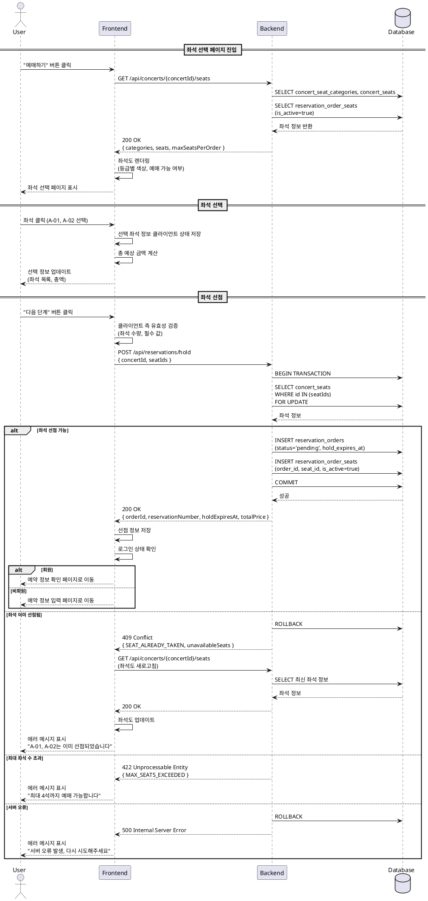

# Usecase 005: 좌석 선택

## Primary Actor
- 콘서트 예매를 원하는 사용자 (회원/비회원)

## Precondition
- 사용자가 콘서트 상세 페이지에서 예매하려는 콘서트를 확인한 상태
- 콘서트에 예매 가능한 좌석이 존재함
- 좌석 정보(`concert_seats`, `concert_seat_categories`)가 데이터베이스에 등록되어 있음

## Trigger
- 사용자가 콘서트 상세 페이지에서 "예매하기" 버튼을 클릭함

## Main Scenario

### 1. 좌석 선택 페이지 진입
1. 사용자가 콘서트 상세 페이지에서 "예매하기" 버튼을 클릭한다.
2. 시스템이 사용자를 좌석 선택 페이지(`/concerts/{concertId}/seats`)로 이동시킨다.
3. 프론트엔드가 백엔드에 좌석 정보 조회 API를 호출한다.
   - `GET /api/concerts/{concertId}/seats`
4. 백엔드가 다음 정보를 조회하여 반환한다:
   - `concert_seat_categories`: 좌석 등급별 이름, 색상, 가격
   - `concert_seats`: 좌석 목록 (seat_label, category_id)
   - `reservation_order_seats`: 이미 선점되었거나 확정된 좌석 (is_active=true)
5. 프론트엔드가 좌석도를 렌더링한다:
   - 등급별로 다른 색상으로 표시
   - 선택 불가능한 좌석(이미 예매된 좌석)은 비활성화 표시
   - 선택 가능한 좌석은 클릭 가능하도록 표시

### 2. 좌석 선택
6. 사용자가 좌석도에서 원하는 좌석을 클릭하여 선택한다.
7. 시스템이 선택된 좌석 정보를 클라이언트 상태에 임시 저장한다.
8. 화면에 선택된 좌석 목록과 총 예상 금액이 실시간으로 업데이트된다.
   - 좌석 등급별 가격을 합산하여 총액 계산
9. 사용자가 추가로 좌석을 선택하거나 선택을 취소할 수 있다.
   - 이미 선택한 좌석을 다시 클릭하면 선택 해제됨

### 3. 좌석 선점 요청
10. 사용자가 원하는 좌석 선택을 완료하고 "다음 단계" 버튼을 클릭한다.
11. 프론트엔드가 백엔드에 좌석 선점 API를 호출한다.
    - `POST /api/reservations/hold`
    - Request Body:
      ```json
      {
        "concertId": "uuid",
        "seatIds": ["seat-uuid-1", "seat-uuid-2"]
      }
      ```
12. 백엔드가 다음을 수행한다:
    - 선택한 좌석들이 모두 예매 가능한지 재검증
    - `reservation_orders` 테이블에 새 레코드 생성
      - `status`: "pending"
      - `concert_id`: 선택한 콘서트 ID
      - `user_id`: 로그인한 경우 회원 ID, 비로그인 시 NULL
      - `hold_expires_at`: 현재 시각 + 5분 (좌석 선점 유효 시간)
      - `reservation_number`: 생성된 예약 번호
    - `reservation_order_seats` 테이블에 선택한 좌석들 기록
      - 각 좌석별로 `order_id`, `seat_id`, `price`, `is_active=true` 저장
13. 백엔드가 좌석 선점 성공 응답을 반환한다:
    ```json
    {
      "success": true,
      "data": {
        "orderId": "order-uuid",
        "reservationNumber": "RN20250115001",
        "holdExpiresAt": "2025-01-15T10:05:00Z",
        "totalPrice": 150000
      }
    }
    ```

### 4. 다음 단계로 이동
14. 프론트엔드가 좌석 선점 정보를 저장하고, 사용자의 로그인 상태를 확인한다.
15. **회원인 경우**: 예약 정보 확인 페이지로 이동 (회원 정보 자동 완성)
16. **비회원인 경우**: 예약 정보 입력 페이지로 이동

## Edge Cases

### E1. 입력 값 유효성 검증 실패
- **상황**: 좌석을 선택하지 않고 "다음 단계" 버튼 클릭
- **처리**: "최소 1개 이상의 좌석을 선택해주세요" 메시지 표시
- **피드백**: 클라이언트 측 검증으로 API 호출 없이 즉시 피드백

### E2. 1인당 예매 가능 좌석 수 초과
- **상황**: 사용자가 허용된 수량(예: 4석)을 초과하여 좌석 선택 시도
- **처리**: 추가 선택을 차단하고 "1인당 최대 4석까지 예매 가능합니다" 메시지 표시
- **피드백**: 클라이언트 측에서 선택 가능한 최대 수량을 제한

### E3. 이미 선점/예매된 좌석 선택 시도
- **상황**: UI에서는 선택 가능하게 보였으나, 다른 사용자가 먼저 선점한 좌석
- **처리**:
  - 백엔드가 `reservation_order_seats`에서 `is_active=true`인 좌석 존재 여부 확인
  - 선점 불가능한 좌석이 포함되어 있으면 HTTP 409 Conflict 응답
  ```json
  {
    "success": false,
    "error": {
      "code": "SEAT_ALREADY_TAKEN",
      "message": "선택하신 좌석 중 일부가 이미 다른 사용자에게 선점되었습니다.",
      "unavailableSeats": ["A-12", "B-05"]
    }
  }
  ```
- **피드백**:
  - "선택하신 좌석 중 A-12, B-05는 방금 다른 사용자가 선점하였습니다. 다시 선택해주세요." 메시지 표시
  - 좌석도를 다시 로드하여 최신 상태 반영
  - 사용자는 좌석 선택 페이지에 머무르며 다른 좌석 선택 가능

### E4. 좌석 정보 조회 실패
- **상황**: 서버 통신 오류 또는 콘서트 정보가 존재하지 않음
- **처리**:
  - HTTP 404: "존재하지 않는 콘서트입니다."
  - HTTP 500: "서버 오류가 발생했습니다. 잠시 후 다시 시도해주세요."
- **피드백**: 에러 메시지와 함께 "이전 페이지로 돌아가기" 버튼 제공

### E5. 좌석 선점 API 호출 실패
- **상황**: 네트워크 오류 또는 서버 타임아웃
- **처리**:
  - 네트워크 오류: "네트워크 연결을 확인해주세요."
  - 서버 타임아웃: "서버 응답 시간이 초과되었습니다. 다시 시도해주세요."
- **피드백**: 에러 메시지 표시 후 사용자가 재시도할 수 있도록 "다시 시도" 버튼 제공

### E6. 예매 가능한 좌석이 없음
- **상황**: 페이지 로드 시 모든 좌석이 이미 예매된 상태
- **처리**: 좌석도는 렌더링하되, 모든 좌석을 비활성화 상태로 표시
- **피드백**: "현재 예매 가능한 좌석이 없습니다. 다음 공연을 확인해주세요." 안내 메시지 표시

### E7. 선점 유효 시간 만료 후 재진입
- **상황**: 사용자가 좌석 선점 후 다음 단계에서 뒤로가기로 좌석 선택 페이지 재진입
- **처리**:
  - 기존 pending 상태의 주문이 있는지 확인
  - `hold_expires_at`이 지났다면 해당 주문을 expired 처리하고 is_active=false로 변경
- **피드백**: "이전에 선택한 좌석의 유효 시간이 만료되었습니다. 다시 선택해주세요." 메시지 표시

## Business Rules

### BR1. 좌석 선점 유효 시간
- 좌석 선점 후 5분 이내에 예약을 완료하지 않으면 자동으로 만료됨
- `hold_expires_at` 시각이 지나면 백그라운드 잡 또는 다음 API 호출 시 자동으로 해당 주문을 expired 처리

### BR2. 1인당 예매 가능 좌석 수
- 동일 콘서트에 대해 1인당 최대 4석까지 예매 가능 (비즈니스 정책)
- 클라이언트와 서버 양쪽에서 검증 수행

### BR3. 좌석 중복 선점 방지
- `reservation_order_seats` 테이블의 `(seat_id, is_active=true)` 파셜 유니크 인덱스로 동시성 제어
- 동일한 좌석에 대해 여러 사용자가 동시에 선점 시도 시, 먼저 커밋된 트랜잭션만 성공

### BR4. 좌석 등급별 가격
- 좌석 가격은 `concert_seat_categories.price`에서 조회
- 선점 시점의 가격을 `reservation_order_seats.price`에 스냅샷으로 저장하여 추후 가격 변경에 영향받지 않음

### BR5. 회원/비회원 좌석 선점
- 회원: `reservation_orders.user_id`에 회원 ID 저장
- 비회원: `reservation_orders.user_id`는 NULL, 이후 단계에서 예매자 정보 직접 입력

### BR6. 좌석 해제 조건
- 예약 상태가 `pending`에서 `expired` 또는 `cancelled`로 변경되면 `is_active=false` 설정
- 해당 좌석은 다시 예매 가능한 상태로 전환됨

## API Specification

### GET /api/concerts/{concertId}/seats
**Purpose**: 콘서트의 전체 좌석 정보 조회

**Request**:
- Path Parameter: `concertId` (uuid)

**Response** (200 OK):
```json
{
  "success": true,
  "data": {
    "concertId": "uuid",
    "concertTitle": "제미니 콘서트 2025",
    "categories": [
      {
        "id": "category-uuid-1",
        "name": "VIP",
        "displayColor": "#FFD700",
        "price": 150000
      },
      {
        "id": "category-uuid-2",
        "name": "R석",
        "displayColor": "#FF6B6B",
        "price": 120000
      },
      {
        "id": "category-uuid-3",
        "name": "S석",
        "displayColor": "#4ECDC4",
        "price": 90000
      }
    ],
    "seats": [
      {
        "id": "seat-uuid-1",
        "seatLabel": "A-01",
        "categoryId": "category-uuid-1",
        "isAvailable": true
      },
      {
        "id": "seat-uuid-2",
        "seatLabel": "A-02",
        "categoryId": "category-uuid-1",
        "isAvailable": false
      }
    ],
    "maxSeatsPerOrder": 4
  }
}
```

**Error Responses**:
- 404: 콘서트를 찾을 수 없음
- 500: 서버 내부 오류

### POST /api/reservations/hold
**Purpose**: 선택한 좌석 선점

**Request**:
```json
{
  "concertId": "uuid",
  "seatIds": ["seat-uuid-1", "seat-uuid-2"]
}
```

**Validation**:
- `seatIds`: 배열, 1개 이상 4개 이하, 각 요소는 유효한 uuid
- `concertId`: 유효한 uuid, 존재하는 콘서트

**Response** (200 OK):
```json
{
  "success": true,
  "data": {
    "orderId": "order-uuid",
    "reservationNumber": "RN20250115001",
    "holdExpiresAt": "2025-01-15T10:05:00Z",
    "seats": [
      {
        "seatId": "seat-uuid-1",
        "seatLabel": "A-01",
        "categoryName": "VIP",
        "price": 150000
      }
    ],
    "totalPrice": 150000
  }
}
```

**Error Responses**:
- 400: 잘못된 요청 (유효성 검증 실패)
  ```json
  {
    "success": false,
    "error": {
      "code": "INVALID_REQUEST",
      "message": "좌석은 최소 1개 이상 선택해야 합니다."
    }
  }
  ```
- 409: 좌석 선점 실패 (이미 다른 사용자가 선점)
  ```json
  {
    "success": false,
    "error": {
      "code": "SEAT_ALREADY_TAKEN",
      "message": "선택하신 좌석 중 일부가 이미 선점되었습니다.",
      "unavailableSeats": ["A-12", "B-05"]
    }
  }
  ```
- 422: 비즈니스 규칙 위반 (예: 최대 좌석 수 초과)
  ```json
  {
    "success": false,
    "error": {
      "code": "MAX_SEATS_EXCEEDED",
      "message": "1인당 최대 4석까지 예매 가능합니다."
    }
  }
  ```

## UI/UX Requirements

### Layout
- **좌석도 영역**: 화면 좌측 또는 상단 (모바일에서는 상단)
- **선택 정보 영역**: 화면 우측 또는 하단 (모바일에서는 하단 고정)
  - 선택한 좌석 목록
  - 총 예상 금액
  - "다음 단계" 버튼

### 좌석도 렌더링
- 등급별로 다른 색상 적용 (`concert_seat_categories.display_color`)
- 좌석 상태별 스타일:
  - **선택 가능**: 등급 색상, 커서 포인터, 호버 시 밝아짐
  - **선택됨**: 진한 색상 또는 테두리 강조, 체크 아이콘 표시
  - **선택 불가(이미 예매)**: 회색, 커서 기본, 클릭 불가
- 좌석 레이블(`seat_label`) 표시: 예) A-01, B-12
- 반응형 디자인: 모바일에서도 터치하기 쉽도록 충분한 크기

### 범례(Legend)
- 등급별 색상과 이름, 가격 정보 표시
- 선택 가능/불가 상태 설명

### 선택 정보 패널
- **선택한 좌석**: 좌석 레이블, 등급, 가격을 카드 형태로 나열
- **각 좌석 우측에 X 버튼**: 클릭 시 해당 좌석 선택 해제
- **총 예상 금액**: 큰 글씨로 강조
- **"다음 단계" 버튼**:
  - 좌석 선택 전: 비활성화 상태
  - 좌석 선택 후: 활성화, Primary 색상

### 로딩 및 에러 상태
- **좌석 정보 로딩 중**: 스켈레톤 UI 또는 로딩 스피너
- **좌석 선점 요청 중**: "다음 단계" 버튼 비활성화, 로딩 스피너 표시
- **에러 발생 시**: Toast 메시지 또는 Alert 박스로 명확한 피드백 제공

### 접근성(Accessibility)
- 키보드 네비게이션 지원: Tab, Enter, Space로 좌석 선택/해제 가능
- ARIA 레이블 적용: 좌석 상태를 스크린 리더가 읽을 수 있도록
- 색상뿐만 아니라 아이콘 또는 패턴으로도 좌석 상태 구분

## Sequence Diagram



## Implementation Notes

### Frontend
- **State Management**:
  - Zustand로 선택한 좌석 정보 전역 관리
  - React Query로 좌석 정보 조회 및 캐싱
- **UI Components**:
  - `SeatMap`: 좌석도 렌더링 컴포넌트
  - `Seat`: 개별 좌석 버튼 컴포넌트 (등급, 상태에 따른 스타일)
  - `SeatLegend`: 등급별 범례 컴포넌트
  - `SelectedSeatsPanel`: 선택 정보 패널 컴포넌트
- **Validation**:
  - Zod 스키마로 클라이언트 측 요청 검증
  - 최대 좌석 수 제한을 UI 레벨에서 먼저 적용

### Backend
- **Transaction 관리**:
  - 좌석 선점은 반드시 트랜잭션 내에서 처리
  - `SELECT ... FOR UPDATE`로 row-level locking 적용
- **Error Handling**:
  - 좌석 중복 선점 시도 시 unique constraint violation을 catch하여 409 응답
  - 비즈니스 규칙 위반 시 명확한 에러 코드와 메시지 반환
- **Background Job**:
  - 주기적으로 `hold_expires_at`이 지난 pending 주문을 expired 처리
  - `is_active=false`로 설정하여 좌석 반납

### Database
- **Indexes**:
  - `reservation_order_seats (seat_id)` WHERE `is_active = true` (파셜 유니크 인덱스)
  - `reservation_orders (concert_id, status)`
  - `concert_seats (concert_id, category_id)`
- **Constraints**:
  - `reservation_orders.status`: CHECK constraint for valid status values
  - `reservation_order_seats (seat_id, is_active)`: Partial unique index

## Related Usecases
- **UC-004**: 로그인 (좌석 선점 시 회원 여부 판단)
- **UC-006**: 예약 정보 입력 (비회원) - 좌석 선점 후 다음 단계
- **UC-007**: 예약 정보 확인 (회원) - 좌석 선점 후 다음 단계
- **UC-008**: 예약 완료 확인 - 최종 예약 확정 후 연결

## Open Questions
- [ ] 좌석 선점 유효 시간(5분)을 UI에 타이머로 표시할 것인가?
- [ ] 좌석도 레이아웃(그리드 구조)은 콘서트마다 다른가, 아니면 고정된 형태인가?
- [ ] 장애인석, VIP 라운지석 등 특수 좌석 카테고리가 필요한가?
- [ ] 좌석 선점 실패 시 자동으로 대체 좌석을 추천하는 기능이 필요한가?
