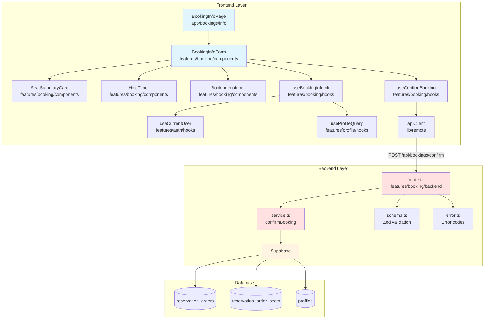
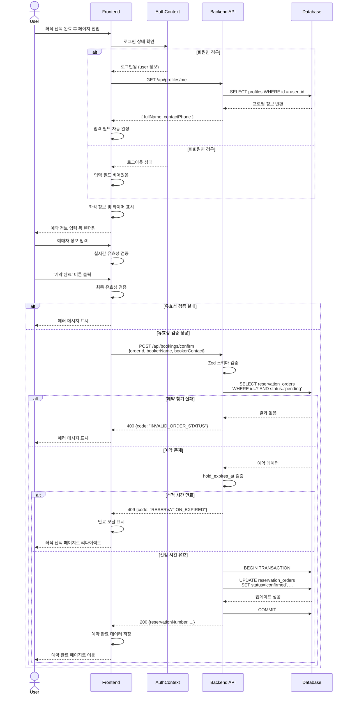

# 예약 정보 입력 페이지 설계 문서 (UC-006/007)

> **통합 설계**: 회원과 비회원 예약 정보 입력 페이지의 통합 설계 문서입니다.
>
> - **UC-006**: 비회원 예약 정보 입력
> - **UC-007**: 회원 예약 정보 확인 및 입력

---

## 1. 페이지 개요

### 1.1 목적
좌석 선점 완료 후 예매자 정보를 입력받아 예약을 확정하는 페이지입니다. 회원의 경우 프로필 정보를 자동 완성하여 편의성을 제공하고, 비회원은 직접 입력하도록 합니다.

### 1.2 주요 기능
- 선택한 좌석 정보 및 총 금액 표시
- 좌석 선점 만료 카운트다운 타이머 (15분)
- 예매자 정보 입력 폼 (이름, 연락처)
- 회원의 경우 프로필 정보 자동 완성
- 실시간 유효성 검증 및 에러 피드백
- 예약 확정 API 호출 및 완료 페이지로 이동

### 1.3 접근 경로
```
좌석 선택 페이지 (UC-005)
  → 좌석 선점 성공
    → 예약 정보 입력 페이지 (UC-006/007)
      → 예약 확정 성공
        → 예약 완료 페이지 (UC-008)
```

---

## 2. 페이지 구조 및 레이아웃

### 2.1 레이아웃 구성

```
┌─────────────────────────────────────────────────────────┐
│  Header (로고, 네비게이션, 로그인 상태)                  │
├─────────────────────────────────────────────────────────┤
│  [Progress Indicator]                                   │
│  ● 좌석 선택  →  ● 정보 입력  →  ○ 예약 완료            │
├─────────────────────────────────────────────────────────┤
│                                                         │
│  ┌──────────────────┐   ┌────────────────────────────┐ │
│  │ 좌석 정보 요약    │   │  예매자 정보 입력           │ │
│  │                  │   │                            │ │
│  │ 콘서트: 제미니... │   │  선점 만료: ⏱️ 14:32        │ │
│  │ 좌석: A-12 (VIP) │   │  ────────────────────────  │ │
│  │ 가격: 150,000원  │   │  [이름 입력 필드]           │ │
│  │                  │   │  └─ 에러 메시지 영역        │ │
│  │ 총 금액:         │   │                            │ │
│  │ 150,000원        │   │  [연락처 입력 필드]         │ │
│  │                  │   │  └─ 에러 메시지 영역        │ │
│  └──────────────────┘   │                            │ │
│                         │  [예약 완료 버튼]           │ │
│                         └────────────────────────────┘ │
│                                                         │
└─────────────────────────────────────────────────────────┘
```

### 2.2 반응형 고려사항

**데스크톱 (≥768px)**
- 2열 레이아웃: 좌측 좌석 요약, 우측 입력 폼
- 최대 폭 1200px, 중앙 정렬

**모바일 (<768px)**
- 1열 세로 레이아웃
- 좌석 요약 카드가 상단에 위치
- 입력 필드는 전체 폭 사용
- 버튼 최소 높이 44px (터치 타겟)

---

## 3. 주요 컴포넌트 목록

### 3.1 페이지 컴포넌트

#### `BookingInfoPage`
- **경로**: `src/app/bookings/[orderId]/info/page.tsx`
- **역할**: 예약 정보 입력 페이지 루트 컴포넌트
- **Props**:
  ```typescript
  {
    params: Promise<{ orderId: string }>
  }
  ```
- **주요 로직**:
  - URL에서 `orderId` 추출
  - 로그인 상태 확인
  - 좌석 선점 정보 조회
  - 회원인 경우 프로필 정보 자동 완성

### 3.2 Feature 컴포넌트

#### `BookingInfoForm`
- **경로**: `src/features/booking/components/BookingInfoForm.tsx`
- **역할**: 예매자 정보 입력 폼 메인 컴포넌트
- **Props**:
  ```typescript
  {
    orderId: string;
    initialData?: {
      bookerName?: string;
      bookerContact?: string;
    };
    holdExpiresAt: string;
  }
  ```
- **주요 기능**:
  - react-hook-form 통한 폼 상태 관리
  - 실시간 유효성 검증
  - 예약 확정 mutation 호출
  - 성공 시 예약 완료 페이지로 리다이렉트

#### `SeatSummaryCard`
- **경로**: `src/features/booking/components/SeatSummaryCard.tsx`
- **역할**: 선택한 좌석 정보 요약 표시 (읽기 전용)
- **Props**:
  ```typescript
  {
    concertTitle: string;
    seats: Array<{
      seatLabel: string;
      categoryName: string;
      price: number;
    }>;
    totalPrice: number;
  }
  ```

#### `HoldTimer`
- **경로**: `src/features/booking/components/HoldTimer.tsx`
- **역할**: 좌석 선점 만료 카운트다운 타이머
- **Props**:
  ```typescript
  {
    expiresAt: string;
    onExpire: () => void;
  }
  ```
- **주요 기능**:
  - `MM:SS` 형식 카운트다운
  - 5분 이하 시 빨간색 강조
  - 만료 시 `onExpire` 콜백 실행

#### `BookingInfoInput`
- **경로**: `src/features/booking/components/BookingInfoInput.tsx`
- **역할**: 재사용 가능한 입력 필드 래퍼
- **Props**:
  ```typescript
  {
    label: string;
    name: string;
    type?: 'text' | 'tel';
    placeholder?: string;
    error?: string;
    register: UseFormRegister<FormData>;
  }
  ```

---

## 4. 폼 상태 관리 (React Hook Form)

### 4.1 폼 스키마

```typescript
// src/features/booking/lib/validation.ts
import { z } from 'zod';

export const bookingInfoFormSchema = z.object({
  bookerName: z.string()
    .min(2, '이름은 2자 이상 입력해주세요')
    .max(20, '이름은 20자 이하로 입력해주세요')
    .regex(/^[가-힣a-zA-Z\s]+$/, '이름은 한글, 영문, 공백만 입력 가능합니다'),
  bookerContact: z.string()
    .regex(/^01[0-9]-\d{3,4}-\d{4}$/, '올바른 연락처 형식이 아닙니다 (예: 010-1234-5678)')
});

export type BookingInfoFormData = z.infer<typeof bookingInfoFormSchema>;
```

### 4.2 폼 초기화 예시

```typescript
// BookingInfoForm.tsx
import { useForm } from 'react-hook-form';
import { zodResolver } from '@hookform/resolvers/zod';

const form = useForm<BookingInfoFormData>({
  resolver: zodResolver(bookingInfoFormSchema),
  defaultValues: {
    bookerName: initialData?.bookerName || '',
    bookerContact: initialData?.bookerContact || '',
  },
  mode: 'onChange', // 실시간 검증
});
```

---

## 5. API 엔드포인트 및 데이터 스키마

### 5.1 예약 확정 API

#### Endpoint
```
POST /api/bookings/confirm
```

#### Request Schema
```typescript
// src/features/booking/backend/schema.ts
export const confirmBookingRequestSchema = z.object({
  orderId: z.string().uuid(),
  bookerName: z.string()
    .min(2, '이름은 2자 이상 입력해주세요')
    .max(20, '이름은 20자 이하로 입력해주세요')
    .regex(/^[가-힣a-zA-Z\s]+$/, '이름은 한글, 영문, 공백만 입력 가능합니다'),
  bookerContact: z.string()
    .regex(/^01[0-9]-\d{3,4}-\d{4}$/, '올바른 연락처 형식이 아닙니다')
});

export type ConfirmBookingRequest = z.infer<typeof confirmBookingRequestSchema>;
```

#### Response Schema (Success)
```typescript
export const confirmBookingResponseSchema = z.object({
  reservationNumber: z.string(),
  concertTitle: z.string(),
  bookerName: z.string(),
  bookerContact: z.string(),
  seats: z.array(z.object({
    seatLabel: z.string(),
    categoryName: z.string(),
    price: z.number()
  })),
  totalPrice: z.number(),
  confirmedAt: z.string().datetime()
});

export type ConfirmBookingResponse = z.infer<typeof confirmBookingResponseSchema>;
```

#### Error Response
```typescript
export const bookingErrorSchema = z.object({
  code: z.enum([
    'RESERVATION_EXPIRED',
    'INVALID_ORDER_STATUS',
    'SEAT_NOT_AVAILABLE',
    'VALIDATION_ERROR',
    'SERVER_ERROR'
  ]),
  message: z.string(),
  details: z.record(z.string()).optional()
});

export type BookingError = z.infer<typeof bookingErrorSchema>;
```

### 5.2 프로필 조회 API (회원용)

#### Endpoint
```
GET /api/profiles/me
```

#### Response Schema
```typescript
export const profileResponseSchema = z.object({
  id: z.string().uuid(),
  fullName: z.string().nullable(),
  contactPhone: z.string().nullable()
});

export type ProfileResponse = z.infer<typeof profileResponseSchema>;
```

---

## 6. 회원/비회원 분기 처리

### 6.1 로그인 상태 확인

```typescript
// src/features/booking/hooks/useBookingInfoInit.ts
import { useCurrentUser } from '@/features/auth/hooks/useCurrentUser';
import { useProfileQuery } from '@/features/profile/hooks/useProfileQuery';

export function useBookingInfoInit() {
  const { user, isLoading: isAuthLoading } = useCurrentUser();
  const { data: profile, isLoading: isProfileLoading } = useProfileQuery({
    enabled: !!user,
  });

  const initialData = user && profile ? {
    bookerName: profile.fullName || '',
    bookerContact: profile.contactPhone || '',
  } : undefined;

  return {
    isLoading: isAuthLoading || (user ? isProfileLoading : false),
    initialData,
    isMember: !!user,
  };
}
```

### 6.2 분기 로직

```typescript
// BookingInfoPage.tsx
const { isMember, initialData, isLoading } = useBookingInfoInit();

if (isLoading) {
  return <LoadingSpinner />;
}

return (
  <BookingInfoForm
    orderId={orderId}
    initialData={initialData} // 회원이면 프로필 데이터, 비회원이면 undefined
    holdExpiresAt={holdExpiresAt}
  />
);
```

---

## 7. 유효성 검증 규칙

### 7.1 클라이언트 측 검증 (실시간)

| 필드 | 규칙 | 에러 메시지 |
|------|------|-------------|
| **이름** | 필수, 2자 이상 | "이름은 2자 이상 입력해주세요" |
| | 20자 이하 | "이름은 20자 이하로 입력해주세요" |
| | 한글/영문/공백만 | "이름은 한글, 영문, 공백만 입력 가능합니다" |
| **연락처** | 필수 | "연락처를 입력해주세요" |
| | 전화번호 형식 | "올바른 연락처 형식이 아닙니다 (예: 010-1234-5678)" |

### 7.2 서버 측 검증

- Zod 스키마를 통한 동일 규칙 재검증
- 좌석 선점 상태 및 만료 시간 확인
- 트랜잭션 내에서 원자적 처리

---

## 8. UI/UX 요구사항

### 8.1 선점 타이머

**표시 형식**
- `MM:SS` (예: 14:32)
- 페이지 상단 또는 폼 내부 상단에 고정

**강조 규칙**
- 5분 초과: 파란색 또는 기본 색상
- 5분 이하 ~ 1분 초과: 주황색
- 1분 이하: 빨간색 + 깜빡임 효과

**만료 처리**
- 타이머 `00:00` 도달 시 자동으로 알림 모달 표시
- "예매 가능 시간이 초과되었습니다. 좌석 선택부터 다시 진행해주세요."
- 확인 버튼 클릭 시 좌석 선택 페이지로 리다이렉트

### 8.2 입력 필드 피드백

**실시간 검증 (onChange)**
- 입력 중 또는 blur 이벤트 시 즉시 검증
- 에러 상태: 빨간색 테두리 + 하단 에러 메시지 (빨간색 텍스트)
- 성공 상태: 초록색 체크 아이콘 (선택사항)

**예시**
```
┌─────────────────────────────────┐
│ 이름 *                          │
│ ┌───────────────────────────────┐
│ │ 홍길동                        │ ← 정상
│ └───────────────────────────────┘
└─────────────────────────────────┘

┌─────────────────────────────────┐
│ 연락처 *                        │
│ ┌───────────────────────────────┐
│ │ 010-1234                      │ ← 에러 (빨간색 테두리)
│ └───────────────────────────────┘
│ ⚠️ 올바른 연락처 형식이 아닙니다 │ ← 에러 메시지
└─────────────────────────────────┘
```

### 8.3 예약 완료 버튼

**버튼 상태**
- 기본: 활성화 (primary 색상)
- 유효성 검증 실패 시: 비활성화 또는 클릭 시 에러 필드로 포커스 이동
- API 요청 중: 로딩 스피너 + "처리 중..." 텍스트 + 비활성화

**인터랙션**
- 클릭 시 중복 요청 방지 (debounce)
- 성공 시 예약 완료 페이지로 자동 리다이렉트

### 8.4 에러 피드백

**필드별 에러**
- 해당 입력 필드 하단에 인라인 메시지

**서버 에러**
- 페이지 상단에 알림 배너 표시
- Toast 메시지로 명확한 피드백

**만료 에러**
- 모달로 명확히 안내 후 자동 리다이렉트

### 8.5 접근성 (a11y)

- 모든 입력 필드에 `<label>` 연결
- 에러 메시지에 `role="alert"` 또는 `aria-live="polite"` 적용
- 키보드 네비게이션 지원 (Tab 순서)
- 포커스 가시성 확보 (outline)

---

## 9. 구현 우선순위

### Phase 1: 기본 폼 구현
1. ✅ 페이지 라우팅 및 레이아웃 구성
2. ✅ 좌석 정보 요약 카드 컴포넌트
3. ✅ 예매자 정보 입력 폼 (react-hook-form)
4. ✅ 클라이언트 측 유효성 검증

### Phase 2: 백엔드 연동
5. ✅ 예약 확정 API 엔드포인트 구현 (`POST /api/bookings/confirm`)
6. ✅ 프로필 조회 API 연동 (회원용)
7. ✅ React Query mutation 훅 (`useConfirmBooking`)

### Phase 3: 회원/비회원 분기
8. ✅ 로그인 상태 확인 및 프로필 자동 완성
9. ✅ 회원과 비회원 플로우 통합

### Phase 4: UX 개선
10. ✅ 선점 타이머 컴포넌트 구현
11. ✅ 에러 피드백 개선 (Toast, Modal)
12. ✅ 로딩 상태 처리

### Phase 5: 테스트 및 최적화
13. ⏳ 유효성 검증 단위 테스트
14. ⏳ E2E 테스트 (정상 플로우, 만료 시나리오)
15. ⏳ 반응형 레이아웃 최적화

---

## 10. 모듈 설계 다이어그램



---

## 11. Implementation Plan

### 11.1 프론트엔드 모듈

#### 모듈 1: `BookingInfoPage`
- **경로**: `src/app/bookings/[orderId]/info/page.tsx`
- **책임**: 페이지 루트, 데이터 초기화
- **구현 계획**:
  ```typescript
  // 1. URL 파라미터 추출
  const params = await props.params;
  const { orderId } = params;

  // 2. 로그인 상태 및 프로필 조회
  const { isMember, initialData, isLoading } = useBookingInfoInit();

  // 3. 좌석 선점 정보 조회
  const { data: holdInfo } = useHoldInfoQuery(orderId);

  // 4. 렌더링
  return (
    <div>
      <ProgressIndicator step={2} />
      <div className="grid grid-cols-1 md:grid-cols-2 gap-6">
        <SeatSummaryCard {...holdInfo} />
        <BookingInfoForm
          orderId={orderId}
          initialData={initialData}
          holdExpiresAt={holdInfo.holdExpiresAt}
        />
      </div>
    </div>
  );
  ```

#### 모듈 2: `BookingInfoForm`
- **경로**: `src/features/booking/components/BookingInfoForm.tsx`
- **책임**: 폼 상태 관리, API 호출
- **구현 계획**:
  ```typescript
  // 1. react-hook-form 초기화
  const form = useForm<BookingInfoFormData>({
    resolver: zodResolver(bookingInfoFormSchema),
    defaultValues: initialData,
    mode: 'onChange',
  });

  // 2. mutation 훅
  const confirmMutation = useConfirmBooking();

  // 3. 제출 핸들러
  const onSubmit = async (data: BookingInfoFormData) => {
    try {
      const result = await confirmMutation.mutateAsync({
        orderId,
        ...data,
      });
      router.push(`/bookings/${result.reservationNumber}/complete`);
    } catch (error) {
      toast.error('예약 확정 중 오류가 발생했습니다.');
    }
  };

  // 4. 렌더링
  return (
    <form onSubmit={form.handleSubmit(onSubmit)}>
      <HoldTimer expiresAt={holdExpiresAt} onExpire={handleExpire} />
      <BookingInfoInput
        label="이름"
        name="bookerName"
        error={form.formState.errors.bookerName?.message}
        register={form.register}
      />
      <BookingInfoInput
        label="연락처"
        name="bookerContact"
        type="tel"
        error={form.formState.errors.bookerContact?.message}
        register={form.register}
      />
      <Button type="submit" disabled={confirmMutation.isPending}>
        {confirmMutation.isPending ? '처리 중...' : '예약 완료'}
      </Button>
    </form>
  );
  ```

#### 모듈 3: `HoldTimer`
- **경로**: `src/features/booking/components/HoldTimer.tsx`
- **책임**: 선점 만료 카운트다운
- **구현 계획**:
  ```typescript
  // 1. 타이머 훅
  const { minutes, seconds, isExpired, isWarning } = useCountdown(expiresAt);

  // 2. 만료 처리
  useEffect(() => {
    if (isExpired) {
      onExpire();
    }
  }, [isExpired, onExpire]);

  // 3. 렌더링
  const colorClass = isWarning ? 'text-red-500' : 'text-blue-500';

  return (
    <div className={`flex items-center gap-2 ${colorClass}`}>
      <ClockIcon />
      <span className="font-mono text-lg">
        {String(minutes).padStart(2, '0')}:{String(seconds).padStart(2, '0')}
      </span>
    </div>
  );
  ```

#### QA Sheet (Presentation Layer)

| 시나리오 | 테스트 방법 | 예상 결과 |
|---------|------------|----------|
| 비회원 페이지 진입 | 로그아웃 상태로 페이지 접근 | 입력 필드가 비어있음 |
| 회원 페이지 진입 | 로그인 상태로 페이지 접근 | 프로필 정보가 자동 완성됨 |
| 이름 필드 유효성 (짧음) | "홍" 입력 | "이름은 2자 이상 입력해주세요" 에러 |
| 이름 필드 유효성 (특수문자) | "홍길동!" 입력 | "이름은 한글, 영문, 공백만 입력 가능합니다" 에러 |
| 연락처 필드 유효성 (형식) | "01012345678" 입력 | "올바른 연락처 형식이 아닙니다" 에러 |
| 연락처 필드 유효성 (정상) | "010-1234-5678" 입력 | 에러 없음, 체크 아이콘 표시 |
| 타이머 5분 이하 | 만료 5분 전 시점에 접근 | 타이머가 주황색으로 변경 |
| 타이머 1분 이하 | 만료 1분 전 시점에 접근 | 타이머가 빨간색 + 깜빡임 |
| 타이머 만료 | 15분 경과 후 페이지 유지 | 만료 모달 자동 표시, 좌석 선택 페이지로 리다이렉트 |
| 예약 완료 버튼 (유효성 실패) | 빈 값 상태로 버튼 클릭 | 에러 메시지 표시, 첫 에러 필드로 포커스 |
| 예약 완료 버튼 (정상) | 유효한 값 입력 후 클릭 | 로딩 표시 → 완료 페이지로 이동 |
| 네트워크 에러 | 서버 중단 상태에서 제출 | Toast 에러 메시지 표시, 재시도 가능 |
| 반응형 (모바일) | 화면 폭 375px로 조정 | 1열 레이아웃, 버튼 높이 44px 이상 |

---

### 11.2 백엔드 모듈

#### 모듈 1: `route.ts`
- **경로**: `src/features/booking/backend/route.ts`
- **책임**: Hono 라우터 정의, 요청 검증
- **구현 계획**:
  ```typescript
  export const registerBookingRoutes = (app: Hono<AppEnv>) => {
    app.post('/api/bookings/confirm', async (c) => {
      const body = await c.req.json();
      const parsedBody = confirmBookingRequestSchema.safeParse(body);

      if (!parsedBody.success) {
        return respond(
          c,
          failure(400, 'VALIDATION_ERROR', '입력값이 유효하지 않습니다.', parsedBody.error.format())
        );
      }

      const supabase = getSupabase(c);
      const logger = getLogger(c);

      const result = await confirmBooking(
        supabase,
        parsedBody.data.orderId,
        parsedBody.data.bookerName,
        parsedBody.data.bookerContact
      );

      if (!result.ok) {
        const errorResult = result as ErrorResult<BookingServiceError, unknown>;

        if (errorResult.error.code === bookingErrorCodes.expiredError) {
          logger.info('Seat hold expired', { orderId: parsedBody.data.orderId });
        }

        return respond(c, result);
      }

      return respond(c, result);
    });
  };
  ```

#### 모듈 2: `service.ts`
- **경로**: `src/features/booking/backend/service.ts`
- **책임**: 비즈니스 로직, Supabase 접근
- **구현 계획**:
  ```typescript
  export const confirmBooking = async (
    supabase: SupabaseClient,
    orderId: string,
    bookerName: string,
    bookerContact: string
  ): Promise<HandlerResult<ConfirmBookingResponse, BookingServiceError, unknown>> => {
    // 1. 예약 조회
    const { data: order, error: fetchError } = await supabase
      .from('reservation_orders')
      .select(`
        *,
        concert:concerts!inner(title),
        reservation_order_seats!inner(
          seat_id,
          price,
          concert_seats!inner(
            seat_label,
            concert_seat_categories!inner(name)
          )
        )
      `)
      .eq('id', orderId)
      .eq('status', 'pending')
      .single();

    if (fetchError || !order) {
      return failure(400, bookingErrorCodes.invalidStatus, '예약 상태가 유효하지 않습니다.');
    }

    // 2. 선점 만료 검증
    if (new Date(order.hold_expires_at) <= new Date()) {
      return failure(409, bookingErrorCodes.expiredError, '예매 가능 시간이 초과되었습니다.');
    }

    // 3. 총 금액 계산
    const totalPrice = order.reservation_order_seats.reduce(
      (sum, seat) => sum + Number(seat.price),
      0
    );

    // 4. 예약 확정
    const reservationNumber = generateReservationNumber();

    const { error: updateError } = await supabase
      .from('reservation_orders')
      .update({
        status: 'confirmed',
        booker_name: bookerName,
        booker_contact: bookerContact,
        reservation_number: reservationNumber,
        total_price: totalPrice,
        confirmed_at: new Date().toISOString(),
        updated_at: new Date().toISOString(),
      })
      .eq('id', orderId)
      .eq('status', 'pending');

    if (updateError) {
      return failure(500, bookingErrorCodes.serverError, '예약 확정 중 오류가 발생했습니다.');
    }

    // 5. 성공 응답 구성
    const response: ConfirmBookingResponse = {
      reservationNumber,
      concertTitle: order.concert.title,
      bookerName,
      bookerContact,
      seats: order.reservation_order_seats.map(s => ({
        seatLabel: s.concert_seats.seat_label,
        categoryName: s.concert_seats.concert_seat_categories.name,
        price: Number(s.price),
      })),
      totalPrice,
      confirmedAt: new Date().toISOString(),
    };

    return success(response);
  };

  function generateReservationNumber(): string {
    const date = new Date().toISOString().slice(0, 10).replace(/-/g, '');
    const serial = Math.floor(Math.random() * 10000).toString().padStart(4, '0');
    return `RES-${date}-${serial}`;
  }
  ```

#### 모듈 3: `error.ts`
- **경로**: `src/features/booking/backend/error.ts`
- **책임**: 에러 코드 정의
- **구현 계획**:
  ```typescript
  export const bookingErrorCodes = {
    expiredError: 'RESERVATION_EXPIRED',
    invalidStatus: 'INVALID_ORDER_STATUS',
    seatNotAvailable: 'SEAT_NOT_AVAILABLE',
    validationError: 'VALIDATION_ERROR',
    serverError: 'SERVER_ERROR',
  } as const;

  export type BookingServiceError = typeof bookingErrorCodes[keyof typeof bookingErrorCodes];
  ```

#### Unit Test (Business Logic)

```typescript
// src/features/booking/backend/service.test.ts
describe('confirmBooking', () => {
  it('예약 확정 성공 - 정상 플로우', async () => {
    const mockOrder = {
      id: 'order-1',
      status: 'pending',
      hold_expires_at: addMinutes(new Date(), 10).toISOString(),
      concert: { title: '제미니 콘서트' },
      reservation_order_seats: [
        { price: 150000, concert_seats: { seat_label: 'A-01', concert_seat_categories: { name: 'VIP' } } }
      ]
    };

    mockSupabase.from().select().eq().eq().single.mockResolvedValue({ data: mockOrder, error: null });
    mockSupabase.from().update().eq().eq.mockResolvedValue({ error: null });

    const result = await confirmBooking(mockSupabase, 'order-1', '홍길동', '010-1234-5678');

    expect(result.ok).toBe(true);
    expect(result.data.reservationNumber).toMatch(/^RES-\d{8}-\d{4}$/);
    expect(result.data.totalPrice).toBe(150000);
  });

  it('예약 확정 실패 - 선점 시간 만료', async () => {
    const expiredOrder = {
      ...mockOrder,
      hold_expires_at: subMinutes(new Date(), 1).toISOString(),
    };

    mockSupabase.from().select().eq().eq().single.mockResolvedValue({ data: expiredOrder, error: null });

    const result = await confirmBooking(mockSupabase, 'order-1', '홍길동', '010-1234-5678');

    expect(result.ok).toBe(false);
    expect(result.error.code).toBe('RESERVATION_EXPIRED');
  });

  it('예약 확정 실패 - 예약 상태 불일치', async () => {
    mockSupabase.from().select().eq().eq().single.mockResolvedValue({ data: null, error: { message: 'Not found' } });

    const result = await confirmBooking(mockSupabase, 'invalid-order', '홍길동', '010-1234-5678');

    expect(result.ok).toBe(false);
    expect(result.error.code).toBe('INVALID_ORDER_STATUS');
  });
});
```

---

## 12. 데이터 플로우 시퀀스



---

## 13. 관련 문서

- [PRD](../../prd.md)
- [User Flow](../../userflow.md)
- [Database Schema](../../database.md)
- [State Management](../../state-management.md)
- [UC-005: 좌석 선택](../005/spec.md)
- [UC-006: 예약 정보 입력 (비회원) - Spec](../006/spec.md)
- [UC-007: 예약 정보 확인 및 입력 (회원) - Spec](../007/spec.md)
- [UC-008: 예약 완료 확인](../008/spec.md)

---

## 14. 구현 시 주의사항

### 14.1 보안
- 클라이언트에서 전달된 `totalPrice`를 신뢰하지 말고 서버에서 재계산
- 예약 번호 생성 시 충돌 방지 (시퀀스 또는 UUID 사용)
- 비회원 예약 조회 시 `reservationNumber` + `bookerName` 모두 일치해야 조회 가능

### 14.2 성능
- 프로필 조회는 React Query로 캐싱하여 불필요한 재요청 방지
- 타이머는 `requestAnimationFrame` 또는 `setInterval`로 최적화

### 14.3 사용자 경험
- 타이머 만료 시 사용자에게 명확한 안내 후 리다이렉트
- 네트워크 에러 시 재시도 버튼 제공
- 입력 필드 에러는 실시간 피드백으로 즉각 안내

### 14.4 데이터 일관성
- 예약 확정은 반드시 트랜잭션 내에서 처리
- 좌석 선점 만료 시 백그라운드 잡에서 `is_active=false` 처리

---

**문서 작성일**: 2025-10-15
**작성자**: Claude Code
**버전**: 1.0
