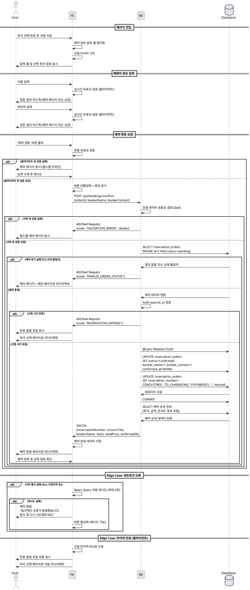

# 유스케이스 006: 예약 정보 입력 (비회원)

## 개요

비회원 사용자가 좌석 선택을 완료한 후 예매자 정보를 입력하고 예약을 확정하는 유스케이스입니다. 시스템은 입력된 정보의 유효성을 검증하고, 좌석 선점 시간 내에 예약을 확정하여 예매 번호를 발급합니다.

## Primary Actor

- 비회원 사용자 (로그인하지 않은 상태에서 예매를 진행하는 사용자)

## Precondition

- 사용자가 좌석 선택 페이지에서 원하는 좌석을 선택하고 좌석 선점에 성공한 상태
- 서버는 `reservation_orders` 테이블에 `status='pending'` 상태의 예약 레코드를 생성하고 `hold_expires_at`로 선점 만료 시간을 설정한 상태
- 선택한 좌석들이 `reservation_order_seats` 테이블에 `is_active=true`로 기록된 상태
- 사용자가 예약 정보 입력 페이지로 진입한 상태

## Trigger

사용자가 예매자 정보 입력 폼에 필요한 정보를 기입하고 '예약 완료' 버튼을 클릭합니다.

## Main Scenario

### 1. 페이지 진입 및 초기화

**User → FE:**
- 좌석 선택 완료 후 예약 정보 입력 페이지로 자동 이동

**FE:**
- 예약 정보 입력 폼 UI를 렌더링
- 선점한 좌석 정보(좌석 번호, 등급, 가격)와 총 결제 금액을 화면에 표시
- 좌석 선점 만료까지 남은 시간을 카운트다운 타이머로 표시 (클라이언트 측)

### 2. 예매자 정보 입력

**User → FE:**
- 예매자 이름 입력 (필수)
- 예매자 연락처 입력 (필수, 형식: 010-XXXX-XXXX 또는 01X-XXXX-XXXX)

**FE:**
- 입력값의 실시간 클라이언트 측 유효성 검증
  - 이름: 2자 이상, 20자 이하, 특수문자 불가
  - 연락처: 전화번호 형식 검증 (정규식)
- 유효성 검증 실패 시 해당 입력 필드 하단에 에러 메시지 표시

### 3. 예약 확정 요청

**User → FE:**
- '예약 완료' 버튼 클릭

**FE:**
- 모든 필드의 최종 유효성 검증
- 검증 성공 시 예약 확정 API 요청

**FE → BE:**
```http
POST /api/bookings/confirm
Content-Type: application/json

{
  "orderId": "uuid",
  "bookerName": "홍길동",
  "bookerContact": "010-1234-5678"
}
```

### 4. 서버 측 예약 확정 처리

**BE:**
1. 요청 데이터 유효성 검증 (Zod 스키마)
2. `reservation_orders` 테이블에서 `orderId` 조회
3. 예약 상태 및 선점 만료 시간 검증:
   - `status='pending'` 확인
   - `hold_expires_at > NOW()` 확인
4. 연결된 좌석들의 `is_active=true` 상태 재확인
5. 예약 확정 처리:

**BE → Database:**
```sql
BEGIN TRANSACTION;

-- 예약 정보 업데이트
UPDATE reservation_orders
SET
  status = 'confirmed',
  booker_name = ?,
  booker_contact = ?,
  confirmed_at = NOW(),
  updated_at = NOW()
WHERE id = ? AND status = 'pending' AND hold_expires_at > NOW();

-- 예약 번호 생성 (예: RES-20250315-XXXX)
UPDATE reservation_orders
SET reservation_number = CONCAT('RES-', TO_CHAR(NOW(), 'YYYYMMDD'), '-', LPAD(nextval('reservation_seq')::text, 4, '0'))
WHERE id = ?;

COMMIT;
```

### 5. 성공 응답 및 페이지 이동

**BE → FE:**
```json
{
  "success": true,
  "data": {
    "reservationNumber": "RES-20250315-0042",
    "concertTitle": "제미니 콘서트",
    "bookerName": "홍길동",
    "bookerContact": "010-1234-5678",
    "seats": [
      {
        "seatLabel": "A-12",
        "categoryName": "VIP",
        "price": 150000
      }
    ],
    "totalPrice": 150000,
    "confirmedAt": "2025-03-15T14:30:00Z"
  }
}
```

**FE:**
- 예약 완료 데이터를 상태로 저장
- 사용자를 '예약 완료' 페이지로 자동 리다이렉트

**FE → User:**
- 예약 완료 페이지 렌더링 (예약 번호 및 상세 정보 표시)

## Edge Cases

### EC1: 클라이언트 측 유효성 검증 실패

**Trigger:** 사용자가 잘못된 형식의 데이터를 입력하고 '예약 완료' 버튼을 클릭

**Handling:**
- FE: 해당 입력 필드 하단에 구체적인 에러 메시지 표시
  - "이름은 2자 이상 입력해주세요"
  - "올바른 연락처 형식이 아닙니다 (예: 010-1234-5678)"
- FE: '예약 완료' 버튼 비활성화 또는 API 요청 차단
- User: 입력값을 수정 후 재시도

### EC2: 좌석 선점 시간 만료

**Trigger:** 서버 측 검증 시 `hold_expires_at <= NOW()` 확인

**Handling:**

**BE → FE:**
```json
{
  "success": false,
  "error": {
    "code": "RESERVATION_EXPIRED",
    "message": "예매 가능 시간이 초과되었습니다. 좌석 선택부터 다시 진행해주세요."
  }
}
```

**FE:**
- 알림 모달 또는 토스트 메시지로 만료 안내
- 자동으로 좌석 선택 페이지로 리다이렉트
- 이전 선점 상태는 서버에서 자동으로 만료 처리 (백그라운드 작업)

### EC3: 예약 상태 불일치

**Trigger:** 다른 요청으로 인해 예약이 이미 확정되었거나 취소된 상태

**Handling:**

**BE → FE:**
```json
{
  "success": false,
  "error": {
    "code": "INVALID_ORDER_STATUS",
    "message": "예약 상태가 유효하지 않습니다. 처음부터 다시 진행해주세요."
  }
}
```

**FE:**
- 에러 메시지 표시
- 메인 페이지 또는 콘서트 상세 페이지로 리다이렉트

### EC4: 좌석 활성 상태 불일치

**Trigger:** 선점 중인 좌석이 다른 이유로 `is_active=false`가 된 경우

**Handling:**

**BE → FE:**
```json
{
  "success": false,
  "error": {
    "code": "SEAT_NOT_AVAILABLE",
    "message": "선택하신 좌석을 예약할 수 없습니다. 좌석 선택부터 다시 진행해주세요."
  }
}
```

**FE:**
- 에러 메시지 표시 후 좌석 선택 페이지로 리다이렉트

### EC5: 서버 통신 오류

**Trigger:** 네트워크 오류, 서버 에러 (5xx) 등

**Handling:**

**FE:**
- React Query의 에러 핸들링을 통해 재시도 로직 실행 (최대 2회)
- 재시도 실패 시 사용자에게 에러 메시지 표시
  - "일시적인 오류가 발생했습니다. 잠시 후 다시 시도해주세요."
- 선점 타이머는 계속 동작하므로 사용자가 시간 내에 재시도 가능

### EC6: 필수 필드 누락

**Trigger:** API 요청 시 필수 필드가 누락되거나 빈 값인 경우

**Handling:**

**BE:**
- Zod 스키마 검증 실패

**BE → FE:**
```json
{
  "success": false,
  "error": {
    "code": "VALIDATION_ERROR",
    "message": "필수 입력 항목을 모두 입력해주세요.",
    "details": {
      "bookerName": "이름을 입력해주세요",
      "bookerContact": "연락처를 입력해주세요"
    }
  }
}
```

**FE:**
- 각 필드별 에러 메시지를 해당 입력 필드 하단에 표시

## Business Rules

### BR1: 좌석 선점 시간 제한
- 좌석 선점은 15분간 유효
- `hold_expires_at`는 좌석 선점 성공 시점에 `NOW() + 15분`으로 설정
- 만료 후 예약 확정 시도 시 `RESERVATION_EXPIRED` 에러 반환

### BR2: 예매자 정보 형식
- **이름:** 2자 이상, 20자 이하, 한글/영문/공백만 허용
- **연락처:** 한국 휴대폰 번호 형식 (010-XXXX-XXXX, 011-XXX-XXXX 등)

### BR3: 예약 번호 생성 규칙
- 형식: `RES-YYYYMMDD-NNNN`
  - `RES`: 예약 prefix
  - `YYYYMMDD`: 예약 확정 날짜
  - `NNNN`: 일련번호 (0001부터 시작, 4자리 zero-padding)

### BR4: 트랜잭션 원자성
- 예약 확정은 단일 트랜잭션으로 처리
- 일부 실패 시 전체 롤백하여 데이터 일관성 보장

### BR5: 비회원 예약 조회 키
- 비회원은 `reservation_number`와 `booker_name`을 함께 사용하여 예약 조회
- 두 값이 모두 일치해야 조회 가능 (보안 강화)

### BR6: 총 금액 계산
- `total_price`는 `reservation_order_seats`의 각 좌석 `price` 합계
- 서버 측에서 재계산하여 저장 (클라이언트 값 신뢰 금지)

### BR7: 예약 상태 전이
```
pending (좌석 선점)
  → confirmed (예약 확정)
  → [최종 상태]

pending (좌석 선점)
  → expired (시간 만료)
  → [최종 상태]

pending (좌석 선점)
  → cancelled (사용자 취소)
  → [최종 상태]
```

## API 스키마

### Request Schema (Zod)

```typescript
// src/features/booking/backend/schema.ts
export const confirmBookingRequestSchema = z.object({
  orderId: z.string().uuid(),
  bookerName: z.string()
    .min(2, '이름은 2자 이상 입력해주세요')
    .max(20, '이름은 20자 이하로 입력해주세요')
    .regex(/^[가-힣a-zA-Z\s]+$/, '이름은 한글, 영문, 공백만 입력 가능합니다'),
  bookerContact: z.string()
    .regex(/^01[0-9]-\d{3,4}-\d{4}$/, '올바른 연락처 형식이 아닙니다 (예: 010-1234-5678)')
});

export type ConfirmBookingRequest = z.infer<typeof confirmBookingRequestSchema>;
```

### Response Schema (Zod)

```typescript
// Success Response
export const confirmBookingResponseSchema = z.object({
  reservationNumber: z.string(),
  concertTitle: z.string(),
  bookerName: z.string(),
  bookerContact: z.string(),
  seats: z.array(z.object({
    seatLabel: z.string(),
    categoryName: z.string(),
    price: z.number()
  })),
  totalPrice: z.number(),
  confirmedAt: z.string().datetime()
});

export type ConfirmBookingResponse = z.infer<typeof confirmBookingResponseSchema>;

// Error Response
export const bookingErrorSchema = z.object({
  code: z.enum([
    'RESERVATION_EXPIRED',
    'INVALID_ORDER_STATUS',
    'SEAT_NOT_AVAILABLE',
    'VALIDATION_ERROR',
    'SERVER_ERROR'
  ]),
  message: z.string(),
  details: z.record(z.string()).optional()
});

export type BookingError = z.infer<typeof bookingErrorSchema>;
```

## UI/UX 요구사항

### 레이아웃 구성

```
┌─────────────────────────────────────┐
│  Header (로고, 네비게이션)          │
├─────────────────────────────────────┤
│  [Progress Bar: 좌석선택 → 정보입력 → 완료] │
├─────────────────────────────────────┤
│  예약 정보 입력                      │
│  --------------------------------   │
│  선택한 좌석 정보 (읽기 전용)        │
│  - 콘서트: 제미니 콘서트             │
│  - 좌석: A-12 (VIP) 150,000원       │
│  - 총 금액: 150,000원                │
│                                     │
│  선점 만료까지: [14:32] ⏱️           │
│  --------------------------------   │
│  예매자 정보 입력                    │
│  [이름 입력 필드]                    │
│   └─ 에러 메시지 표시 영역           │
│  [연락처 입력 필드]                  │
│   └─ 에러 메시지 표시 영역           │
│                                     │
│  [예약 완료 버튼]                    │
└─────────────────────────────────────┘
```

### 인터랙션 디테일

1. **선점 타이머**
   - 페이지 진입 시 자동으로 카운트다운 시작
   - 형식: `MM:SS` (예: 14:32)
   - 5분 이하 남은 경우 빨간색으로 강조
   - 만료 시 자동으로 알림 표시 및 좌석 선택 페이지로 리다이렉트

2. **입력 필드 유효성 피드백**
   - 실시간 검증 (onChange)
   - 에러 상태: 빨간색 테두리 + 하단 에러 메시지 (빨간색)
   - 성공 상태: 초록색 체크 아이콘 (선택사항)

3. **예약 완료 버튼**
   - 기본 상태: 활성화 (파란색 배경)
   - API 요청 중: 로딩 스피너 + "처리 중..." 텍스트 + 버튼 비활성화
   - 클릭 시 중복 요청 방지 (debounce)

4. **로딩 상태**
   - API 요청 중 전체 폼 위에 반투명 오버레이 + 스피너 표시 (선택사항)
   - 버튼 내 로딩 인디케이터로 충분할 수 있음

5. **에러 피드백**
   - 서버 에러: 페이지 상단에 알림 배너 표시
   - 필드별 에러: 해당 필드 하단에 인라인 메시지
   - 만료 에러: 모달 또는 토스트로 명확히 안내 후 자동 리다이렉트

### 반응형 고려사항

- **모바일:** 단일 컬럼 레이아웃, 큰 터치 타겟 (버튼 최소 44px 높이)
- **태블릿/데스크톱:** 중앙 정렬된 최대 폭 600px 컨테이너

### 접근성 (a11y)

- 모든 입력 필드에 `<label>` 연결
- 에러 메시지에 `role="alert"` 또는 `aria-live="polite"` 적용
- 키보드 네비게이션 지원 (Tab 순서)
- 포커스 가시성 확보 (outline)

## 시퀀스 다이어그램



## 구현 참고사항

### 프론트엔드 (React)

**파일 구조:**
```
src/features/booking/
├── components/
│   ├── BookingInfoForm.tsx         # 메인 폼 컴포넌트
│   ├── SeatSummary.tsx             # 선택 좌석 요약 (읽기 전용)
│   ├── HoldTimer.tsx               # 선점 타이머 컴포넌트
│   └── BookingInfoInput.tsx        # 입력 필드 재사용 컴포넌트
├── hooks/
│   ├── useConfirmBooking.ts        # React Query mutation
│   └── useHoldTimer.ts             # 타이머 로직 훅
└── lib/
    └── validation.ts                # 클라이언트 측 유효성 검증 함수
```

**핵심 훅 예시:**
```typescript
// src/features/booking/hooks/useConfirmBooking.ts
import { useMutation } from '@tanstack/react-query';
import { apiClient } from '@/lib/remote/api-client';
import { confirmBookingRequestSchema, type ConfirmBookingResponse } from '../lib/dto';

export function useConfirmBooking() {
  return useMutation({
    mutationFn: async (data: unknown) => {
      const validated = confirmBookingRequestSchema.parse(data);
      const response = await apiClient.post<ConfirmBookingResponse>(
        '/api/bookings/confirm',
        validated
      );
      return response.data;
    },
    retry: 2,
    retryDelay: 1000,
  });
}
```

### 백엔드 (Hono)

**파일 구조:**
```
src/features/booking/backend/
├── route.ts                # Hono 라우터 정의
├── service.ts              # 비즈니스 로직 (Supabase 접근)
├── schema.ts               # Zod 스키마
└── error.ts                # 에러 코드 정의
```

**서비스 레이어 예시:**
```typescript
// src/features/booking/backend/service.ts
export async function confirmBooking(
  supabase: SupabaseClient,
  orderId: string,
  bookerName: string,
  bookerContact: string
) {
  // 1. 예약 조회 및 검증
  const { data: order, error: fetchError } = await supabase
    .from('reservation_orders')
    .select('*, reservation_order_seats(*, concert_seats(*, concert_seat_categories(*)))')
    .eq('id', orderId)
    .eq('status', 'pending')
    .single();

  if (fetchError || !order) {
    return failure('INVALID_ORDER_STATUS', '예약 상태가 유효하지 않습니다.');
  }

  // 2. 선점 만료 검증
  if (new Date(order.hold_expires_at) <= new Date()) {
    return failure('RESERVATION_EXPIRED', '예매 가능 시간이 초과되었습니다.');
  }

  // 3. 총 금액 계산
  const totalPrice = order.reservation_order_seats.reduce(
    (sum, seat) => sum + Number(seat.price),
    0
  );

  // 4. 예약 확정 (트랜잭션)
  const reservationNumber = generateReservationNumber();

  const { error: updateError } = await supabase
    .from('reservation_orders')
    .update({
      status: 'confirmed',
      booker_name: bookerName,
      booker_contact: bookerContact,
      reservation_number: reservationNumber,
      total_price: totalPrice,
      confirmed_at: new Date().toISOString(),
      updated_at: new Date().toISOString(),
    })
    .eq('id', orderId);

  if (updateError) {
    return failure('SERVER_ERROR', '예약 확정 중 오류가 발생했습니다.');
  }

  // 5. 성공 응답 데이터 구성
  return success({
    reservationNumber,
    // ... 나머지 데이터
  });
}

function generateReservationNumber(): string {
  const date = new Date().toISOString().slice(0, 10).replace(/-/g, '');
  const serial = Math.floor(Math.random() * 10000).toString().padStart(4, '0');
  return `RES-${date}-${serial}`;
}
```

### 백그라운드 작업 (선점 만료 처리)

주기적으로 (예: 1분마다) 실행되는 크론 잡 또는 스케줄러:

```typescript
// src/backend/jobs/expireReservations.ts
export async function expireReservations(supabase: SupabaseClient) {
  const { error } = await supabase
    .from('reservation_orders')
    .update({
      status: 'expired',
      updated_at: new Date().toISOString()
    })
    .eq('status', 'pending')
    .lt('hold_expires_at', new Date().toISOString());

  if (error) {
    console.error('Failed to expire reservations:', error);
  }

  // is_active 해제
  const { error: seatError } = await supabase
    .from('reservation_order_seats')
    .update({ is_active: false })
    .in('order_id',
      supabase
        .from('reservation_orders')
        .select('id')
        .eq('status', 'expired')
    );

  if (seatError) {
    console.error('Failed to deactivate expired seats:', seatError);
  }
}
```

## 테스트 시나리오

### E2E 테스트

1. **정상 플로우**
   - 좌석 선택 → 정보 입력 → 확정 성공 → 완료 페이지 확인

2. **유효성 검증 실패**
   - 이름 1자 입력 → 에러 메시지 확인
   - 잘못된 연락처 형식 → 에러 메시지 확인

3. **선점 시간 만료**
   - 15분 대기 → 확정 시도 → 만료 에러 → 좌석 선택 페이지로 리다이렉트

4. **네트워크 에러 시뮬레이션**
   - 서버 중단 상태에서 확정 시도 → 재시도 → 에러 피드백 확인

### 단위 테스트

- 클라이언트 측 유효성 검증 함수
- 타이머 로직 훅
- 서비스 레이어의 예약 확정 로직
- 예약 번호 생성 함수

---

## 관련 문서

- [유저플로우 전체](../userflow.md)
- [데이터베이스 스키마](../database.md)
- [PRD](../prd.md)
- 유스케이스 005: 좌석 선택
- 유스케이스 008: 예약 완료 확인
