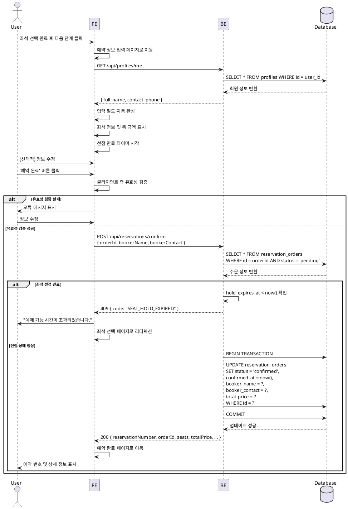

# UC-007: 예약 정보 확인 및 입력 (회원)

## Primary Actor
로그인한 회원 사용자

## Precondition
- 사용자가 로그인되어 있어야 함
- 좌석 선택이 완료되어 좌석 선점(`pending` 상태의 `reservation_orders`)이 성공적으로 이루어진 상태
- 좌석 선점 만료 시간(`hold_expires_at`)이 아직 남아있어야 함

## Trigger
사용자가 좌석 선택 페이지에서 좌석을 선택하고 다음 단계로 진행하여, 예약 정보 입력 페이지에 진입함

## Main Scenario

### 1. 페이지 진입 및 자동 완성
1. 사용자가 예약 정보 입력 페이지에 접근
2. 시스템은 로그인된 사용자의 `profiles` 테이블에서 회원 정보를 조회
3. 시스템은 다음 필드를 자동으로 채움:
   - 예약자 이름: `profiles.full_name`
   - 예약자 연락처: `profiles.contact_phone`
4. 시스템은 선택한 좌석 정보와 총 예상 금액을 화면에 표시
5. 시스템은 좌석 선점 만료까지 남은 시간을 타이머로 표시

### 2. 정보 확인 및 수정 (선택적)
1. 사용자는 자동 완성된 정보를 확인
2. 필요시 예약자 이름이나 연락처를 수정

### 3. 예약 확정 요청
1. 사용자가 '예약 완료' 버튼을 클릭
2. 시스템은 클라이언트 측에서 입력 필드 유효성 검증:
   - 예약자 이름: 필수, 2-50자
   - 예약자 연락처: 필수, 전화번호 형식 (010-XXXX-XXXX 또는 01X-XXX-XXXX)
3. 시스템은 백엔드 API에 예약 확정 요청 전송:
   - `order_id` (선점된 주문 ID)
   - `booker_name`
   - `booker_contact`
4. 백엔드는 다음을 검증:
   - 좌석 선점 상태 확인 (`reservation_orders.status = 'pending'`)
   - 선점 만료 시간 확인 (`hold_expires_at > now()`)
   - 좌석 활성 상태 확인 (`reservation_order_seats.is_active = true`)
5. 백엔드는 `reservation_orders` 업데이트:
   - `status`: `'pending'` → `'confirmed'`
   - `confirmed_at`: 현재 시각
   - `booker_name`: 입력받은 값
   - `booker_contact`: 입력받은 값
   - `total_price`: 좌석별 가격 합산
   - `user_id`: 로그인된 사용자 ID (이미 설정되어 있음)
6. 백엔드는 성공 응답과 함께 `reservation_number` 반환
7. 시스템은 사용자를 예약 완료 페이지로 이동

## Edge Cases

### EC-1: 회원 정보 필수 값 누락
- **상황**: `profiles` 테이블의 `full_name` 또는 `contact_phone`이 NULL이거나 빈 값
- **처리**:
  - 해당 필드를 비워두고 필수 입력 상태로 표시
  - 사용자가 직접 입력하도록 유도
  - 입력하지 않고 제출 시 클라이언트 측 유효성 검증 실패 메시지 표시

### EC-2: 유효성 검증 실패
- **상황**: 사용자가 입력한 정보가 형식에 맞지 않음
- **처리**:
  - 해당 입력 필드 하단에 구체적인 오류 메시지 표시
  - 예: "연락처는 010-1234-5678 형식으로 입력해주세요"
  - 제출 버튼 비활성화 또는 제출 시 포커스 이동

### EC-3: 좌석 선점 시간 만료
- **상황**: 사용자가 정보를 입력하는 중 `hold_expires_at` 시간이 경과
- **처리**:
  - 백엔드에서 `400 Bad Request` 또는 `409 Conflict` 에러 반환
  - 에러 코드: `SEAT_HOLD_EXPIRED`
  - 프론트엔드는 "예매 가능 시간이 초과되었습니다. 좌석을 다시 선택해주세요." 메시지 표시
  - 자동으로 좌석 선택 페이지로 리디렉션
  - 백그라운드 잡이 `reservation_orders.status`를 `'expired'`로 변경하고 `reservation_order_seats.is_active`를 `false`로 설정

### EC-4: 좌석 선점 상태 이상
- **상황**: 다른 프로세스에 의해 좌석이 이미 확정되었거나 취소됨
- **처리**:
  - 백엔드에서 `409 Conflict` 에러 반환
  - 에러 코드: `INVALID_ORDER_STATUS`
  - "예약 처리 중 오류가 발생했습니다. 다시 시도해주세요." 메시지 표시
  - 좌석 선택 페이지로 리디렉션

### EC-5: 네트워크 또는 서버 오류
- **상황**: API 호출 중 네트워크 오류 또는 서버 5xx 에러 발생
- **처리**:
  - "일시적인 오류가 발생했습니다. 잠시 후 다시 시도해주세요." 메시지 표시
  - 재시도 버튼 제공
  - 사용자가 입력한 정보는 유지 (폼 상태 보존)

### EC-6: 로그인 세션 만료
- **상황**: 페이지 진입 또는 예약 확정 중 세션이 만료됨
- **처리**:
  - 백엔드에서 `401 Unauthorized` 에러 반환
  - 로그인 모달 표시 또는 로그인 페이지로 리디렉션
  - 로그인 후 선점된 좌석이 유효하면 원래 페이지로 복귀
  - 선점 시간이 만료되었다면 처음부터 다시 시작

## Business Rules

### BR-1: 자동 완성 우선순위
- 회원의 `profiles` 정보를 우선적으로 사용
- 필수 값이 누락된 경우에만 사용자 직접 입력 요구

### BR-2: 좌석 선점 시간 관리
- 좌석 선점 시간은 서버 시각 기준으로 엄격히 적용
- 클라이언트 타이머는 안내용이며, 최종 검증은 서버에서 수행

### BR-3: 예약자 정보 스냅샷
- 예약 확정 시점의 `booker_name`, `booker_contact`는 `reservation_orders`에 저장
- 이후 `profiles` 정보가 변경되어도 예약 정보는 변경되지 않음 (스냅샷 유지)

### BR-4: 회원 예약 귀속
- `reservation_orders.user_id`에 회원 ID를 저장하여 마이페이지에서 조회 가능
- 비회원 예약과 달리 예약 번호 없이도 마이페이지에서 확인 가능

### BR-5: 가격 정합성
- `total_price`는 `reservation_order_seats`의 각 좌석 `price` 합계와 일치해야 함
- 백엔드에서 계산하여 저장 (클라이언트 값 신뢰하지 않음)

### BR-6: 유효성 검증 규칙
- 예약자 이름: 한글, 영문, 공백 허용, 2-50자
- 예약자 연락처: 숫자와 하이픈만 허용, 전화번호 형식 (정규식: `^01[0-9]-\d{3,4}-\d{4}$`)

## API 스키마 (예상)

### Request: POST /api/reservations/confirm

```typescript
{
  orderId: string;        // UUID, 선점된 주문 ID
  bookerName: string;     // 예약자 이름
  bookerContact: string;  // 예약자 연락처 (010-1234-5678 형식)
}
```

### Response (Success): 200 OK

```typescript
{
  success: true;
  data: {
    reservationNumber: string;  // 예약 번호 (예: "RES-20250315-XXXX")
    orderId: string;             // 주문 ID
    concertTitle: string;        // 콘서트 제목
    seats: Array<{
      seatLabel: string;         // 좌석 표기 (예: "A-12")
      categoryName: string;      // 좌석 등급 (예: "VIP")
      price: number;             // 좌석 가격
    }>;
    totalPrice: number;          // 총 결제 금액
    bookerName: string;          // 예약자 이름
    bookerContact: string;       // 예약자 연락처
    confirmedAt: string;         // 확정 시각 (ISO 8601)
  };
}
```

### Response (Error): 400 / 409

```typescript
{
  success: false;
  error: {
    code: string;  // "SEAT_HOLD_EXPIRED" | "INVALID_ORDER_STATUS" | "VALIDATION_ERROR"
    message: string;
    details?: object;
  };
}
```

## UI/UX 요구사항

### 레이아웃
- 예약 정보 입력 폼 (중앙 배치)
- 선택한 좌석 요약 정보 (우측 사이드바 또는 상단 카드)
- 총 결제 금액 표시 (강조)
- 남은 시간 타이머 (상단 또는 헤더에 고정)

### 자동 완성 필드
- 예약자 이름 입력 필드: 회원 정보로 자동 채움, 수정 가능
- 예약자 연락처 입력 필드: 회원 정보로 자동 채움, 수정 가능
- 자동 채워진 필드는 시각적으로 구분 (예: 연한 배경색)

### 유효성 검증 피드백
- 실시간 유효성 검증 (입력 중 또는 blur 이벤트)
- 오류 시 입력 필드 테두리 빨간색, 하단에 오류 메시지 표시
- 성공 시 입력 필드 테두리 초록색 (선택적)

### 타이머
- 분:초 형식으로 표시 (예: "05:00")
- 1분 이하 남았을 때 빨간색으로 강조
- 만료 시 자동으로 알림 모달 표시 후 리디렉션

### 버튼 상태
- '예약 완료' 버튼:
  - 모든 필수 필드가 유효할 때만 활성화
  - 제출 중일 때 로딩 스피너 표시 및 비활성화

### 반응형 디자인
- 모바일: 세로 스크롤, 좌석 요약 정보를 상단으로 이동
- PC: 좌우 레이아웃, 입력 폼(좌측) + 요약 정보(우측)

## 에러 처리 및 피드백

| 에러 상황 | 에러 코드 | HTTP 상태 | 사용자 피드백 | 후속 액션 |
|---------|---------|---------|------------|----------|
| 필수 필드 누락 | `VALIDATION_ERROR` | 400 | "필수 입력 항목을 확인해주세요." | 해당 필드 포커스 |
| 연락처 형식 오류 | `VALIDATION_ERROR` | 400 | "연락처 형식이 올바르지 않습니다." | 입력 예시 표시 |
| 좌석 선점 만료 | `SEAT_HOLD_EXPIRED` | 409 | "예매 가능 시간이 초과되었습니다." | 좌석 선택 페이지로 이동 |
| 주문 상태 이상 | `INVALID_ORDER_STATUS` | 409 | "예약 처리 중 오류가 발생했습니다." | 좌석 선택 페이지로 이동 |
| 세션 만료 | `UNAUTHORIZED` | 401 | "로그인이 필요합니다." | 로그인 모달 표시 |
| 서버 오류 | `INTERNAL_ERROR` | 500 | "일시적인 오류가 발생했습니다." | 재시도 버튼 제공 |
| 네트워크 오류 | - | - | "인터넷 연결을 확인해주세요." | 재시도 버튼 제공 |

## Sequence Diagram



## 관련 유스케이스
- **UC-005**: 좌석 선택 (선행 유스케이스)
- **UC-006**: 예약 정보 입력 (비회원) (유사 유스케이스)
- **UC-008**: 예약 완료 확인 (후행 유스케이스)
- **UC-010**: 마이페이지 조회 (회원) (예약 내역 확인)

## 참고사항
- 이 유스케이스는 **로그인한 회원 사용자**만 해당
- 비회원 사용자는 **UC-006: 예약 정보 입력 (비회원)** 플로우를 따름
- 회원과 비회원의 주요 차이점:
  1. 회원: `profiles` 정보로 자동 완성
  2. 회원: `reservation_orders.user_id`에 연결되어 마이페이지에서 조회 가능
  3. 비회원: 모든 정보를 수동 입력, 예약 번호로만 조회 가능
