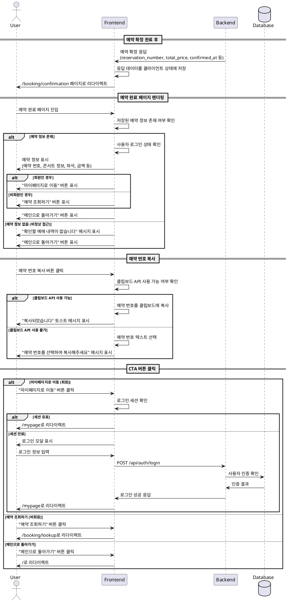

# UC-008: 예약 완료 확인

## 개요
예약 확정 단계를 성공적으로 마친 사용자가 최종 예약 정보를 확인하고, 다음 행동으로 자연스럽게 연결되도록 안내하는 유스케이스입니다. 예약 번호를 포함한 핵심 정보를 명확하게 제시하며, 회원/비회원에 따라 적절한 CTA를 제공합니다.

## Primary Actor
- 회원 사용자 (로그인 상태)
- 비회원 사용자

## Precondition
- 사용자가 좌석 선택 및 예약 정보 입력을 완료하여 예약 확정 API 호출에 성공한 상태
- 예약 확정 결과로 `reservation_number`, `total_price`, `confirmed_at` 등 최종 예약 정보를 서버로부터 수신한 상태

## Trigger
- 예약 정보 입력 페이지에서 '예약 완료' 버튼 클릭 후 서버 응답 성공
- 시스템이 사용자를 예약 완료 페이지로 자동 리다이렉트

## Main Scenario

### 1. 페이지 진입 및 데이터 로드
1. 사용자가 예약 확정 API 호출에 성공하면, 시스템은 응답 데이터를 클라이언트 상태에 저장한다
2. 시스템은 사용자를 `/booking/confirmation` 경로로 리다이렉트한다
3. 페이지는 이전 단계에서 받은 예약 정보를 렌더링한다

### 2. 예약 정보 표시
1. 시스템은 다음 정보를 UI에 표시한다:
   - 예약 번호 (`reservation_number`) - 강조 표시
   - 콘서트 제목 (`concert.title`)
   - 예약자 이름 (`booker_name`)
   - 예약자 연락처 (`booker_contact`)
   - 선택한 좌석 목록 (좌석 번호와 등급)
   - 총 결제 금액 (`total_price`)
   - 예약 확정 시각 (`confirmed_at`)
2. 시스템은 예약 번호를 복사할 수 있는 버튼을 제공한다

### 3. 로그인 상태 확인 및 CTA 구성
1. 시스템은 현재 사용자의 로그인 상태를 확인한다
2. **회원인 경우:**
   - "마이페이지로 이동" 버튼을 표시한다
   - 버튼 클릭 시 `/mypage` (내 예매 내역 탭)로 이동한다
3. **비회원인 경우:**
   - "예약 조회하기" 버튼을 표시한다
   - 버튼 클릭 시 `/booking/lookup` 페이지로 이동한다
4. 추가로 "메인으로 돌아가기" 버튼을 제공한다

### 4. 예약 정보 안내
1. 시스템은 예약 확인 관련 안내 문구를 표시한다:
   - "예약이 완료되었습니다"
   - "예약 번호를 반드시 저장해주세요"
   - 비회원의 경우: "예약 번호와 예약자 이름으로 조회 가능합니다"

## Edge Cases

### EC-1: 비정상적인 경로로 페이지 접근
**상황:** 사용자가 예약 확정 없이 직접 URL로 페이지에 접근하거나, 페이지 새로고침 시 상태가 손실된 경우

**처리:**
1. 시스템은 렌더링할 예약 정보의 존재 여부를 확인한다
2. 정보가 없는 경우:
   - "확인할 예매 내역이 없습니다" 안내 메시지를 표시한다
   - "메인으로 돌아가기" 버튼만 제공한다
   - 또는 자동으로 메인 페이지로 리다이렉트한다

### EC-2: 예약 번호 복사 실패
**상황:** 브라우저가 클립보드 API를 지원하지 않거나 권한이 없는 경우

**처리:**
1. 복사 버튼 클릭 시 클립보드 API 사용 가능 여부를 확인한다
2. 사용 불가능한 경우:
   - 예약 번호를 선택(select)하여 사용자가 수동으로 복사할 수 있도록 한다
   - "예약 번호를 선택하여 복사해주세요" 토스트 메시지를 표시한다

### EC-3: 로그인 세션 만료 (회원)
**상황:** 예약 확정과 페이지 진입 사이에 로그인 세션이 만료된 경우

**처리:**
1. 시스템은 예약 정보는 정상적으로 표시한다 (이미 확정된 정보이므로)
2. "마이페이지로 이동" 버튼은 표시하되, 클릭 시:
   - 로그인 모달을 표시한다
   - 로그인 성공 후 마이페이지로 이동한다

### EC-4: 네트워크 연결 끊김으로 인한 부분적 데이터
**상황:** API 응답이 불완전하게 수신되어 일부 정보가 누락된 경우

**처리:**
1. 필수 정보 (`reservation_number`) 존재 여부를 확인한다
2. 필수 정보가 있는 경우:
   - 사용 가능한 정보만 표시한다
   - 누락된 정보는 "정보 없음" 또는 "-"로 표시한다
3. 필수 정보가 없는 경우:
   - EC-1과 동일하게 처리한다

## Business Rules

### BR-1: 예약 번호 형식
- 예약 번호는 서버에서 생성된 고유 식별자이며, 비회원 조회 시 필수 정보이다
- 형식: 영문 대문자 + 숫자 조합 (예: `TG20250115AB123`)

### BR-2: 예약 정보 표시 우선순위
- 예약 번호는 가장 눈에 띄는 위치에 큰 글씨로 표시한다
- 총 결제 금액은 두 번째로 강조한다
- 좌석 정보는 명확하게 구분하여 리스트로 표시한다

### BR-3: 데이터 소스
- 페이지에 표시되는 모든 정보는 예약 확정 API 응답에서 제공된다
- 추가 API 호출 없이 클라이언트 상태(또는 URL 쿼리 파라미터)만으로 렌더링한다

### BR-4: 페이지 재진입 제한
- 예약 완료 페이지는 일회성 확인 페이지로 설계한다
- 새로고침 시 정보가 없으면 메인으로 리다이렉트한다
- 회원은 마이페이지에서, 비회원은 예약 조회 페이지에서 정보를 다시 확인할 수 있다

## API 요청/응답 스키마

### API 호출 없음 (데이터는 이전 단계에서 수신)

이 유스케이스에서는 별도의 API 호출이 발생하지 않습니다. 모든 데이터는 예약 확정 단계(UC-007)의 API 응답에서 제공됩니다.

### 사용되는 데이터 구조 (예시)

```typescript
interface BookingConfirmationData {
  reservationNumber: string;        // 예약 번호
  concertId: string;                 // 콘서트 ID
  concertTitle: string;              // 콘서트 제목
  bookerName: string;                // 예약자 이름
  bookerContact: string;             // 예약자 연락처
  totalPrice: number;                // 총 결제 금액
  confirmedAt: string;               // 예약 확정 시각 (ISO 8601)
  seats: Array<{
    seatId: string;                  // 좌석 ID
    seatLabel: string;               // 좌석 번호 (예: "A-12")
    categoryName: string;            // 좌석 등급명 (예: "VIP")
    price: number;                   // 좌석 가격
  }>;
}
```

## UI/UX 요구사항

### 레이아웃
- 중앙 정렬된 카드 형태로 정보를 표시한다
- 모바일 환경에서도 모든 정보가 명확하게 보이도록 반응형 디자인을 적용한다

### 정보 표시
- **예약 번호**:
  - 24pt 이상의 볼드 폰트로 표시
  - 복사 버튼을 바로 옆에 배치
  - 배경색을 달리하여 강조
- **총 결제 금액**:
  - 18pt 이상의 볼드 폰트로 표시
  - 통화 기호와 함께 천 단위 구분 기호 사용 (예: "₩150,000")
- **좌석 정보**:
  - 좌석 등급별로 색상 구분
  - 좌석 번호와 금액을 명확하게 표시
- **안내 메시지**:
  - 성공을 나타내는 아이콘(체크 마크)과 함께 표시
  - 긍정적인 톤의 문구 사용

### 인터랙션
- 예약 번호 복사 버튼:
  - 복사 성공 시 "복사되었습니다" 토스트 메시지 표시
  - 버튼 아이콘을 체크 마크로 일시적으로 변경
- CTA 버튼:
  - Primary 버튼: "마이페이지로 이동" 또는 "예약 조회하기"
  - Secondary 버튼: "메인으로 돌아가기"
  - 버튼은 하단에 고정 배치하여 항상 접근 가능하도록 한다

### 접근성
- 모든 중요 정보에 적절한 시맨틱 태그 사용
- 예약 번호는 `aria-label`로 "예약 번호"임을 명시
- 복사 버튼은 스크린 리더에서 "예약 번호 복사" 등으로 읽히도록 한다
- 키보드 네비게이션으로 모든 버튼에 접근 가능

## 에러 처리 및 피드백

### 정보 표시 오류
- 필수 정보 누락 시 명확한 안내 메시지와 함께 메인으로 돌아갈 수 있는 방법 제공
- 오류 상황에서도 사용자가 막막하지 않도록 다음 액션을 안내

### 사용자 피드백
- **성공 상태**:
  - "예약이 완료되었습니다!" 헤드라인
  - 긍정적인 색상(그린 계열) 사용
  - 성공 아이콘 표시
- **정보 확인 안내**:
  - "예약 번호를 저장해주세요"
  - "예약 확인은 [방법]에서 가능합니다"
- **경고 메시지**:
  - 비회원: "예약 번호와 예약자 이름이 필요합니다"
  - 회원: "마이페이지에서 언제든 확인하실 수 있습니다"

### 오류 메시지 예시
```typescript
const ERROR_MESSAGES = {
  NO_DATA: '확인할 예매 내역이 없습니다. 메인 페이지에서 다시 예매를 진행해주세요.',
  COPY_FAILED: '자동 복사가 지원되지 않습니다. 예약 번호를 선택하여 복사해주세요.',
  SESSION_EXPIRED: '로그인 세션이 만료되었습니다. 다시 로그인해주세요.',
  INCOMPLETE_DATA: '일부 정보를 불러오지 못했습니다. 예약은 정상적으로 완료되었으니 예약 번호로 조회해주세요.',
};
```

## Sequence Diagram



## 참고사항

### 관련 유스케이스
- UC-006: 예약 정보 입력 (비회원) - 이전 단계
- UC-007: 예약 정보 확인 및 입력 (회원) - 이전 단계
- UC-009: 예약 조회 (비회원) - 다음 단계 (비회원)
- UC-010: 마이페이지 조회 (회원) - 다음 단계 (회원)

### 기술적 고려사항
- 예약 정보는 클라이언트 상태 관리(Zustand)에 임시 저장하거나, URL 쿼리 파라미터로 전달할 수 있다
- 보안상 민감한 정보는 URL에 노출하지 않도록 한다
- 페이지 새로고침 시 정보가 손실될 수 있으므로, 사용자에게 예약 번호 저장을 강력히 권장한다
- 필요시 localStorage에 최근 예약 번호를 임시 저장할 수 있으나, 브라우저 종료 시 자동 삭제되도록 구현한다

### 향후 개선 사항
- 예약 완료 시 이메일/SMS 자동 발송 (회원의 경우)
- 예약 정보 PDF 다운로드 기능
- 캘린더 추가 기능 (콘서트 일정을 사용자 캘린더에 추가)
- 소셜 공유 기능 (예: "친구에게 공유하기")
