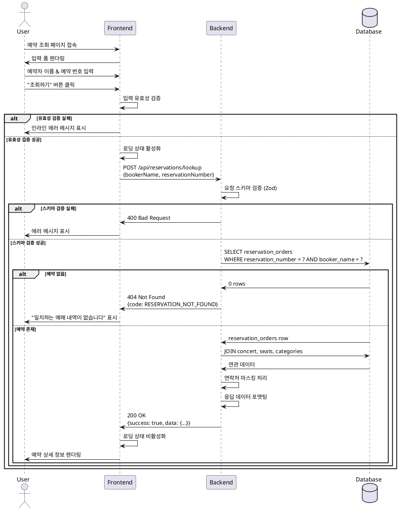

# UC-009: 예약 조회 (비회원)

## 1. 개요 (Overview)

비회원 사용자가 예약 번호와 예약자 이름을 입력하여 본인의 예약 내역을 조회하는 기능입니다. 회원가입 없이 콘서트를 예매한 사용자가 예약 정보를 확인할 수 있도록 간편한 조회 시스템을 제공합니다.

**목적:**
- 비회원 사용자에게 예약 확인 수단 제공
- 예약 번호와 예약자 이름을 통한 간편한 인증
- 예약 상세 정보(콘서트명, 날짜, 좌석, 금액 등) 확인

## 2. 기본 정보 (Basic Information)

- **Primary Actor:** 비회원 사용자 (예매 완료한 게스트)
- **Stakeholders:**
  - 비회원 사용자: 예약 정보를 확인하고 싶어함
  - 운영팀: 고객 문의 감소 및 자가 서비스 확대
- **Precondition:**
  - 사용자가 예약 조회 페이지에 접근함
  - 사용자가 이전에 예약을 완료하여 예약 번호를 보유하고 있음
- **Postcondition:**
  - 성공 시: 예약 상세 정보가 화면에 표시됨
  - 실패 시: 적절한 오류 메시지가 표시되며 재시도 가능 상태 유지

## 3. 트리거 (Trigger)

사용자가 예약 조회 페이지에서 예약자 이름과 예약 번호를 입력하고 **"조회하기"** 버튼을 클릭합니다.

## 4. Main Scenario

### 4.1 정상 플로우 (Happy Path)

1. **[User]** 사용자가 예약 조회 페이지로 이동합니다.
2. **[FE]** 예약 조회 입력 폼을 렌더링합니다.
   - 예약자 이름 입력 필드 (text)
   - 예약 번호 입력 필드 (text)
   - "조회하기" 버튼
3. **[User]** 사용자가 예약자 이름과 예약 번호를 입력하고 "조회하기" 버튼을 클릭합니다.
4. **[FE]** 입력 데이터의 유효성을 검증합니다.
   - 예약자 이름: 필수 입력, 공백만 허용하지 않음
   - 예약 번호: 필수 입력, 공백만 허용하지 않음
5. **[FE]** 백엔드 API에 예약 조회를 요청합니다.
   - `POST /api/reservations/lookup`
   - Body: `{ bookerName: string, reservationNumber: string }`
6. **[BE]** 요청 데이터를 받아 유효성을 재검증합니다.
7. **[BE]** 데이터베이스에서 일치하는 예약을 조회합니다.
   ```sql
   SELECT * FROM reservation_orders
   WHERE reservation_number = $1
     AND booker_name = $2
     AND status IN ('confirmed', 'pending')
   ```
8. **[BE]** 연관된 데이터를 함께 조회합니다.
   - `concerts`: 콘서트 정보
   - `reservation_order_seats`: 예약된 좌석 정보
   - `concert_seats`: 좌석 상세 정보
   - `concert_seat_categories`: 좌석 등급 정보
9. **[BE]** 조회된 데이터를 포맷하여 응답합니다.
   ```typescript
   {
     success: true,
     data: {
       reservationId: string,
       reservationNumber: string,
       status: 'confirmed' | 'pending',
       bookerName: string,
       bookerContact: string,
       totalPrice: number,
       confirmedAt: string | null,
       concert: {
         id: string,
         title: string,
         // ... 기타 콘서트 정보
       },
       seats: [
         {
           seatLabel: string,
           categoryName: string,
           price: number,
         }
       ]
     }
   }
   ```
10. **[FE]** 응답 데이터를 받아 예약 상세 정보를 화면에 렌더링합니다.
    - 예약 번호 (강조 표시)
    - 예약 상태 배지
    - 콘서트 제목
    - 예약자 정보
    - 좌석 정보 리스트
    - 총 결제 금액
11. **[User]** 사용자가 예약 정보를 확인합니다.

## 5. Edge Cases

### 5.1 일치하는 예약 없음

**Scenario:**
- 사용자가 입력한 예약 번호와 예약자 이름 조합이 데이터베이스에 존재하지 않는 경우

**처리:**
1. **[BE]** 데이터베이스 조회 결과가 없음을 확인
2. **[BE]** 실패 응답 반환
   ```typescript
   {
     success: false,
     error: {
       code: 'RESERVATION_NOT_FOUND',
       message: '일치하는 예매 내역이 없습니다.'
     }
   }
   ```
3. **[FE]** 에러 메시지를 사용자 친화적으로 표시
   - "입력하신 정보와 일치하는 예매 내역을 찾을 수 없습니다."
   - "예매자 이름과 예매 번호를 다시 확인해주세요."
4. **[FE]** 입력 필드는 유지하여 재시도 가능하도록 함

### 5.2 입력 데이터 유효성 검증 실패

**Scenario:**
- 예약자 이름 또는 예약 번호가 비어있거나 공백만 입력된 경우

**처리:**
1. **[FE]** 클라이언트 측 유효성 검증 실패 감지
2. **[FE]** 해당 입력 필드 하단에 인라인 에러 메시지 표시
   - "예약자 이름을 입력해주세요."
   - "예약 번호를 입력해주세요."
3. **[FE]** API 요청 전송하지 않음
4. **[FE]** 입력 필드에 포커스 이동 또는 빨간색 테두리 표시

### 5.3 서버 통신 오류

**Scenario:**
- 네트워크 오류, 서버 다운, 타임아웃 등으로 API 호출 실패

**처리:**
1. **[FE]** API 호출 중 예외 발생 감지 (try-catch)
2. **[FE]** 사용자에게 일반적인 오류 메시지 표시
   - "일시적인 오류가 발생했습니다. 잠시 후 다시 시도해주세요."
3. **[FE]** 로딩 상태 해제, 버튼 재활성화
4. **[FE]** (선택) 재시도 버튼 제공
5. **[FE]** 에러 로그 기록 (모니터링 용도)

### 5.4 취소된 예약 조회

**Scenario:**
- 사용자가 취소된 예약의 번호로 조회 시도

**처리:**
1. **[BE]** 예약 상태가 'cancelled' 또는 'expired'인 경우 감지
2. **[BE]** 조회 성공 응답이지만 상태 필드를 명확히 반환
   ```typescript
   {
     success: true,
     data: {
       status: 'cancelled',
       // ... 기타 정보
     }
   }
   ```
3. **[FE]** 예약 상태에 따라 UI 표시 조정
   - "취소된 예약" 배지 표시
   - 안내 메시지: "이 예약은 취소되었습니다."
4. **[FE]** 좌석 정보 등은 표시하되, 회색 처리 또는 구분선 적용

### 5.5 잘못된 요청 형식

**Scenario:**
- 클라이언트 측 유효성 검증을 우회하여 잘못된 형식의 데이터 전송

**처리:**
1. **[BE]** Zod 스키마 검증 실패 감지
2. **[BE]** 400 Bad Request 응답 반환
   ```typescript
   {
     success: false,
     error: {
       code: 'INVALID_REQUEST',
       message: '요청 형식이 올바르지 않습니다.',
       details: [
         { field: 'bookerName', message: 'Required' }
       ]
     }
   }
   ```
3. **[FE]** 일반적인 에러 메시지 표시
   - "요청이 올바르지 않습니다. 입력 내용을 확인해주세요."

## 6. Business Rules

### 6.1 조회 인증 규칙
- 예약 번호(reservation_number)와 예약자 이름(booker_name)이 **모두 정확히 일치**해야 조회 가능
- 대소문자 구분: booker_name은 대소문자를 구분하여 비교
- 공백 처리: 입력값의 앞뒤 공백은 trim 처리 후 비교

### 6.2 조회 가능 예약 상태
- `confirmed`: 확정된 예약 (정상 조회 가능)
- `pending`: 좌석 선점 중인 예약 (조회 가능, 상태 명시)
- `cancelled`: 취소된 예약 (조회 가능, 취소 상태 표시)
- `expired`: 만료된 예약 (조회 가능, 만료 상태 표시)

### 6.3 개인정보 보호
- 예약자 연락처(booker_contact)는 마스킹 처리하여 표시
  - 예: `010-1234-5678` → `010-****-5678`
- 예약 번호와 예약자 이름 조합으로만 조회 가능 (추측 방지)

### 6.4 조회 제한
- Rate limiting 적용: 동일 IP에서 1분당 최대 10회 조회 요청
- 무차별 대입 공격(brute force) 방지

## 7. API 스키마

### 7.1 Request

**Endpoint:** `POST /api/reservations/lookup`

**Request Body:**
```typescript
{
  bookerName: string;     // 예약자 이름 (필수, 1~50자)
  reservationNumber: string; // 예약 번호 (필수, 형식: RES-XXXXXXXXXX)
}
```

**Zod Schema:**
```typescript
const LookupRequestSchema = z.object({
  bookerName: z.string().trim().min(1, '예약자 이름을 입력해주세요.').max(50),
  reservationNumber: z.string().trim().min(1, '예약 번호를 입력해주세요.')
});
```

### 7.2 Response (Success)

**Status:** `200 OK`

```typescript
{
  success: true;
  data: {
    reservationId: string;           // UUID
    reservationNumber: string;       // RES-XXXXXXXXXX
    status: 'confirmed' | 'pending' | 'cancelled' | 'expired';
    bookerName: string;
    bookerContact: string;           // 마스킹 처리됨
    totalPrice: number;
    confirmedAt: string | null;      // ISO 8601 형식
    createdAt: string;
    concert: {
      id: string;
      title: string;
      // 추가 콘서트 정보
    };
    seats: Array<{
      seatLabel: string;             // 예: 'A-12'
      categoryName: string;          // 예: 'VIP'
      displayColor: string;          // 예: '#FFD700'
      price: number;
    }>;
  };
}
```

### 7.3 Response (Error)

**Status:** `404 Not Found`

```typescript
{
  success: false;
  error: {
    code: 'RESERVATION_NOT_FOUND';
    message: '일치하는 예매 내역이 없습니다.';
  };
}
```

**Status:** `400 Bad Request`

```typescript
{
  success: false;
  error: {
    code: 'INVALID_REQUEST';
    message: '요청 형식이 올바르지 않습니다.';
    details?: Array<{
      field: string;
      message: string;
    }>;
  };
}
```

**Status:** `429 Too Many Requests`

```typescript
{
  success: false;
  error: {
    code: 'RATE_LIMIT_EXCEEDED';
    message: '요청 횟수를 초과했습니다. 잠시 후 다시 시도해주세요.';
  };
}
```

**Status:** `500 Internal Server Error`

```typescript
{
  success: false;
  error: {
    code: 'INTERNAL_SERVER_ERROR';
    message: '서버 오류가 발생했습니다.';
  };
}
```

## 8. UI/UX 요구사항

### 8.1 페이지 레이아웃
- 단일 페이지에 **입력 폼**과 **조회 결과 영역**을 모두 표시
- 초기 로드 시: 입력 폼만 표시, 조회 결과 영역 숨김
- 조회 성공 시: 입력 폼 상단 고정, 하단에 결과 표시
- 조회 실패 시: 폼 아래 에러 메시지 표시, 결과 영역 숨김

### 8.2 입력 폼
- 예약자 이름 입력 필드
  - Placeholder: "예약자 이름을 입력하세요"
  - 최대 길이: 50자
- 예약 번호 입력 필드
  - Placeholder: "예약 번호를 입력하세요 (예: RES-1234567890)"
  - 자동 대문자 변환 (선택 사항)
- "조회하기" 버튼
  - Primary 버튼 스타일
  - 로딩 중: 버튼 비활성화 및 스피너 표시
  - 텍스트: "조회하기" → "조회 중..."

### 8.3 조회 결과 표시
- 카드 형식의 정보 블록
  - **헤더 영역:**
    - 예약 번호 (강조, 큰 글씨)
    - 예약 상태 배지 (색상 구분: 확정-녹색, 대기-주황, 취소-회색)
  - **콘서트 정보:**
    - 콘서트 제목
    - (추가 정보: 날짜, 장소 등)
  - **예약자 정보:**
    - 예약자 이름
    - 연락처 (마스킹)
  - **좌석 정보:**
    - 좌석 목록 (등급별 색상 표시)
    - 각 좌석의 라벨, 등급명, 가격
  - **결제 정보:**
    - 총 결제 금액 (강조)

### 8.4 에러 피드백
- 인라인 에러: 입력 필드 하단에 빨간색 텍스트
- 전역 에러: 폼 하단에 경고 박스 형태로 표시
- 에러 아이콘 사용 (선택 사항)

### 8.5 반응형 디자인
- 모바일: 단일 컬럼 레이아웃
- 태블릿/데스크톱: 중앙 정렬, 최대 너비 제한 (예: 600px)

### 8.6 접근성 (Accessibility)
- 모든 입력 필드에 label 연결
- 에러 메시지는 aria-live 영역으로 스크린 리더에 전달
- 키보드 네비게이션 지원

## 9. 에러 처리 및 피드백

### 9.1 클라이언트 측 에러 처리

| 에러 유형 | 처리 방법 | 사용자 피드백 |
|-----------|-----------|---------------|
| 필수 입력 누락 | Form validation | "예약자 이름을 입력해주세요." |
| 공백만 입력 | trim() 후 검증 | "올바른 정보를 입력해주세요." |
| 네트워크 오류 | try-catch | "네트워크 오류가 발생했습니다. 인터넷 연결을 확인해주세요." |
| API 타임아웃 | timeout 설정 (30초) | "응답 시간이 초과되었습니다. 다시 시도해주세요." |

### 9.2 서버 측 에러 처리

| 에러 코드 | HTTP Status | 처리 방법 | 로깅 레벨 |
|-----------|-------------|-----------|-----------|
| RESERVATION_NOT_FOUND | 404 | 사용자 피드백 | INFO |
| INVALID_REQUEST | 400 | 사용자 피드백 | WARN |
| RATE_LIMIT_EXCEEDED | 429 | 재시도 지연 안내 | WARN |
| DATABASE_ERROR | 500 | 일반 에러 메시지 | ERROR |
| INTERNAL_SERVER_ERROR | 500 | 일반 에러 메시지 | ERROR |

### 9.3 로딩 상태 관리
- API 호출 시작: 로딩 스피너 표시, 버튼 비활성화
- API 호출 완료: 로딩 스피너 제거, 버튼 활성화
- 최소 로딩 시간: 200ms (너무 빠른 깜빡임 방지)

## 10. Sequence Diagram



## 11. 구현 참고사항

### 11.1 Frontend (React Query)
```typescript
// hooks/useBookingLookup.ts
const useBookingLookup = () => {
  return useMutation({
    mutationFn: async (data: LookupRequest) => {
      const response = await apiClient.post('/api/reservations/lookup', data);
      return response.data;
    },
    onError: (error) => {
      // 에러 처리 로직
    }
  });
};
```

### 11.2 Backend (Hono)
```typescript
// features/reservation/backend/route.ts
app.post('/api/reservations/lookup', async (c) => {
  const body = await c.req.json();
  const validated = LookupRequestSchema.parse(body);

  const result = await reservationService.lookupByGuest(
    validated.bookerName,
    validated.reservationNumber
  );

  if (!result) {
    return c.json(failure('RESERVATION_NOT_FOUND', '일치하는 예매 내역이 없습니다.'), 404);
  }

  return c.json(success(result));
});
```

### 11.3 데이터베이스 쿼리 최적화
- `reservation_number` 컬럼에 인덱스 생성 (이미 UNIQUE 제약이 있으므로 자동 생성됨)
- `booker_name` 컬럼에 인덱스 추가 고려 (조회 빈도에 따라)
- JOIN 쿼리 최적화: 필요한 컬럼만 SELECT

## 12. 테스트 시나리오

### 12.1 정상 케이스
- [ ] 유효한 예약 번호와 이름으로 조회 성공
- [ ] 확정된 예약 조회 시 상태 'confirmed' 표시
- [ ] 연락처가 올바르게 마스킹되어 표시됨
- [ ] 좌석 정보가 모두 올바르게 표시됨

### 12.2 에러 케이스
- [ ] 존재하지 않는 예약 번호로 조회 시 404 에러
- [ ] 예약 번호는 맞지만 이름이 틀린 경우 404 에러
- [ ] 빈 문자열 입력 시 클라이언트 유효성 검증 실패
- [ ] 공백만 입력 시 trim 후 유효성 검증 실패
- [ ] Rate limit 초과 시 429 에러

### 12.3 경계 케이스
- [ ] 취소된 예약 조회 시 상태 표시
- [ ] 만료된 예약 조회 시 상태 표시
- [ ] pending 상태 예약 조회 시 대기 상태 표시
- [ ] 매우 긴 이름 (50자) 입력 시 정상 동작

## 13. 관련 문서
- [PRD - TicketGem 콘서트 예매 시스템](../prd.md)
- [User Flow - 유저플로우 9](../userflow.md#유저플로우-9-예약-조회-비회원)
- [Database Schema - reservation_orders](../database.md#26-reservation_orders)
- UC-006: 예약 정보 입력 (비회원)
- UC-008: 예약 완료 확인
