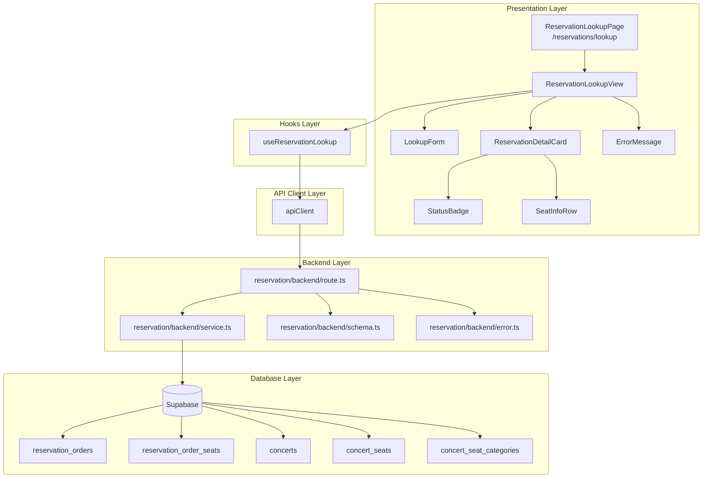

# UC-009: 예약 조회 페이지 (비회원용) - 상세 설계

## 1. 개요

### 1.1 목적
비회원 사용자가 예약 번호와 예약자 이름을 입력하여 본인의 예약 내역을 조회할 수 있는 페이지를 구현합니다. 단일 페이지에 **입력 폼**과 **조회 결과**가 함께 표시되며, 사용자는 회원가입 없이도 간편하게 예약 정보를 확인할 수 있습니다.

### 1.2 주요 기능
- 예약자 이름 및 예약 번호 입력 폼
- 입력 정보 기반 예약 조회 API 호출
- 조회된 예약 상세 정보 표시 (콘서트명, 날짜, 좌석, 금액 등)
- 예약 상태별 UI 표시 (확정/대기/취소/만료)
- 연락처 마스킹 처리
- 에러 상태 처리 (조회 실패, 일치하는 예약 없음 등)

### 1.3 라우팅 경로
- **페이지 경로**: `/reservations/lookup`
- **API 엔드포인트**: `POST /api/reservations/lookup`

---

## 2. 페이지 구조 및 레이아웃

### 2.1 와이어프레임

```
┌─────────────────────────────────────────────────┐
│ Header (공통)                                    │
│  - Logo                                         │
│  - Navigation                                   │
│  - Login Button / User Profile                  │
└─────────────────────────────────────────────────┘
┌─────────────────────────────────────────────────┐
│ Page Title                                      │
│  "예약 조회"                                     │
└─────────────────────────────────────────────────┘
┌─────────────────────────────────────────────────┐
│ Lookup Form Section (항상 표시)                 │
│  ┌─────────────────────────────────────────┐   │
│  │ 예약자 이름 입력 필드                    │   │
│  │ [___________________________]            │   │
│  ├─────────────────────────────────────────┤   │
│  │ 예약 번호 입력 필드                      │   │
│  │ [___________________________]            │   │
│  ├─────────────────────────────────────────┤   │
│  │         [ 조회하기 버튼 ]                │   │
│  └─────────────────────────────────────────┘   │
└─────────────────────────────────────────────────┘
┌─────────────────────────────────────────────────┐
│ Result Section (조회 성공 시 표시)               │
│  ┌─────────────────────────────────────────┐   │
│  │ 예약 정보 카드                           │   │
│  │  - 예약 번호 (강조)                      │   │
│  │  - 예약 상태 배지                        │   │
│  │  - 콘서트 정보                           │   │
│  │  - 예약자 정보                           │   │
│  │  - 좌석 정보                             │   │
│  │  - 총 금액                               │   │
│  └─────────────────────────────────────────┘   │
└─────────────────────────────────────────────────┘
┌─────────────────────────────────────────────────┐
│ Error Section (조회 실패 시 표시)                │
│  ⚠️ "일치하는 예매 내역이 없습니다"              │
│  "예매자 이름과 예매 번호를 다시 확인해주세요."  │
└─────────────────────────────────────────────────┘
```

### 2.2 레이아웃 특징
- **입력 폼**: 페이지 상단에 항상 고정 표시
- **결과 영역**: 조회 성공 시 폼 하단에 표시 (초기에는 숨김)
- **에러 영역**: 조회 실패 시 폼 하단에 표시 (성공 시 숨김)
- **중앙 정렬**: 모든 콘텐츠는 중앙 정렬 (최대 너비 제한: 600px)
- **반응형**: 모바일/태블릿/데스크톱 모두 지원

---

## 3. 주요 컴포넌트 목록 및 역할

### 3.1 Page Component

#### `ReservationLookupPage` (src/app/reservations/lookup/page.tsx)
**역할**: 예약 조회 페이지 최상위 컴포넌트

**구조**:
```typescript
'use client';

export default function ReservationLookupPage() {
  return (
    <main className="min-h-screen bg-background">
      <Header />
      <div className="container mx-auto max-w-2xl px-4 py-8">
        <PageTitle />
        <ReservationLookupView />
      </div>
    </main>
  );
}
```

---

### 3.2 Feature Components

#### `ReservationLookupView` (src/features/reservation/components/reservation-lookup-view.tsx)
**역할**: 예약 조회 메인 컨테이너 (폼 + 결과 표시)

**Props**: 없음 (내부에서 상태 관리)

**내부 상태**:
```typescript
const [bookerName, setBookerName] = useState('');
const [reservationNumber, setReservationNumber] = useState('');
const [hasSearched, setHasSearched] = useState(false);
```

**사용 Hooks**:
- `useReservationLookup()`: 조회 mutation hook

**렌더링 로직**:
1. 항상 `LookupForm` 표시
2. `hasSearched === true && data` → `ReservationDetailCard` 표시
3. `hasSearched === true && error` → `ErrorMessage` 표시
4. `isPending` → 로딩 스피너 표시

---

#### `LookupForm` (src/features/reservation/components/lookup-form.tsx)
**역할**: 예약자 이름 및 예약 번호 입력 폼

**Props**:
```typescript
interface LookupFormProps {
  bookerName: string;
  reservationNumber: string;
  onBookerNameChange: (value: string) => void;
  onReservationNumberChange: (value: string) => void;
  onSubmit: () => void;
  isLoading: boolean;
  errors?: {
    bookerName?: string;
    reservationNumber?: string;
  };
}
```

**UI 구성**:
```typescript
<form onSubmit={handleSubmit} className="space-y-4">
  <FormField
    label="예약자 이름"
    placeholder="예약자 이름을 입력하세요"
    value={bookerName}
    onChange={onBookerNameChange}
    error={errors?.bookerName}
    required
  />
  <FormField
    label="예약 번호"
    placeholder="예약 번호를 입력하세요 (예: RES-1234567890)"
    value={reservationNumber}
    onChange={onReservationNumberChange}
    error={errors?.reservationNumber}
    required
  />
  <Button
    type="submit"
    disabled={isLoading || !bookerName.trim() || !reservationNumber.trim()}
    className="w-full"
  >
    {isLoading ? '조회 중...' : '조회하기'}
  </Button>
</form>
```

**유효성 검증**:
- 예약자 이름: 필수 입력, 공백만 허용하지 않음
- 예약 번호: 필수 입력, 공백만 허용하지 않음
- 클라이언트 측 실시간 검증 + 서버 측 재검증

---

#### `ReservationDetailCard` (src/features/reservation/components/reservation-detail-card.tsx)
**역할**: 조회된 예약 상세 정보 표시

**Props**:
```typescript
interface ReservationDetailCardProps {
  reservation: ReservationLookupResponse;
}

interface ReservationLookupResponse {
  reservationId: string;
  reservationNumber: string;
  status: 'confirmed' | 'pending' | 'cancelled' | 'expired';
  bookerName: string;
  bookerContact: string; // 마스킹 처리됨
  totalPrice: number;
  confirmedAt: string | null;
  createdAt: string;
  concert: {
    id: string;
    title: string;
    performanceDate?: string;
    venue?: string;
  };
  seats: Array<{
    seatLabel: string;
    categoryName: string;
    displayColor: string;
    price: number;
  }>;
}
```

**UI 구성**:
```typescript
<div className="space-y-6 rounded-lg border border-slate-200 bg-white p-6 shadow-md">
  {/* 헤더: 예약 번호 + 상태 배지 */}
  <div className="flex items-start justify-between">
    <div>
      <h2 className="text-2xl font-bold text-slate-900">
        {reservation.reservationNumber}
      </h2>
      <p className="text-sm text-slate-500">
        예약일: {formatDate(reservation.createdAt)}
      </p>
    </div>
    <StatusBadge status={reservation.status} />
  </div>

  {/* 콘서트 정보 */}
  <section>
    <h3 className="mb-2 font-semibold text-slate-900">콘서트 정보</h3>
    <p className="text-lg font-medium">{reservation.concert.title}</p>
    {reservation.concert.performanceDate && (
      <p className="text-sm text-slate-600">
        공연일: {formatDate(reservation.concert.performanceDate)}
      </p>
    )}
    {reservation.concert.venue && (
      <p className="text-sm text-slate-600">장소: {reservation.concert.venue}</p>
    )}
  </section>

  {/* 예약자 정보 */}
  <section>
    <h3 className="mb-2 font-semibold text-slate-900">예약자 정보</h3>
    <p className="text-sm">이름: {reservation.bookerName}</p>
    <p className="text-sm">연락처: {reservation.bookerContact}</p>
  </section>

  {/* 좌석 정보 */}
  <section>
    <h3 className="mb-2 font-semibold text-slate-900">좌석 정보</h3>
    <div className="space-y-2">
      {reservation.seats.map((seat, idx) => (
        <SeatInfoRow key={idx} seat={seat} />
      ))}
    </div>
  </section>

  {/* 결제 정보 */}
  <section className="border-t border-slate-200 pt-4">
    <div className="flex items-center justify-between">
      <span className="text-lg font-semibold text-slate-900">총 금액</span>
      <span className="text-2xl font-bold text-primary">
        {reservation.totalPrice.toLocaleString('ko-KR')}원
      </span>
    </div>
  </section>
</div>
```

---

#### `StatusBadge` (src/features/reservation/components/status-badge.tsx)
**역할**: 예약 상태 배지 표시

**Props**:
```typescript
interface StatusBadgeProps {
  status: 'confirmed' | 'pending' | 'cancelled' | 'expired';
}
```

**UI 구성**:
```typescript
const statusConfig = {
  confirmed: { label: '예약 확정', color: 'bg-green-100 text-green-800' },
  pending: { label: '결제 대기', color: 'bg-yellow-100 text-yellow-800' },
  cancelled: { label: '취소됨', color: 'bg-gray-100 text-gray-800' },
  expired: { label: '만료됨', color: 'bg-red-100 text-red-800' },
};

const config = statusConfig[status];

return (
  <span className={`rounded-full px-3 py-1 text-xs font-medium ${config.color}`}>
    {config.label}
  </span>
);
```

---

#### `SeatInfoRow` (src/features/reservation/components/seat-info-row.tsx)
**역할**: 개별 좌석 정보 행 표시

**Props**:
```typescript
interface SeatInfoRowProps {
  seat: {
    seatLabel: string;
    categoryName: string;
    displayColor: string;
    price: number;
  };
}
```

**UI 구성**:
```typescript
<div className="flex items-center justify-between rounded-md border border-slate-200 bg-slate-50 p-3">
  <div className="flex items-center gap-3">
    <div
      className="h-4 w-4 rounded-full"
      style={{ backgroundColor: seat.displayColor }}
    />
    <span className="font-medium text-slate-900">
      {seat.categoryName} - {seat.seatLabel}
    </span>
  </div>
  <span className="text-sm text-slate-700">
    {seat.price.toLocaleString('ko-KR')}원
  </span>
</div>
```

---

#### `ErrorMessage` (src/features/reservation/components/error-message.tsx)
**역할**: 조회 실패 에러 메시지 표시

**Props**:
```typescript
interface ErrorMessageProps {
  title: string;
  description?: string;
  onRetry?: () => void;
}
```

**UI 구성**:
```typescript
<div className="rounded-lg border border-red-200 bg-red-50 p-6 text-center">
  <AlertCircle className="mx-auto h-12 w-12 text-red-500" />
  <h3 className="mt-4 text-lg font-semibold text-red-900">{title}</h3>
  {description && (
    <p className="mt-2 text-sm text-red-700">{description}</p>
  )}
  {onRetry && (
    <Button onClick={onRetry} variant="outline" className="mt-4">
      다시 시도
    </Button>
  )}
</div>
```

---

## 4. 폼 상태 관리 및 조회 결과 관리

### 4.1 클라이언트 상태 (Component State)

```typescript
// src/features/reservation/components/reservation-lookup-view.tsx
'use client';

import { useState } from 'react';
import { useReservationLookup } from '@/features/reservation/hooks/useReservationLookup';

export const ReservationLookupView = () => {
  const [bookerName, setBookerName] = useState('');
  const [reservationNumber, setReservationNumber] = useState('');
  const [hasSearched, setHasSearched] = useState(false);

  const { mutate, data, error, isPending } = useReservationLookup();

  const handleSubmit = () => {
    // 클라이언트 측 유효성 검증
    if (!bookerName.trim() || !reservationNumber.trim()) {
      return;
    }

    setHasSearched(true);
    mutate({ bookerName: bookerName.trim(), reservationNumber: reservationNumber.trim() });
  };

  return (
    <div className="space-y-8">
      <LookupForm
        bookerName={bookerName}
        reservationNumber={reservationNumber}
        onBookerNameChange={setBookerName}
        onReservationNumberChange={setReservationNumber}
        onSubmit={handleSubmit}
        isLoading={isPending}
      />

      {isPending && <LoadingSpinner />}

      {hasSearched && !isPending && data && (
        <ReservationDetailCard reservation={data} />
      )}

      {hasSearched && !isPending && error && (
        <ErrorMessage
          title="일치하는 예매 내역이 없습니다"
          description="예매자 이름과 예매 번호를 다시 확인해주세요."
          onRetry={handleSubmit}
        />
      )}
    </div>
  );
};
```

### 4.2 서버 상태 (React Query)

```typescript
// src/features/reservation/hooks/useReservationLookup.ts
'use client';

import { useMutation } from '@tanstack/react-query';
import { apiClient, extractApiErrorMessage } from '@/lib/remote/api-client';
import {
  LookupRequestSchema,
  ReservationLookupResponseSchema,
  type LookupRequest,
} from '@/features/reservation/lib/dto';

const lookupReservation = async (payload: LookupRequest) => {
  try {
    const validatedPayload = LookupRequestSchema.parse(payload);
    const { data } = await apiClient.post('/api/reservations/lookup', validatedPayload);
    return ReservationLookupResponseSchema.parse(data);
  } catch (error) {
    const message = extractApiErrorMessage(error, 'Failed to lookup reservation.');
    throw new Error(message);
  }
};

export const useReservationLookup = () => {
  return useMutation({
    mutationFn: lookupReservation,
    retry: 0, // 조회는 재시도하지 않음 (사용자가 수동으로 재시도)
  });
};
```

---

## 5. API 엔드포인트 및 데이터 스키마

### 5.1 Backend: Schema

**파일**: `src/features/reservation/backend/schema.ts`

```typescript
import { z } from 'zod';

// Request Schema
export const LookupRequestSchema = z.object({
  bookerName: z
    .string()
    .trim()
    .min(1, '예약자 이름을 입력해주세요.')
    .max(50, '예약자 이름은 50자 이하여야 합니다.'),
  reservationNumber: z
    .string()
    .trim()
    .min(1, '예약 번호를 입력해주세요.'),
});

export type LookupRequest = z.infer<typeof LookupRequestSchema>;

// Seat Schema
export const LookedUpSeatSchema = z.object({
  seatLabel: z.string(),
  categoryName: z.string(),
  displayColor: z.string(),
  price: z.number().nonnegative(),
});

export type LookedUpSeat = z.infer<typeof LookedUpSeatSchema>;

// Concert Schema
export const LookedUpConcertSchema = z.object({
  id: z.string().uuid(),
  title: z.string(),
  performanceDate: z.string().nullable().optional(),
  venue: z.string().nullable().optional(),
});

export type LookedUpConcert = z.infer<typeof LookedUpConcertSchema>;

// Response Schema
export const ReservationLookupResponseSchema = z.object({
  reservationId: z.string().uuid(),
  reservationNumber: z.string(),
  status: z.enum(['confirmed', 'pending', 'cancelled', 'expired']),
  bookerName: z.string(),
  bookerContact: z.string(), // 마스킹 처리됨
  totalPrice: z.number().nonnegative(),
  confirmedAt: z.string().nullable(),
  createdAt: z.string(),
  concert: LookedUpConcertSchema,
  seats: z.array(LookedUpSeatSchema),
});

export type ReservationLookupResponse = z.infer<typeof ReservationLookupResponseSchema>;
```

---

### 5.2 Backend: Service

**파일**: `src/features/reservation/backend/service.ts`

```typescript
import type { SupabaseClient } from '@supabase/supabase-js';
import {
  failure,
  success,
  type HandlerResult,
} from '@/backend/http/response';
import {
  ReservationLookupResponseSchema,
  type ReservationLookupResponse,
} from './schema';
import {
  reservationErrorCodes,
  type ReservationServiceError,
} from './error';

const RESERVATIONS_TABLE = 'reservation_orders';
const RESERVATION_SEATS_TABLE = 'reservation_order_seats';
const CONCERTS_TABLE = 'concerts';
const SEATS_TABLE = 'concert_seats';
const CATEGORIES_TABLE = 'concert_seat_categories';

/**
 * 연락처 마스킹 처리 (중간 4자리 마스킹)
 * 예: 010-1234-5678 → 010-****-5678
 */
const maskContact = (contact: string): string => {
  if (!contact) return '';
  const pattern = /(\d{3})-?(\d{4})-?(\d{4})/;
  return contact.replace(pattern, '$1-****-$3');
};

/**
 * 비회원 예약 조회
 * @param client - Supabase 클라이언트
 * @param bookerName - 예약자 이름
 * @param reservationNumber - 예약 번호
 */
export const lookupReservationByGuest = async (
  client: SupabaseClient,
  bookerName: string,
  reservationNumber: string,
): Promise<HandlerResult<ReservationLookupResponse, ReservationServiceError, unknown>> => {
  // 1. 예약 기본 정보 조회
  const { data: orderData, error: orderError } = await client
    .from(RESERVATIONS_TABLE)
    .select(`
      id,
      reservation_number,
      status,
      booker_name,
      booker_contact,
      total_price,
      confirmed_at,
      created_at,
      concert_id
    `)
    .eq('reservation_number', reservationNumber)
    .eq('booker_name', bookerName)
    .maybeSingle();

  if (orderError) {
    return failure(500, reservationErrorCodes.lookupError, orderError.message);
  }

  if (!orderData) {
    return failure(404, reservationErrorCodes.notFound, 'Reservation not found');
  }

  // 2. 콘서트 정보 조회
  const { data: concertData, error: concertError } = await client
    .from(CONCERTS_TABLE)
    .select('id, title, performance_date, venue')
    .eq('id', orderData.concert_id)
    .maybeSingle();

  if (concertError) {
    return failure(500, reservationErrorCodes.lookupError, concertError.message);
  }

  if (!concertData) {
    return failure(500, reservationErrorCodes.lookupError, 'Concert not found');
  }

  // 3. 예약 좌석 정보 조회
  const { data: seatsData, error: seatsError } = await client
    .from(RESERVATION_SEATS_TABLE)
    .select(`
      price,
      seat_id,
      ${SEATS_TABLE} (
        seat_label,
        category_id,
        ${CATEGORIES_TABLE} (
          name,
          display_color
        )
      )
    `)
    .eq('order_id', orderData.id)
    .eq('is_active', true);

  if (seatsError) {
    return failure(500, reservationErrorCodes.lookupError, seatsError.message);
  }

  // 4. 응답 데이터 매핑
  const seats = seatsData.map((seat: any) => ({
    seatLabel: seat.concert_seats.seat_label,
    categoryName: seat.concert_seats.concert_seat_categories.name,
    displayColor: seat.concert_seats.concert_seat_categories.display_color,
    price: parseFloat(seat.price),
  }));

  const response: ReservationLookupResponse = {
    reservationId: orderData.id,
    reservationNumber: orderData.reservation_number,
    status: orderData.status,
    bookerName: orderData.booker_name,
    bookerContact: maskContact(orderData.booker_contact || ''),
    totalPrice: parseFloat(orderData.total_price || 0),
    confirmedAt: orderData.confirmed_at,
    createdAt: orderData.created_at,
    concert: {
      id: concertData.id,
      title: concertData.title,
      performanceDate: concertData.performance_date,
      venue: concertData.venue,
    },
    seats,
  };

  const parsed = ReservationLookupResponseSchema.safeParse(response);

  if (!parsed.success) {
    return failure(
      500,
      reservationErrorCodes.validationError,
      'Response validation failed',
      parsed.error.format(),
    );
  }

  return success(parsed.data);
};
```

---

### 5.3 Backend: Route

**파일**: `src/features/reservation/backend/route.ts`

```typescript
import type { Hono } from 'hono';
import {
  failure,
  respond,
  type ErrorResult,
} from '@/backend/http/response';
import {
  getLogger,
  getSupabase,
  type AppEnv,
} from '@/backend/hono/context';
import { LookupRequestSchema } from './schema';
import { lookupReservationByGuest } from './service';
import {
  reservationErrorCodes,
  type ReservationServiceError,
} from './error';

export const registerReservationRoutes = (app: Hono<AppEnv>) => {
  /**
   * 비회원 예약 조회
   * POST /api/reservations/lookup
   */
  app.post('/api/reservations/lookup', async (c) => {
    const body = await c.req.json();
    const parsedBody = LookupRequestSchema.safeParse(body);

    if (!parsedBody.success) {
      return respond(
        c,
        failure(
          400,
          'INVALID_REQUEST',
          'Invalid request body',
          parsedBody.error.format(),
        ),
      );
    }

    const supabase = getSupabase(c);
    const logger = getLogger(c);

    const result = await lookupReservationByGuest(
      supabase,
      parsedBody.data.bookerName,
      parsedBody.data.reservationNumber,
    );

    if (!result.ok) {
      const errorResult = result as ErrorResult<ReservationServiceError, unknown>;

      if (errorResult.error.code === reservationErrorCodes.notFound) {
        logger.info(
          `Reservation not found: ${parsedBody.data.reservationNumber} / ${parsedBody.data.bookerName}`,
        );
      } else if (errorResult.error.code === reservationErrorCodes.lookupError) {
        logger.error('Reservation lookup failed', errorResult.error.message);
      }

      return respond(c, result);
    }

    return respond(c, result);
  });
};
```

---

### 5.4 Backend: Error Codes

**파일**: `src/features/reservation/backend/error.ts`

```typescript
export const reservationErrorCodes = {
  notFound: 'RESERVATION_NOT_FOUND',
  lookupError: 'RESERVATION_LOOKUP_ERROR',
  validationError: 'RESERVATION_VALIDATION_ERROR',
} as const;

type ReservationErrorValue = (typeof reservationErrorCodes)[keyof typeof reservationErrorCodes];

export type ReservationServiceError = ReservationErrorValue;
```

---

### 5.5 Frontend: DTO Export

**파일**: `src/features/reservation/lib/dto.ts`

```typescript
export {
  LookupRequestSchema,
  ReservationLookupResponseSchema,
  LookedUpSeatSchema,
  LookedUpConcertSchema,
  type LookupRequest,
  type ReservationLookupResponse,
  type LookedUpSeat,
  type LookedUpConcert,
} from '@/features/reservation/backend/schema';
```

---

## 6. 유효성 검증 규칙

### 6.1 클라이언트 측 검증

| 필드 | 검증 규칙 | 에러 메시지 |
|------|-----------|-------------|
| 예약자 이름 | 필수 입력, 공백만 허용하지 않음, 최대 50자 | "예약자 이름을 입력해주세요." |
| 예약 번호 | 필수 입력, 공백만 허용하지 않음 | "예약 번호를 입력해주세요." |

### 6.2 서버 측 검증 (Zod)

```typescript
LookupRequestSchema.parse({
  bookerName: "홍길동",
  reservationNumber: "RES-1234567890"
});
// ✅ 통과

LookupRequestSchema.parse({
  bookerName: "",
  reservationNumber: "RES-1234567890"
});
// ❌ 실패: "예약자 이름을 입력해주세요."

LookupRequestSchema.parse({
  bookerName: "홍길동",
  reservationNumber: "   "
});
// ❌ 실패: "예약 번호를 입력해주세요."
```

### 6.3 비즈니스 규칙

- **대소문자 구분**: `booker_name`은 대소문자를 구분하여 비교
- **공백 처리**: 입력값의 앞뒤 공백은 `trim()` 처리 후 비교
- **정확한 일치**: 예약 번호와 예약자 이름이 모두 정확히 일치해야 조회 가능
- **조회 가능 상태**: 모든 상태의 예약 조회 가능 (`confirmed`, `pending`, `cancelled`, `expired`)

---

## 7. UI/UX 요구사항

### 7.1 조회 전 상태 (Initial State)

- **표시 요소**: 입력 폼만 표시
- **버튼 상태**: 필수 입력 누락 시 비활성화
- **안내 문구**: 폼 상단에 간단한 설명 추가 (선택)
  - "예약 번호와 예약자 이름을 입력하여 예약 내역을 조회하세요."

### 7.2 조회 중 상태 (Loading State)

- **버튼 텍스트**: "조회 중..."
- **버튼 비활성화**: `disabled`
- **로딩 스피너**: 폼 하단에 스피너 표시
- **최소 표시 시간**: 200ms (너무 빠른 깜빡임 방지)

### 7.3 조회 성공 상태 (Success State)

- **폼**: 상단에 고정 유지 (재조회 가능)
- **결과 카드**: 폼 하단에 부드러운 페이드 인 애니메이션으로 표시
- **강조 요소**:
  - 예약 번호 (큰 글씨, 굵은 글씨)
  - 예약 상태 배지 (색상 구분)
  - 총 금액 (큰 글씨, Primary 색상)

### 7.4 조회 실패 상태 (Error State)

- **에러 메시지**: 친근하고 명확한 문구
  - "일치하는 예매 내역이 없습니다."
  - "예매자 이름과 예매 번호를 다시 확인해주세요."
- **재시도 버튼**: 사용자가 쉽게 재시도할 수 있도록 제공
- **입력 유지**: 입력값은 유지되어 사용자가 수정 후 재시도 가능

### 7.5 반응형 디자인

| 화면 크기 | 레이아웃 |
|-----------|----------|
| Mobile (< 640px) | 단일 컬럼, 전체 너비 |
| Tablet (640px ~ 1024px) | 중앙 정렬, 최대 너비 600px |
| Desktop (>= 1024px) | 중앙 정렬, 최대 너비 600px |

### 7.6 접근성 (Accessibility)

- **Label 연결**: 모든 입력 필드에 `<label>` 연결
- **ARIA 속성**: `aria-invalid`, `aria-describedby` 사용
- **에러 메시지**: `aria-live="polite"` 영역으로 스크린 리더에 전달
- **키보드 네비게이션**: Tab, Enter 키 지원
- **포커스 관리**: 에러 발생 시 첫 번째 에러 필드로 포커스 이동

---

## 8. 에러 처리

### 8.1 클라이언트 측 에러 처리

| 에러 유형 | 처리 방법 | 사용자 피드백 |
|-----------|-----------|---------------|
| 필수 입력 누락 | 버튼 비활성화 | 버튼 클릭 불가 |
| 공백만 입력 | `trim()` 후 검증 | "올바른 정보를 입력해주세요." |
| 네트워크 오류 | try-catch | "네트워크 오류가 발생했습니다. 인터넷 연결을 확인해주세요." |
| API 타임아웃 | timeout 설정 (30초) | "응답 시간이 초과되었습니다. 다시 시도해주세요." |

### 8.2 서버 측 에러 처리

| 에러 코드 | HTTP Status | 처리 방법 | 로깅 레벨 |
|-----------|-------------|-----------|-----------|
| RESERVATION_NOT_FOUND | 404 | 사용자 피드백 | INFO |
| INVALID_REQUEST | 400 | 사용자 피드백 | WARN |
| DATABASE_ERROR | 500 | 일반 에러 메시지 | ERROR |
| INTERNAL_SERVER_ERROR | 500 | 일반 에러 메시지 | ERROR |

### 8.3 에러 메시지 매핑

```typescript
// src/features/reservation/constants/error-messages.ts
export const errorMessages = {
  RESERVATION_NOT_FOUND: '일치하는 예매 내역이 없습니다.',
  INVALID_REQUEST: '요청이 올바르지 않습니다. 입력 내용을 확인해주세요.',
  RESERVATION_LOOKUP_ERROR: '예매 내역을 조회하는 중 오류가 발생했습니다.',
  NETWORK_ERROR: '네트워크 오류가 발생했습니다. 인터넷 연결을 확인해주세요.',
  UNKNOWN_ERROR: '알 수 없는 오류가 발생했습니다. 잠시 후 다시 시도해주세요.',
} as const;
```

---

## 9. 구현 우선순위

### Phase 1: Backend Core (P0)
1. ✅ Error codes 정의 (`reservation/backend/error.ts`)
2. ✅ Schema 정의 (`reservation/backend/schema.ts`)
3. ✅ Service 구현 (`reservation/backend/service.ts`)
   - `lookupReservationByGuest()` 함수
   - 연락처 마스킹 로직
4. ✅ Route 구현 (`reservation/backend/route.ts`)
5. ✅ Hono app에 라우트 등록

### Phase 2: Frontend Core (P0)
1. ✅ DTO export (`reservation/lib/dto.ts`)
2. ✅ React Query hook (`reservation/hooks/useReservationLookup.ts`)
3. ✅ Page component (`app/reservations/lookup/page.tsx`)
4. ✅ Main view component (`reservation/components/reservation-lookup-view.tsx`)

### Phase 3: UI Components (P0)
1. ✅ `LookupForm` 컴포넌트
2. ✅ `ReservationDetailCard` 컴포넌트
3. ✅ `StatusBadge` 컴포넌트
4. ✅ `SeatInfoRow` 컴포넌트
5. ✅ `ErrorMessage` 컴포넌트

### Phase 4: Polish & Testing (P1)
1. 유효성 검증 강화
2. 에러 핸들링 개선
3. 로딩 스켈레톤 추가
4. 접근성 개선
5. Unit test 작성
6. E2E test 작성

---

## 10. 모듈 다이어그램



---

## 11. Implementation Plan

### 11.1 Backend Unit Tests

**파일**: `src/features/reservation/backend/service.test.ts`

```typescript
describe('Reservation Service', () => {
  describe('lookupReservationByGuest', () => {
    it('should return reservation details for valid input', async () => {
      const result = await lookupReservationByGuest(
        mockSupabaseClient,
        '홍길동',
        'RES-1234567890',
      );
      expect(result.ok).toBe(true);
      expect(result.data?.reservationNumber).toBe('RES-1234567890');
    });

    it('should return 404 when reservation not found', async () => {
      const result = await lookupReservationByGuest(
        mockSupabaseClient,
        '존재하지않는이름',
        'INVALID-NUMBER',
      );
      expect(result.ok).toBe(false);
      expect(result.error.code).toBe('RESERVATION_NOT_FOUND');
    });

    it('should mask contact information', async () => {
      const result = await lookupReservationByGuest(
        mockSupabaseClient,
        '홍길동',
        'RES-1234567890',
      );
      expect(result.ok).toBe(true);
      expect(result.data?.bookerContact).toMatch(/010-\*\*\*\*-\d{4}/);
    });
  });
});
```

### 11.2 Frontend QA Sheet

#### LookupForm Component

| Test Case | Expected Behavior | Status |
|-----------|-------------------|--------|
| 예약자 이름 입력 | 입력값이 상태에 반영됨 | ⬜ |
| 예약 번호 입력 | 입력값이 상태에 반영됨 | ⬜ |
| 필수 입력 누락 | 버튼 비활성화 | ⬜ |
| 폼 제출 | `onSubmit` 콜백 호출 | ⬜ |
| 로딩 중 | 버튼 비활성화 + "조회 중..." 표시 | ⬜ |

#### ReservationDetailCard Component

| Test Case | Expected Behavior | Status |
|-----------|-------------------|--------|
| 예약 정보 렌더링 | 모든 필드가 올바르게 표시됨 | ⬜ |
| 상태 배지 | 예약 상태에 맞는 색상/텍스트 표시 | ⬜ |
| 좌석 목록 | 모든 좌석이 정확하게 표시됨 | ⬜ |
| 연락처 마스킹 | `010-****-5678` 형식으로 표시 | ⬜ |
| 총 금액 표시 | 천 단위 구분 쉼표 포함 | ⬜ |

#### ReservationLookupView Component

| Test Case | Expected Behavior | Status |
|-----------|-------------------|--------|
| 초기 로드 | 입력 폼만 표시 | ⬜ |
| 조회 성공 | 폼 + 결과 카드 표시 | ⬜ |
| 조회 실패 | 폼 + 에러 메시지 표시 | ⬜ |
| 로딩 중 | 폼 + 로딩 스피너 표시 | ⬜ |
| 재조회 | 기존 결과 제거 후 새 결과 표시 | ⬜ |

---

## 12. 참고 자료

- **PRD**: `/docs/prd.md`
- **User Flow**: `/docs/userflow.md` (유저플로우 9)
- **Database Schema**: `/docs/database.md` (reservation_orders)
- **UC-006**: 예약 정보 입력 (비회원)
- **UC-008**: 예약 완료 확인

---

## 13. 추가 고려사항

### 13.1 보안

- **Rate Limiting**: 동일 IP에서 1분당 최대 10회 조회 요청 (무차별 대입 공격 방지)
- **입력 검증**: 클라이언트 + 서버 이중 검증
- **민감 정보 보호**: 연락처 마스킹 처리

### 13.2 성능

- **React Query 캐싱**: 동일 요청은 캐싱하지 않음 (민감 정보이므로)
- **DB 인덱스**: `reservation_number` 컬럼에 UNIQUE 인덱스 (자동 생성됨)

### 13.3 사용자 경험

- **명확한 피드백**: 모든 상태에 대한 명확한 UI 제공
- **에러 복구**: 재시도 버튼으로 쉬운 에러 복구
- **입력 유지**: 에러 발생 시에도 입력값 유지
