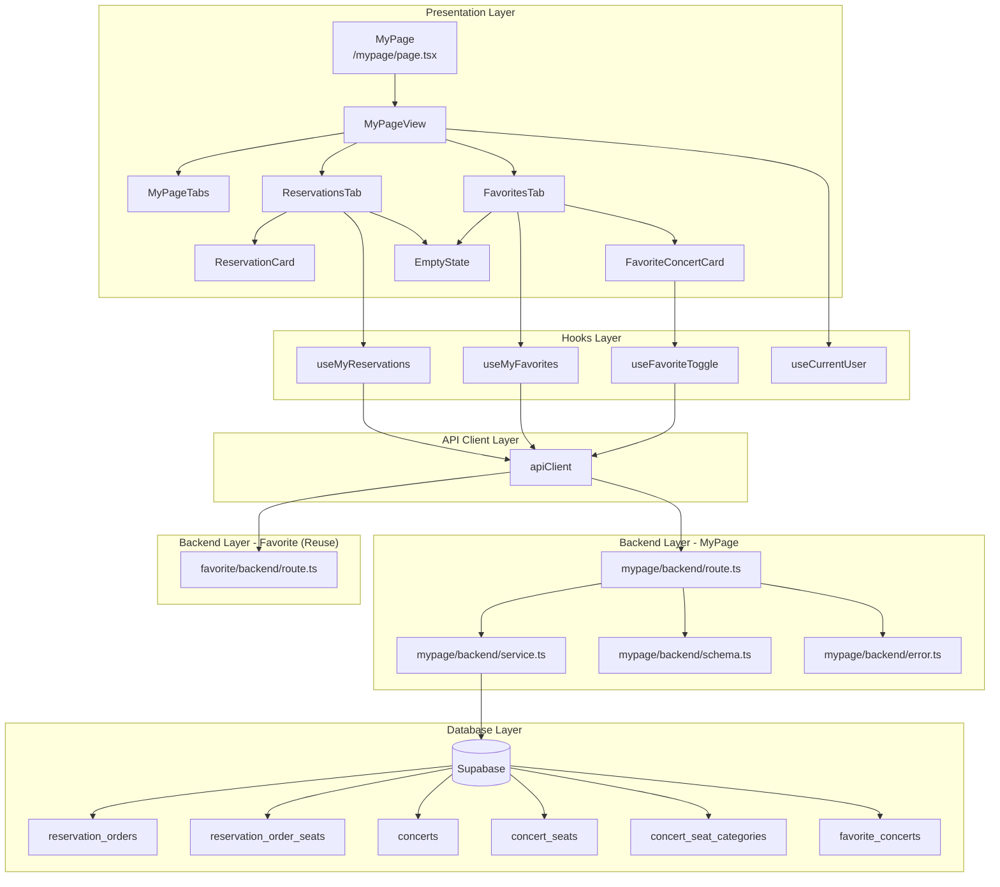

# UC-010: 마이페이지 - 상세 설계

## 1. 개요

### 1.1 목적
로그인한 회원 사용자가 자신의 예매 내역과 찜한 콘서트 목록을 조회할 수 있는 마이페이지를 구현합니다. '내 예매 내역'과 '찜한 콘서트' 두 개의 탭으로 구성되어 있으며, 탭 전환을 통해 각각의 정보를 확인할 수 있습니다.

### 1.2 주요 기능
- 로그인한 사용자의 예매 내역 조회 및 표시
- 로그인한 사용자의 찜한 콘서트 목록 조회 및 표시
- 탭 전환을 통한 콘텐츠 전환
- 찜하기 해제 기능
- 빈 상태 처리 (데이터 없음)

### 1.3 라우팅 경로
- **페이지 경로**: `/mypage`
- **API 엔드포인트**:
  - `GET /api/mypage/reservations` (예매 내역 조회)
  - `GET /api/mypage/favorites` (찜한 콘서트 조회)
  - `POST /api/favorites/toggle` (찜하기 해제 - 기존 API 재사용)

---

## 2. 모듈 구조 설계

### 2.1 모듈 개요

| 모듈명 | 위치 | 설명 |
|--------|------|------|
| **MyPage** | `src/app/mypage/page.tsx` | 마이페이지 메인 컴포넌트 |
| **MyPageView** | `src/features/mypage/components/my-page-view.tsx` | 탭 전환 및 콘텐츠 표시 메인 컨테이너 |
| **MyPageTabs** | `src/features/mypage/components/my-page-tabs.tsx` | 탭 네비게이션 컴포넌트 |
| **ReservationsTab** | `src/features/mypage/components/reservations-tab.tsx` | 예매 내역 탭 콘텐츠 |
| **FavoritesTab** | `src/features/mypage/components/favorites-tab.tsx` | 찜한 콘서트 탭 콘텐츠 |
| **ReservationCard** | `src/features/mypage/components/reservation-card.tsx` | 개별 예매 내역 카드 |
| **FavoriteConcertCard** | `src/features/mypage/components/favorite-concert-card.tsx` | 개별 찜한 콘서트 카드 |
| **EmptyState** | `src/features/mypage/components/empty-state.tsx` | 데이터 없을 때 표시되는 UI (재사용) |
| **useMyReservations** | `src/features/mypage/hooks/useMyReservations.ts` | 예매 내역 조회 React Query 훅 |
| **useMyFavorites** | `src/features/mypage/hooks/useMyFavorites.ts` | 찜한 콘서트 조회 React Query 훅 |
| **mypage/backend/route** | `src/features/mypage/backend/route.ts` | 마이페이지 API 라우트 |
| **mypage/backend/service** | `src/features/mypage/backend/service.ts` | 마이페이지 비즈니스 로직 |
| **mypage/backend/schema** | `src/features/mypage/backend/schema.ts` | 요청/응답 zod 스키마 |
| **mypage/backend/error** | `src/features/mypage/backend/error.ts` | 마이페이지 에러 코드 정의 |

### 2.2 모듈 다이어그램



---

## 3. Implementation Plan

### 3.1 Backend Layer

#### 3.1.1 MyPage Feature - Error Codes
**파일**: `src/features/mypage/backend/error.ts`

```typescript
export const mypageErrorCodes = {
  unauthorized: 'MYPAGE_UNAUTHORIZED',
  fetchReservationsError: 'MYPAGE_FETCH_RESERVATIONS_ERROR',
  fetchFavoritesError: 'MYPAGE_FETCH_FAVORITES_ERROR',
  validationError: 'MYPAGE_VALIDATION_ERROR',
} as const;

type MypageErrorValue = (typeof mypageErrorCodes)[keyof typeof mypageErrorCodes];

export type MypageServiceError = MypageErrorValue;
```

**Unit Test Plan**:
- ✅ `mypageErrorCodes` 객체가 정의된 모든 에러 코드를 포함하는지 확인
- ✅ 에러 코드 타입이 문자열 리터럴 타입으로 제대로 추론되는지 확인

---

#### 3.1.2 MyPage Feature - Schema
**파일**: `src/features/mypage/backend/schema.ts`

```typescript
import { z } from 'zod';

// 예매 좌석 정보 스키마
export const ReservationSeatSchema = z.object({
  id: z.string().uuid(),
  seatLabel: z.string(),
  price: z.number().nonnegative(),
  category: z.object({
    name: z.string(),
    displayColor: z.string(),
  }),
});

export type ReservationSeat = z.infer<typeof ReservationSeatSchema>;

// 예매 내역 아이템 스키마
export const ReservationItemSchema = z.object({
  id: z.string().uuid(),
  reservationNumber: z.string(),
  status: z.enum(['pending', 'confirmed', 'cancelled', 'expired']),
  totalPrice: z.number().nonnegative(),
  confirmedAt: z.string().nullable(),
  createdAt: z.string(),
  concert: z.object({
    id: z.string().uuid(),
    title: z.string(),
    posterImageUrl: z.string().nullable(),
  }),
  seats: z.array(ReservationSeatSchema),
});

export type ReservationItem = z.infer<typeof ReservationItemSchema>;

// 예매 내역 응답 스키마
export const MyReservationsResponseSchema = z.object({
  reservations: z.array(ReservationItemSchema),
});

export type MyReservationsResponse = z.infer<typeof MyReservationsResponseSchema>;

// 찜한 콘서트 아이템 스키마
export const FavoriteConcertItemSchema = z.object({
  id: z.string().uuid(),
  createdAt: z.string(),
  concert: z.object({
    id: z.string().uuid(),
    title: z.string(),
    posterImageUrl: z.string().nullable(),
    venue: z.string().nullable(),
    performanceDate: z.string().nullable(),
  }),
});

export type FavoriteConcertItem = z.infer<typeof FavoriteConcertItemSchema>;

// 찜한 콘서트 응답 스키마
export const MyFavoritesResponseSchema = z.object({
  favorites: z.array(FavoriteConcertItemSchema),
});

export type MyFavoritesResponse = z.infer<typeof MyFavoritesResponseSchema>;

// DB Row 스키마
export const ReservationOrderRowSchema = z.object({
  id: z.string().uuid(),
  reservation_number: z.string(),
  status: z.string(),
  total_price: z.string().nullable(),
  confirmed_at: z.string().nullable(),
  created_at: z.string(),
  concert_id: z.string().uuid(),
  concert_title: z.string().nullable(),
  concert_image_url: z.string().nullable(),
});

export type ReservationOrderRow = z.infer<typeof ReservationOrderRowSchema>;

export const ReservationSeatRowSchema = z.object({
  id: z.string().uuid(),
  seat_label: z.string(),
  price: z.string(),
  category_name: z.string(),
  category_color: z.string(),
});

export type ReservationSeatRow = z.infer<typeof ReservationSeatRowSchema>;

export const FavoriteConcertRowSchema = z.object({
  id: z.string().uuid(),
  created_at: z.string(),
  concert_id: z.string().uuid(),
  concert_title: z.string().nullable(),
  concert_image_url: z.string().nullable(),
  concert_venue: z.string().nullable(),
  concert_performance_date: z.string().nullable(),
});

export type FavoriteConcertRow = z.infer<typeof FavoriteConcertRowSchema>;
```

**Unit Test Plan**:
- ✅ `MyReservationsResponseSchema`가 모든 필수 필드를 검증하는지 확인
- ✅ `MyFavoritesResponseSchema`가 모든 필수 필드를 검증하는지 확인
- ✅ `ReservationItemSchema`가 잘못된 status 값을 거부하는지 확인
- ✅ 음수 가격을 거부하는지 확인

---

#### 3.1.3 MyPage Feature - Service
**파일**: `src/features/mypage/backend/service.ts`

```typescript
import type { SupabaseClient } from '@supabase/supabase-js';
import {
  failure,
  success,
  type HandlerResult,
} from '@/backend/http/response';
import {
  MyReservationsResponseSchema,
  MyFavoritesResponseSchema,
  ReservationOrderRowSchema,
  ReservationSeatRowSchema,
  FavoriteConcertRowSchema,
  type MyReservationsResponse,
  type MyFavoritesResponse,
  type ReservationOrderRow,
  type ReservationSeatRow,
  type FavoriteConcertRow,
} from './schema';
import {
  mypageErrorCodes,
  type MypageServiceError,
} from './error';

const RESERVATION_ORDERS_TABLE = 'reservation_orders';
const RESERVATION_SEATS_TABLE = 'reservation_order_seats';
const CONCERTS_TABLE = 'concerts';
const CONCERT_SEATS_TABLE = 'concert_seats';
const SEAT_CATEGORIES_TABLE = 'concert_seat_categories';
const FAVORITES_TABLE = 'favorite_concerts';

const fallbackPosterImage = (id: string) =>
  `https://picsum.photos/seed/${encodeURIComponent(id)}/400/600`;

/**
 * 사용자의 예매 내역을 조회합니다.
 * @param client - Supabase 클라이언트
 * @param userId - 로그인한 사용자 ID
 */
export const getMyReservations = async (
  client: SupabaseClient,
  userId: string,
): Promise<HandlerResult<MyReservationsResponse, MypageServiceError, unknown>> => {
  // 1. 예매 내역 조회 (콘서트 정보 포함)
  const { data: reservationsData, error: reservationsError } = await client
    .from(RESERVATION_ORDERS_TABLE)
    .select(`
      id,
      reservation_number,
      status,
      total_price,
      confirmed_at,
      created_at,
      concert_id,
      concerts!inner(
        id,
        title,
        image_url
      )
    `)
    .eq('user_id', userId)
    .order('created_at', { ascending: false });

  if (reservationsError) {
    return failure(500, mypageErrorCodes.fetchReservationsError, reservationsError.message);
  }

  if (!reservationsData || reservationsData.length === 0) {
    return success({ reservations: [] });
  }

  // 2. 각 예매의 좌석 정보 조회
  const reservationIds = reservationsData.map((r) => r.id);

  const { data: seatsData, error: seatsError } = await client
    .from(RESERVATION_SEATS_TABLE)
    .select(`
      id,
      order_id,
      price,
      concert_seats!inner(
        id,
        seat_label,
        concert_seat_categories!inner(
          name,
          display_color
        )
      )
    `)
    .in('order_id', reservationIds)
    .eq('is_active', true);

  if (seatsError) {
    console.error('Failed to fetch reservation seats:', seatsError);
  }

  // 3. 데이터 매핑
  const reservations = reservationsData.map((reservation) => {
    const orderSeats = seatsData?.filter((s) => s.order_id === reservation.id) || [];

    const seats = orderSeats.map((seat) => ({
      id: seat.id,
      seatLabel: seat.concert_seats.seat_label,
      price: parseFloat(seat.price),
      category: {
        name: seat.concert_seats.concert_seat_categories.name,
        displayColor: seat.concert_seats.concert_seat_categories.display_color,
      },
    }));

    return {
      id: reservation.id,
      reservationNumber: reservation.reservation_number,
      status: reservation.status,
      totalPrice: reservation.total_price ? parseFloat(reservation.total_price) : 0,
      confirmedAt: reservation.confirmed_at,
      createdAt: reservation.created_at,
      concert: {
        id: reservation.concerts.id,
        title: reservation.concerts.title,
        posterImageUrl: reservation.concerts.image_url ?? fallbackPosterImage(reservation.concerts.id),
      },
      seats,
    };
  });

  const response: MyReservationsResponse = { reservations };

  const parsed = MyReservationsResponseSchema.safeParse(response);

  if (!parsed.success) {
    return failure(
      500,
      mypageErrorCodes.validationError,
      'Reservations response failed validation.',
      parsed.error.format(),
    );
  }

  return success(parsed.data);
};

/**
 * 사용자가 찜한 콘서트 목록을 조회합니다.
 * @param client - Supabase 클라이언트
 * @param userId - 로그인한 사용자 ID
 */
export const getMyFavorites = async (
  client: SupabaseClient,
  userId: string,
): Promise<HandlerResult<MyFavoritesResponse, MypageServiceError, unknown>> => {
  const { data: favoritesData, error: favoritesError } = await client
    .from(FAVORITES_TABLE)
    .select(`
      id,
      created_at,
      concert_id,
      concerts!inner(
        id,
        title,
        image_url,
        venue,
        performance_date
      )
    `)
    .eq('user_id', userId)
    .order('created_at', { ascending: false });

  if (favoritesError) {
    return failure(500, mypageErrorCodes.fetchFavoritesError, favoritesError.message);
  }

  if (!favoritesData || favoritesData.length === 0) {
    return success({ favorites: [] });
  }

  const favorites = favoritesData.map((favorite) => ({
    id: favorite.id,
    createdAt: favorite.created_at,
    concert: {
      id: favorite.concerts.id,
      title: favorite.concerts.title,
      posterImageUrl: favorite.concerts.image_url ?? fallbackPosterImage(favorite.concerts.id),
      venue: favorite.concerts.venue,
      performanceDate: favorite.concerts.performance_date,
    },
  }));

  const response: MyFavoritesResponse = { favorites };

  const parsed = MyFavoritesResponseSchema.safeParse(response);

  if (!parsed.success) {
    return failure(
      500,
      mypageErrorCodes.validationError,
      'Favorites response failed validation.',
      parsed.error.format(),
    );
  }

  return success(parsed.data);
};
```

**Unit Test Plan**:
- ✅ 유효한 사용자 ID로 예매 내역 조회 시 성공 응답 반환
- ✅ 예매 내역이 없는 경우 빈 배열 반환
- ✅ 유효한 사용자 ID로 찜한 콘서트 조회 시 성공 응답 반환
- ✅ 찜한 콘서트가 없는 경우 빈 배열 반환
- ✅ 좌석 정보 조회 실패 시에도 기본 예매 정보는 반환되는지 확인
- ✅ DB 에러 발생 시 500 에러 반환 확인

---

#### 3.1.4 MyPage Feature - Route
**파일**: `src/features/mypage/backend/route.ts`

```typescript
import type { Hono } from 'hono';
import {
  failure,
  respond,
  type ErrorResult,
} from '@/backend/http/response';
import {
  getLogger,
  getSupabase,
  type AppEnv,
} from '@/backend/hono/context';
import { getMyReservations, getMyFavorites } from './service';
import {
  mypageErrorCodes,
  type MypageServiceError,
} from './error';

export const registerMypageRoutes = (app: Hono<AppEnv>) => {
  /**
   * 내 예매 내역 조회
   * GET /api/mypage/reservations
   * 로그인 필수
   */
  app.get('/api/mypage/reservations', async (c) => {
    const userId = c.get('userId') as string | undefined;

    if (!userId) {
      return respond(
        c,
        failure(401, mypageErrorCodes.unauthorized, 'Login required'),
      );
    }

    const supabase = getSupabase(c);
    const logger = getLogger(c);

    const result = await getMyReservations(supabase, userId);

    if (!result.ok) {
      const errorResult = result as ErrorResult<MypageServiceError, unknown>;

      if (errorResult.error.code === mypageErrorCodes.fetchReservationsError) {
        logger.error('Failed to fetch reservations', errorResult.error.message);
      }

      return respond(c, result);
    }

    return respond(c, result);
  });

  /**
   * 찜한 콘서트 목록 조회
   * GET /api/mypage/favorites
   * 로그인 필수
   */
  app.get('/api/mypage/favorites', async (c) => {
    const userId = c.get('userId') as string | undefined;

    if (!userId) {
      return respond(
        c,
        failure(401, mypageErrorCodes.unauthorized, 'Login required'),
      );
    }

    const supabase = getSupabase(c);
    const logger = getLogger(c);

    const result = await getMyFavorites(supabase, userId);

    if (!result.ok) {
      const errorResult = result as ErrorResult<MypageServiceError, unknown>;

      if (errorResult.error.code === mypageErrorCodes.fetchFavoritesError) {
        logger.error('Failed to fetch favorites', errorResult.error.message);
      }

      return respond(c, result);
    }

    return respond(c, result);
  });
};
```

**Unit Test Plan**:
- ✅ 인증된 사용자로 예매 내역 조회 시 200 응답 반환
- ✅ 비인증 사용자로 예매 내역 조회 시 401 에러 반환
- ✅ 인증된 사용자로 찜한 콘서트 조회 시 200 응답 반환
- ✅ 비인증 사용자로 찜한 콘서트 조회 시 401 에러 반환
- ✅ 서버 에러 발생 시 500 에러 반환

---

### 3.2 Frontend Layer

#### 3.2.1 DTO Export
**파일**: `src/features/mypage/lib/dto.ts`

```typescript
export {
  MyReservationsResponseSchema,
  MyFavoritesResponseSchema,
  ReservationItemSchema,
  FavoriteConcertItemSchema,
  ReservationSeatSchema,
  type MyReservationsResponse,
  type MyFavoritesResponse,
  type ReservationItem,
  type FavoriteConcertItem,
  type ReservationSeat,
} from '@/features/mypage/backend/schema';
```

---

#### 3.2.2 React Query Hooks

**파일**: `src/features/mypage/hooks/useMyReservations.ts`

```typescript
'use client';

import { useQuery } from '@tanstack/react-query';
import { apiClient, extractApiErrorMessage } from '@/lib/remote/api-client';
import { MyReservationsResponseSchema } from '@/features/mypage/lib/dto';

const fetchMyReservations = async () => {
  try {
    const { data } = await apiClient.get('/api/mypage/reservations');
    return MyReservationsResponseSchema.parse(data);
  } catch (error) {
    const message = extractApiErrorMessage(error, 'Failed to fetch reservations.');
    throw new Error(message);
  }
};

export const useMyReservations = () =>
  useQuery({
    queryKey: ['mypage', 'reservations'],
    queryFn: fetchMyReservations,
    staleTime: 30 * 1000, // 30초
    retry: 2,
  });
```

**QA Sheet**:

| Test Case | Input | Expected Output | Notes |
|-----------|-------|-----------------|-------|
| 정상 조회 | 인증된 사용자 | `{ data: { reservations: [...] } }` | 예매 내역 반환 |
| 예매 내역 없음 | 인증된 사용자 (예매 없음) | `{ data: { reservations: [] } }` | 빈 배열 반환 |
| 비인증 상태 | 인증 토큰 없음 | `{ error: Error }` | 401 에러 메시지 |
| 네트워크 오류 | 네트워크 타임아웃 | `{ error: Error }` | 재시도 후 실패 |

---

**파일**: `src/features/mypage/hooks/useMyFavorites.ts`

```typescript
'use client';

import { useQuery } from '@tanstack/react-query';
import { apiClient, extractApiErrorMessage } from '@/lib/remote/api-client';
import { MyFavoritesResponseSchema } from '@/features/mypage/lib/dto';

const fetchMyFavorites = async () => {
  try {
    const { data } = await apiClient.get('/api/mypage/favorites');
    return MyFavoritesResponseSchema.parse(data);
  } catch (error) {
    const message = extractApiErrorMessage(error, 'Failed to fetch favorites.');
    throw new Error(message);
  }
};

export const useMyFavorites = () =>
  useQuery({
    queryKey: ['mypage', 'favorites'],
    queryFn: fetchMyFavorites,
    staleTime: 30 * 1000, // 30초
    retry: 2,
  });
```

**QA Sheet**:

| Test Case | Input | Expected Output | Notes |
|-----------|-------|-----------------|-------|
| 정상 조회 | 인증된 사용자 | `{ data: { favorites: [...] } }` | 찜한 콘서트 반환 |
| 찜한 콘서트 없음 | 인증된 사용자 (찜 없음) | `{ data: { favorites: [] } }` | 빈 배열 반환 |
| 비인증 상태 | 인증 토큰 없음 | `{ error: Error }` | 401 에러 메시지 |
| 네트워크 오류 | 네트워크 타임아웃 | `{ error: Error }` | 재시도 후 실패 |

---

#### 3.2.3 UI Components

**파일**: `src/features/mypage/components/my-page-view.tsx`

```typescript
'use client';

import { useState } from 'react';
import { useCurrentUser } from '@/features/auth/hooks/useCurrentUser';
import { MyPageTabs } from './my-page-tabs';
import { ReservationsTab } from './reservations-tab';
import { FavoritesTab } from './favorites-tab';
import { Alert, AlertDescription } from '@/components/ui/alert';
import { Button } from '@/components/ui/button';
import { useRouter } from 'next/navigation';

type TabType = 'reservations' | 'favorites';

export const MyPageView = () => {
  const [activeTab, setActiveTab] = useState<TabType>('reservations');
  const { isAuthenticated, isLoading } = useCurrentUser();
  const router = useRouter();

  if (isLoading) {
    return (
      <div className="flex min-h-[400px] items-center justify-center">
        <p className="text-slate-600">로딩 중...</p>
      </div>
    );
  }

  if (!isAuthenticated) {
    return (
      <div className="flex min-h-[400px] items-center justify-center">
        <Alert variant="destructive" className="max-w-md">
          <AlertDescription className="space-y-4">
            <p>로그인이 필요한 서비스입니다.</p>
            <Button onClick={() => router.push('/login')} variant="outline" size="sm">
              로그인하기
            </Button>
          </AlertDescription>
        </Alert>
      </div>
    );
  }

  return (
    <div className="mx-auto max-w-6xl space-y-6 p-4">
      <h1 className="text-3xl font-bold">마이페이지</h1>
      <MyPageTabs activeTab={activeTab} onTabChange={setActiveTab} />
      {activeTab === 'reservations' && <ReservationsTab />}
      {activeTab === 'favorites' && <FavoritesTab />}
    </div>
  );
};
```

**QA Sheet**:

| Test Case | Expected Behavior |
|-----------|-------------------|
| 로그인 상태 | 탭과 콘텐츠 정상 표시 |
| 비로그인 상태 | 로그인 필요 안내 표시 |
| 로딩 중 | 로딩 메시지 표시 |
| 탭 전환 | 탭 클릭 시 콘텐츠 변경 |

---

**파일**: `src/features/mypage/components/my-page-tabs.tsx`

```typescript
'use client';

import { Tabs, TabsList, TabsTrigger } from '@/components/ui/tabs';

interface MyPageTabsProps {
  activeTab: 'reservations' | 'favorites';
  onTabChange: (tab: 'reservations' | 'favorites') => void;
}

export const MyPageTabs = ({ activeTab, onTabChange }: MyPageTabsProps) => {
  return (
    <Tabs value={activeTab} onValueChange={(value) => onTabChange(value as 'reservations' | 'favorites')}>
      <TabsList className="grid w-full max-w-md grid-cols-2">
        <TabsTrigger value="reservations">내 예매 내역</TabsTrigger>
        <TabsTrigger value="favorites">찜한 콘서트</TabsTrigger>
      </TabsList>
    </Tabs>
  );
};
```

**QA Sheet**:

| Test Case | Expected Behavior |
|-----------|-------------------|
| 기본 탭 | '내 예매 내역' 활성화 |
| 탭 클릭 | 활성 탭 변경 |
| 키보드 네비게이션 | Tab, Arrow 키로 탭 이동 |

---

**파일**: `src/features/mypage/components/reservations-tab.tsx`

```typescript
'use client';

import { useMyReservations } from '@/features/mypage/hooks/useMyReservations';
import { ReservationCard } from './reservation-card';
import { EmptyState } from './empty-state';
import { Skeleton } from '@/components/ui/skeleton';
import { Alert, AlertDescription } from '@/components/ui/alert';
import { Button } from '@/components/ui/button';

export const ReservationsTab = () => {
  const { data, status, error, refetch } = useMyReservations();

  if (status === 'pending') {
    return <ReservationsTabSkeleton />;
  }

  if (status === 'error') {
    return (
      <div className="flex min-h-[300px] items-center justify-center">
        <Alert variant="destructive" className="max-w-md">
          <AlertDescription className="space-y-4">
            <p>{error instanceof Error ? error.message : '예매 내역을 불러올 수 없습니다.'}</p>
            <Button onClick={() => refetch()} variant="outline" size="sm">
              다시 시도
            </Button>
          </AlertDescription>
        </Alert>
      </div>
    );
  }

  if (!data || data.reservations.length === 0) {
    return (
      <EmptyState
        title="아직 예매 내역이 없어요"
        description="원하는 콘서트를 예매해보세요!"
        actionLabel="콘서트 둘러보기"
        actionHref="/"
      />
    );
  }

  return (
    <div className="space-y-4">
      {data.reservations.map((reservation) => (
        <ReservationCard key={reservation.id} reservation={reservation} />
      ))}
    </div>
  );
};

const ReservationsTabSkeleton = () => (
  <div className="space-y-4">
    {[1, 2, 3].map((i) => (
      <Skeleton key={i} className="h-40 w-full rounded-lg" />
    ))}
  </div>
);
```

**QA Sheet**:

| Test Case | Expected Behavior |
|-----------|-------------------|
| 로딩 상태 | 스켈레톤 UI 표시 |
| 에러 상태 | 에러 메시지 + 재시도 버튼 |
| 예매 내역 있음 | 예매 카드 목록 표시 |
| 예매 내역 없음 | 빈 상태 UI 표시 |

---

**파일**: `src/features/mypage/components/favorites-tab.tsx`

```typescript
'use client';

import { useMyFavorites } from '@/features/mypage/hooks/useMyFavorites';
import { FavoriteConcertCard } from './favorite-concert-card';
import { EmptyState } from './empty-state';
import { Skeleton } from '@/components/ui/skeleton';
import { Alert, AlertDescription } from '@/components/ui/alert';
import { Button } from '@/components/ui/button';

export const FavoritesTab = () => {
  const { data, status, error, refetch } = useMyFavorites();

  if (status === 'pending') {
    return <FavoritesTabSkeleton />;
  }

  if (status === 'error') {
    return (
      <div className="flex min-h-[300px] items-center justify-center">
        <Alert variant="destructive" className="max-w-md">
          <AlertDescription className="space-y-4">
            <p>{error instanceof Error ? error.message : '찜한 콘서트를 불러올 수 없습니다.'}</p>
            <Button onClick={() => refetch()} variant="outline" size="sm">
              다시 시도
            </Button>
          </AlertDescription>
        </Alert>
      </div>
    );
  }

  if (!data || data.favorites.length === 0) {
    return (
      <EmptyState
        title="찜한 콘서트가 없어요"
        description="관심있는 콘서트를 찜해보세요!"
        actionLabel="콘서트 둘러보기"
        actionHref="/"
      />
    );
  }

  return (
    <div className="grid gap-4 sm:grid-cols-2 lg:grid-cols-3">
      {data.favorites.map((favorite) => (
        <FavoriteConcertCard key={favorite.id} favorite={favorite} />
      ))}
    </div>
  );
};

const FavoritesTabSkeleton = () => (
  <div className="grid gap-4 sm:grid-cols-2 lg:grid-cols-3">
    {[1, 2, 3, 4, 5, 6].map((i) => (
      <Skeleton key={i} className="h-64 w-full rounded-lg" />
    ))}
  </div>
);
```

**QA Sheet**:

| Test Case | Expected Behavior |
|-----------|-------------------|
| 로딩 상태 | 스켈레톤 UI 그리드 표시 |
| 에러 상태 | 에러 메시지 + 재시도 버튼 |
| 찜한 콘서트 있음 | 콘서트 카드 그리드 표시 |
| 찜한 콘서트 없음 | 빈 상태 UI 표시 |

---

**파일**: `src/features/mypage/components/reservation-card.tsx`

```typescript
'use client';

import Image from 'next/image';
import { format } from 'date-fns';
import { ko } from 'date-fns/locale';
import { Badge } from '@/components/ui/badge';
import { Card, CardContent } from '@/components/ui/card';
import type { ReservationItem } from '@/features/mypage/lib/dto';

interface ReservationCardProps {
  reservation: ReservationItem;
}

const statusColors = {
  pending: 'bg-yellow-500',
  confirmed: 'bg-green-500',
  cancelled: 'bg-gray-500',
  expired: 'bg-gray-500',
} as const;

const statusLabels = {
  pending: '대기중',
  confirmed: '확정',
  cancelled: '취소됨',
  expired: '만료됨',
} as const;

export const ReservationCard = ({ reservation }: ReservationCardProps) => {
  const formattedDate = format(new Date(reservation.createdAt), 'PPP', { locale: ko });

  return (
    <Card>
      <CardContent className="flex gap-4 p-4">
        {reservation.concert.posterImageUrl && (
          <div className="relative h-32 w-24 flex-shrink-0 overflow-hidden rounded-md">
            <Image
              src={reservation.concert.posterImageUrl}
              alt={reservation.concert.title}
              fill
              className="object-cover"
            />
          </div>
        )}
        <div className="flex flex-1 flex-col justify-between">
          <div className="space-y-2">
            <div className="flex items-start justify-between gap-2">
              <h3 className="font-semibold text-slate-900">{reservation.concert.title}</h3>
              <Badge className={statusColors[reservation.status]}>
                {statusLabels[reservation.status]}
              </Badge>
            </div>
            <p className="text-sm text-slate-600">예약번호: {reservation.reservationNumber}</p>
            <div className="flex flex-wrap gap-2">
              {reservation.seats.map((seat) => (
                <div key={seat.id} className="flex items-center gap-2 text-sm">
                  <div
                    className="h-3 w-3 rounded-full"
                    style={{ backgroundColor: seat.category.displayColor }}
                  />
                  <span className="text-slate-700">
                    {seat.category.name} {seat.seatLabel}
                  </span>
                </div>
              ))}
            </div>
          </div>
          <div className="flex items-center justify-between text-sm">
            <span className="text-slate-600">{formattedDate}</span>
            <span className="font-semibold text-slate-900">
              {reservation.totalPrice.toLocaleString('ko-KR')}원
            </span>
          </div>
        </div>
      </CardContent>
    </Card>
  );
};
```

**QA Sheet**:

| Test Case | Expected Behavior |
|-----------|-------------------|
| 포스터 이미지 있음 | 썸네일 이미지 표시 |
| 포스터 이미지 없음 | 이미지 영역 미표시 |
| 예약 상태 | 상태에 따른 배지 색상 표시 |
| 좌석 정보 | 등급 색상 + 좌석번호 표시 |
| 총 금액 | 천 단위 구분 쉼표 표시 |

---

**파일**: `src/features/mypage/components/favorite-concert-card.tsx`

```typescript
'use client';

import Image from 'next/image';
import { useRouter } from 'next/navigation';
import { Heart, Calendar, MapPin } from 'lucide-react';
import { format } from 'date-fns';
import { ko } from 'date-fns/locale';
import { Card, CardContent } from '@/components/ui/card';
import { Button } from '@/components/ui/button';
import { useToast } from '@/hooks/use-toast';
import { useFavoriteToggle } from '@/features/favorite/hooks/useFavoriteToggle';
import type { FavoriteConcertItem } from '@/features/mypage/lib/dto';

interface FavoriteConcertCardProps {
  favorite: FavoriteConcertItem;
}

export const FavoriteConcertCard = ({ favorite }: FavoriteConcertCardProps) => {
  const router = useRouter();
  const { mutate, isPending } = useFavoriteToggle();
  const { toast } = useToast();

  const formattedDate = favorite.concert.performanceDate
    ? format(new Date(favorite.concert.performanceDate), 'PPP', { locale: ko })
    : null;

  const handleCardClick = () => {
    router.push(`/concerts/${favorite.concert.id}`);
  };

  const handleFavoriteToggle = (e: React.MouseEvent) => {
    e.stopPropagation();

    mutate(favorite.concert.id, {
      onSuccess: () => {
        toast({
          title: '찜 목록에서 제거했습니다',
          variant: 'default',
        });
      },
      onError: (error) => {
        toast({
          title: '요청 실패',
          description: error instanceof Error ? error.message : '다시 시도해주세요.',
          variant: 'destructive',
        });
      },
    });
  };

  return (
    <Card className="cursor-pointer overflow-hidden transition-shadow hover:shadow-lg" onClick={handleCardClick}>
      <div className="relative aspect-[2/3] w-full">
        {favorite.concert.posterImageUrl && (
          <Image
            src={favorite.concert.posterImageUrl}
            alt={favorite.concert.title}
            fill
            className="object-cover"
          />
        )}
        <Button
          variant="ghost"
          size="icon"
          className="absolute right-2 top-2 bg-white/80 hover:bg-white"
          onClick={handleFavoriteToggle}
          disabled={isPending}
          aria-label="찜하기 해제"
        >
          <Heart className="h-5 w-5 fill-red-500 text-red-500" />
        </Button>
      </div>
      <CardContent className="space-y-2 p-4">
        <h3 className="line-clamp-2 font-semibold text-slate-900">{favorite.concert.title}</h3>
        {formattedDate && (
          <div className="flex items-center gap-2 text-sm text-slate-600">
            <Calendar className="h-4 w-4" />
            <span>{formattedDate}</span>
          </div>
        )}
        {favorite.concert.venue && (
          <div className="flex items-center gap-2 text-sm text-slate-600">
            <MapPin className="h-4 w-4" />
            <span className="line-clamp-1">{favorite.concert.venue}</span>
          </div>
        )}
      </CardContent>
    </Card>
  );
};
```

**QA Sheet**:

| Test Case | Expected Behavior |
|-----------|-------------------|
| 포스터 이미지 | 2:3 비율로 표시 |
| 찜하기 해제 버튼 | 우측 상단에 하트 버튼 표시 |
| 하트 버튼 클릭 | 찜하기 해제 API 호출 |
| 카드 클릭 | 콘서트 상세 페이지로 이동 |
| 날짜/장소 정보 | 있을 경우에만 표시 |

---

**파일**: `src/features/mypage/components/empty-state.tsx`

```typescript
'use client';

import Link from 'next/link';
import { Package } from 'lucide-react';
import { Button } from '@/components/ui/button';

interface EmptyStateProps {
  title: string;
  description: string;
  actionLabel: string;
  actionHref: string;
}

export const EmptyState = ({ title, description, actionLabel, actionHref }: EmptyStateProps) => {
  return (
    <div className="flex min-h-[400px] flex-col items-center justify-center space-y-4 text-center">
      <Package className="h-16 w-16 text-slate-300" />
      <div className="space-y-2">
        <h3 className="text-xl font-semibold text-slate-900">{title}</h3>
        <p className="text-slate-600">{description}</p>
      </div>
      <Button asChild>
        <Link href={actionHref}>{actionLabel}</Link>
      </Button>
    </div>
  );
};
```

**QA Sheet**:

| Test Case | Expected Behavior |
|-----------|-------------------|
| 아이콘 표시 | 패키지 아이콘 표시 |
| 메시지 표시 | 제목 + 설명 표시 |
| 액션 버튼 | 클릭 시 지정된 URL로 이동 |

---

#### 3.2.4 Page Component

**파일**: `src/app/mypage/page.tsx`

```typescript
import { MyPageView } from '@/features/mypage/components/my-page-view';

export default function MyPage() {
  return (
    <main className="container mx-auto py-8">
      <MyPageView />
    </main>
  );
}
```

---

## 4. Integration Checklist

### 4.1 Backend Integration
- [ ] `registerMypageRoutes`를 `src/backend/hono/app.ts`에 등록
- [ ] 테이블 존재 여부 확인 (`reservation_orders`, `reservation_order_seats`, `concerts`, `concert_seats`, `concert_seat_categories`, `favorite_concerts`)
- [ ] 인증 미들웨어가 `userId`를 컨텍스트에 주입하는지 확인

### 4.2 Frontend Integration
- [ ] `src/app/mypage/page.tsx` 파일 생성
- [ ] 모든 컴포넌트가 `use client` 지시어 사용하는지 확인
- [ ] API 클라이언트 설정 (`@/lib/remote/api-client`) 확인
- [ ] Toast UI 컴포넌트 설치 및 설정 확인
- [ ] Tabs UI 컴포넌트 (`shadcn/ui`) 설치 확인

### 4.3 Testing
- [ ] 백엔드 unit test 실행
- [ ] 프론트엔드 QA sheet 기반 테스트 실행
- [ ] 로그인/비로그인 상태별 동작 확인
- [ ] 에러 케이스 (401, 500) 처리 확인
- [ ] 빈 상태 (데이터 없음) UI 확인

---

## 5. 구현 우선순위

### Phase 1: Backend Core (필수)
1. MyPage backend (error, schema, service, route)
2. Route registration in Hono app
3. 인증 미들웨어 확인 및 userId 주입 확인

### Phase 2: Frontend Core (필수)
1. DTO exports
2. React Query hooks (useMyReservations, useMyFavorites)
3. Page component (`/mypage/page.tsx`)
4. Main view component (MyPageView)
5. Tabs component (MyPageTabs)

### Phase 3: UI Components (필수)
1. ReservationsTab
2. FavoritesTab
3. ReservationCard
4. FavoriteConcertCard
5. EmptyState (재사용 가능)

### Phase 4: Polish (선택)
1. Loading skeleton 개선
2. 탭 전환 애니메이션
3. 예매 내역 상세 모달
4. 접근성 향상 (ARIA 속성)

---

## 6. 관련 문서
- **UC-003**: 찜하기 기능 (FavoriteButton 재사용)
- **UC-008**: 예약 완료 페이지 (마이페이지 이동 버튼)
- **Database Schema**: `/docs/database.md`
- **User Flow**: `/docs/userflow.md`
- **State Management**: `/docs/state-management.md`

---

## 7. 추가 고려사항

### 7.1 성능 최적화
- React Query `staleTime` 설정으로 불필요한 재조회 방지 (30초)
- 탭 전환 시 이전 데이터는 캐시에서 즉시 표시
- 이미지 최적화 (Next.js Image 컴포넌트 사용)
- 예매 내역이 많을 경우 무한 스크롤 또는 페이지네이션 고려

### 7.2 보안
- 모든 API는 인증된 사용자만 접근 가능 (401 에러 반환)
- 서버 측에서 `user_id` 기반 데이터 필터링 필수
- XSS 방지를 위한 입력값 검증

### 7.3 접근성
- 탭 네비게이션은 키보드로 접근 가능 (Tab, Arrow keys)
- ARIA 속성 사용 (role="tablist", aria-selected 등)
- 스크린 리더 친화적인 텍스트 제공
- 시맨틱 HTML 사용

### 7.4 반응형 디자인
- 모바일: 예매 카드 단일 열, 찜한 콘서트 단일 열
- 태블릿: 예매 카드 단일 열, 찜한 콘서트 2열
- 데스크톱: 예매 카드 단일 열, 찜한 콘서트 3열
- Tailwind CSS breakpoint 활용
- 터치 친화적인 버튼 크기

### 7.5 UX 개선
- 탭 전환 시 부드러운 애니메이션 효과
- 낙관적 업데이트 (찜하기 해제 시)
- 에러 발생 시 명확한 피드백 제공
- 빈 상태에서 다음 행동 유도 (CTA 버튼)

### 7.6 향후 개선 사항
- 예매 내역 필터링 (날짜 범위, 상태별)
- 예매 내역 상세 페이지 또는 모달
- 찜한 콘서트 정렬 옵션 (최신순, 공연일 순)
- 예매 취소 기능 (비즈니스 규칙에 따라)
- 알림 설정 (찜한 콘서트 티켓 오픈 알림)
