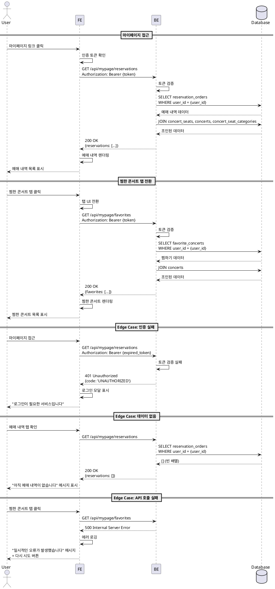

# 유스케이스 010: 마이페이지 조회 (회원)

## 개요

로그인한 회원 사용자가 마이페이지에 접근하여 자신의 예매 내역과 찜한 콘서트 목록을 조회할 수 있다. 마이페이지는 '내 예매 내역'과 '찜한 콘서트' 두 개의 탭으로 구성되어 있으며, 사용자는 탭 전환을 통해 원하는 정보를 확인할 수 있다.

## Primary Actor

- 로그인한 회원 사용자

## Precondition

- 사용자가 로그인되어 있어야 함
- 유효한 인증 토큰이 존재해야 함

## Trigger

- 사용자가 헤더 또는 네비게이션에서 '마이페이지' 링크를 클릭함
- 예약 완료 후 '마이페이지로 이동' 버튼을 클릭함

## Main Scenario

### 1. 마이페이지 접근
1. 사용자가 '마이페이지' 링크를 클릭한다.
2. 시스템은 사용자의 인증 상태를 확인한다.
3. 시스템은 마이페이지로 라우팅하고 기본 탭('내 예매 내역')을 활성화한다.
4. 시스템은 백엔드 API를 호출하여 사용자의 예매 내역 목록을 요청한다.
   - **Request**: `GET /api/mypage/reservations`
   - **Headers**: `Authorization: Bearer {token}`
5. 백엔드는 `reservation_orders` 테이블에서 `user_id`가 일치하는 레코드를 조회한다.
6. 백엔드는 연관된 `reservation_order_seats`, `concerts`, `concert_seats`, `concert_seat_categories` 정보를 조인하여 반환한다.
7. 시스템은 예매 내역 목록을 화면에 렌더링한다.

### 2. 탭 전환 - 찜한 콘서트
1. 사용자가 '찜한 콘서트' 탭을 클릭한다.
2. 시스템은 탭 UI를 전환하고 백엔드 API를 호출하여 찜한 콘서트 목록을 요청한다.
   - **Request**: `GET /api/mypage/favorites`
   - **Headers**: `Authorization: Bearer {token}`
3. 백엔드는 `favorite_concerts` 테이블에서 `user_id`가 일치하는 레코드를 조회한다.
4. 백엔드는 연관된 `concerts` 정보를 조인하여 반환한다.
5. 시스템은 찜한 콘서트 목록을 화면에 렌더링한다.

### 3. 탭 전환 - 내 예매 내역
1. 사용자가 다시 '내 예매 내역' 탭을 클릭한다.
2. 시스템은 캐시된 데이터가 있는 경우 즉시 표시하고, 없는 경우 API를 재호출한다.
3. 예매 내역 목록이 화면에 표시된다.

## Edge Cases

### EC-1: 인증 실패 (로그인 풀림)
- **조건**: 사용자의 인증 토큰이 만료되었거나 유효하지 않음
- **처리**:
  1. 시스템은 API 응답으로 `401 Unauthorized`를 수신한다.
  2. 시스템은 사용자를 로그인 페이지로 리다이렉트하거나 로그인 모달을 표시한다.
  3. "로그인이 필요한 서비스입니다" 메시지를 표시한다.
  4. 로그인 완료 후 마이페이지로 다시 리다이렉트한다.

### EC-2: 예매 내역 없음
- **조건**: 사용자가 예매한 콘서트가 하나도 없음
- **처리**:
  1. 백엔드는 빈 배열을 반환한다.
  2. 시스템은 '내 예매 내역' 탭에 "아직 예매 내역이 없습니다" 메시지를 표시한다.
  3. (선택) "콘서트 둘러보기" 버튼을 제공하여 메인 페이지로 이동할 수 있도록 한다.

### EC-3: 찜한 콘서트 없음
- **조건**: 사용자가 찜한 콘서트가 하나도 없음
- **처리**:
  1. 백엔드는 빈 배열을 반환한다.
  2. 시스템은 '찜한 콘서트' 탭에 "찜한 콘서트가 없습니다" 메시지를 표시한다.
  3. (선택) "콘서트 둘러보기" 버튼을 제공하여 메인 페이지로 이동할 수 있도록 한다.

### EC-4: API 호출 실패
- **조건**: 네트워크 오류, 서버 에러(5xx) 등으로 API 호출 실패
- **처리**:
  1. 시스템은 에러 응답을 감지한다.
  2. 사용자에게 "일시적인 오류가 발생했습니다. 잠시 후 다시 시도해주세요" 메시지를 표시한다.
  3. "다시 시도" 버튼을 제공하여 API 재호출을 할 수 있도록 한다.
  4. 에러는 로깅 시스템에 기록된다.

### EC-5: 부분 데이터 로드 실패
- **조건**: 예매 내역은 로드되었으나 관련 콘서트 정보 조인 실패
- **처리**:
  1. 백엔드는 가능한 데이터만 반환하고 누락된 정보를 표시한다.
  2. 시스템은 누락된 정보를 플레이스홀더로 표시한다. (예: "정보를 불러올 수 없습니다")
  3. 전체 목록은 정상적으로 렌더링한다.

## API 요청/응답 스키마

### GET /api/mypage/reservations

**요청**
```typescript
// Headers
Authorization: Bearer {access_token}
```

**응답 (성공 200)**
```typescript
{
  success: true,
  data: {
    reservations: [
      {
        id: string,                    // 예약 ID
        reservationNumber: string,     // 예약 번호 (예: RES-20250315-001)
        status: 'pending' | 'confirmed' | 'cancelled' | 'expired',
        totalPrice: number,            // 총 결제 금액
        confirmedAt: string | null,    // 예약 확정 시각 (ISO 8601)
        createdAt: string,             // 예약 생성 시각
        concert: {
          id: string,
          title: string,               // 콘서트 제목
          posterImageUrl?: string,     // 포스터 이미지 URL
        },
        seats: [
          {
            id: string,
            seatLabel: string,         // 좌석 표기 (예: A-12)
            price: number,             // 좌석 가격
            category: {
              name: string,            // 좌석 등급명 (예: VIP, R석)
              displayColor: string,    // 등급 색상
            }
          }
        ]
      }
    ]
  }
}
```

**응답 (인증 실패 401)**
```typescript
{
  success: false,
  error: {
    code: 'UNAUTHORIZED',
    message: '로그인이 필요한 서비스입니다'
  }
}
```

**응답 (서버 오류 500)**
```typescript
{
  success: false,
  error: {
    code: 'INTERNAL_SERVER_ERROR',
    message: '서버 오류가 발생했습니다'
  }
}
```

### GET /api/mypage/favorites

**요청**
```typescript
// Headers
Authorization: Bearer {access_token}
```

**응답 (성공 200)**
```typescript
{
  success: true,
  data: {
    favorites: [
      {
        id: string,                    // 찜하기 ID
        createdAt: string,             // 찜한 시각 (ISO 8601)
        concert: {
          id: string,
          title: string,               // 콘서트 제목
          posterImageUrl?: string,     // 포스터 이미지 URL
          venue?: string,              // 공연장
          startDate?: string,          // 공연 시작일
          endDate?: string,            // 공연 종료일
        }
      }
    ]
  }
}
```

**응답 (인증 실패 401)**
```typescript
{
  success: false,
  error: {
    code: 'UNAUTHORIZED',
    message: '로그인이 필요한 서비스입니다'
  }
}
```

## UI/UX 요구사항

### 레이아웃
- 페이지 상단에 '내 예매 내역'과 '찜한 콘서트' 탭이 수평으로 배치됨
- 활성 탭은 시각적으로 구분됨 (언더라인, 색상 변경 등)
- 탭 콘텐츠 영역은 탭 하단에 위치하며, 탭 전환 시 애니메이션 효과를 고려

### 내 예매 내역 탭
- 예매 내역은 카드 또는 리스트 형태로 표시
- 각 예매 항목은 다음 정보를 포함:
  - 콘서트 포스터 이미지 (썸네일)
  - 콘서트 제목
  - 예약 번호
  - 예약 상태 (pending: 대기중, confirmed: 확정, cancelled: 취소됨, expired: 만료됨)
  - 좌석 정보 (등급, 좌석 번호)
  - 총 결제 금액
  - 예약 날짜
- 예매 내역 클릭 시 상세 정보 확인 가능 (모달 또는 상세 페이지)
- 최신 예매가 상단에 표시되도록 정렬
- 예매 상태별로 색상 구분 (confirmed: 녹색, pending: 노란색, cancelled/expired: 회색)

### 찜한 콘서트 탭
- 찜한 콘서트는 그리드 또는 리스트 형태로 표시
- 각 콘서트 항목은 다음 정보를 포함:
  - 콘서트 포스터 이미지
  - 콘서트 제목
  - 공연 기간
  - 공연장
  - 찜하기 해제 버튼 (하트 아이콘)
- 콘서트 항목 클릭 시 콘서트 상세 페이지로 이동
- 최근 찜한 순서대로 정렬

### 빈 상태 UI
- 데이터가 없을 때 친근한 일러스트레이션 또는 아이콘과 함께 안내 메시지 표시
- "콘서트 둘러보기" 버튼을 제공하여 메인 페이지로 쉽게 이동

### 로딩 상태
- API 호출 중 스켈레톤 UI 또는 로딩 스피너 표시
- 탭 전환 시 부드러운 로딩 경험 제공

### 반응형 디자인
- 모바일: 탭이 전체 너비로 표시되며, 콘텐츠는 단일 열로 표시
- 태블릿: 콘텐츠가 2열로 표시
- 데스크톱: 콘텐츠가 3열 또는 리스트 형태로 표시

## 에러 처리 및 피드백

### 네트워크 오류
- 토스트 메시지로 "네트워크 연결을 확인해주세요" 표시
- "다시 시도" 버튼 제공

### 인증 오류
- "로그인이 필요한 서비스입니다" 메시지와 함께 로그인 모달 표시
- 로그인 완료 후 자동으로 마이페이지로 복귀

### 서버 오류
- "일시적인 오류가 발생했습니다. 잠시 후 다시 시도해주세요" 메시지 표시
- 에러는 서버 로그에 기록되어야 함

### 데이터 없음
- 친근한 메시지와 함께 다음 행동을 유도하는 버튼 제공
- 부정적인 표현 지양 (예: "없습니다" → "아직 예매 내역이 없어요!")

## Business Rules

### BR-1: 인증 필수
- 마이페이지는 로그인한 회원만 접근 가능
- 비로그인 상태에서 접근 시 로그인 페이지로 리다이렉트

### BR-2: 데이터 소유권
- 사용자는 본인의 데이터만 조회 가능
- `user_id` 기반으로 데이터 필터링 필수

### BR-3: 예매 상태 표시
- `reservation_orders.status` 값에 따라 정확한 상태 표시
- pending: 좌석 선점 중
- confirmed: 예매 확정
- cancelled: 사용자가 취소함
- expired: 선점 시간 만료로 자동 취소됨

### BR-4: 찜하기 해제
- 찜한 콘서트 탭에서 하트 아이콘 클릭 시 즉시 찜하기 해제
- API 호출 실패 시 이전 상태로 롤백 (낙관적 업데이트)

### BR-5: 실시간 데이터 동기화
- 탭 전환 시마다 최신 데이터를 서버에서 가져옴
- React Query의 캐싱 전략을 활용하여 불필요한 API 호출 최소화

### BR-6: 데이터 정렬
- 예매 내역: `created_at` 기준 내림차순 (최신순)
- 찜한 콘서트: `created_at` 기준 내림차순 (최근 찜한 순)

## Sequence Diagram



## 참고사항

### 성능 최적화
- React Query를 사용하여 API 응답 캐싱 (staleTime: 30초)
- 탭 전환 시 이전에 로드된 데이터는 캐시에서 즉시 표시
- 무한 스크롤 또는 페이지네이션 고려 (예매 내역이 많을 경우)

### 접근성
- 탭 네비게이션은 키보드로 접근 가능 (Tab, Arrow keys)
- ARIA 속성 사용 (role="tablist", aria-selected 등)
- 스크린 리더 친화적인 텍스트 제공

### 보안
- 모든 API 요청에 인증 토큰 포함
- 서버 측에서 `user_id` 기반 데이터 필터링 필수
- XSS 방지를 위한 입력 값 이스케이핑

### 향후 개선 사항
- 예매 내역 필터링 (날짜 범위, 상태별)
- 예매 내역 상세 페이지 또는 모달
- 찜한 콘서트 정렬 옵션 (최신순, 공연일 순)
- 예매 취소 기능 (비즈니스 규칙에 따라)
- 알림 설정 (찜한 콘서트 티켓 오픈 알림)
